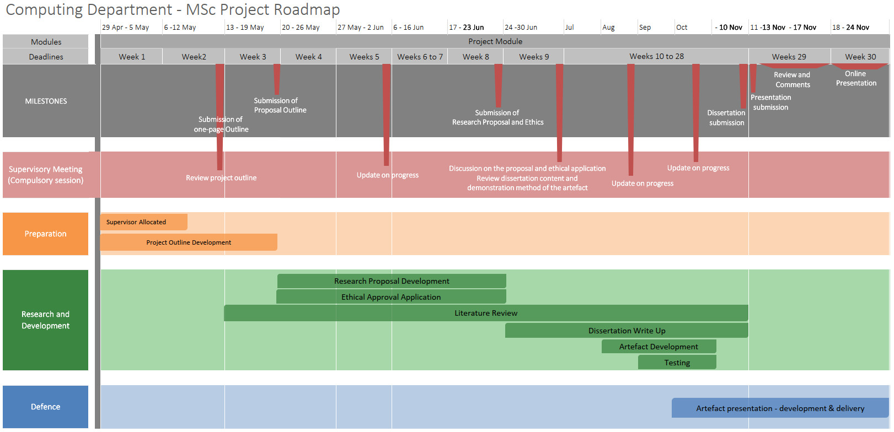

# MSc Computing Project April 2025

 

## List of Formative Activities and Submissions

#### Week 1: An Introduction to Your Dissertation
[Developing Your Proposal](CSPJ_WK01.md)
 

#### Week 2: Project Planning and Risks
[Outlining Your Project](CSPJ_WK02.md)
 

#### Week 3: Project Types and Research Methods
[Defining Your Methods](CSPJ_WK03.md)
 

#### Week 4: Reviewing Literature
[Structuring Your Literature Review](CSPJ_WK04.md)
 

#### Week 5: Research Ethics
[Understanding Ethical Considerations](CSPJ_WK05.md)
 

#### Week 6: Intellectual Property  

#### Week 7-8: Research Proposal and Ethical Approval Submission
[Ethical Application and Research Proposal Submission](CSPJ_WK08.md)
 
 

#### [Draft Submission](CSPJ_Draft.md)

#### [Dissertation Submission](CSPJ_WK28.md)

#### [Artefact Presentation](CSPJ_WK29.md)

 

---
