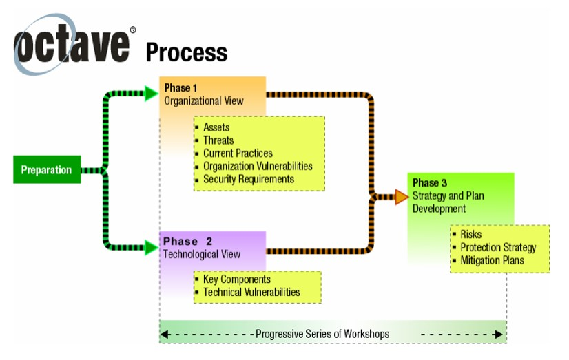

### [Assignment 1: Risk Identification Report](ISM_A1_RiskIdentificationReport.pdf)

 

#### Table of Contents
1.	Executive Summary
2.	Methodology
3.	Risk Assessment\
 3.1.	Maintain Status Quo\
 3.1.1.	Threat Profiles\
 3.1.2.	Mitigation Plan\
 3.2.	Proposed Changes\
 3.2.1.	Threat Profiles\
 3.2.2.	Mitigation Plan
4.	Recommendations
5.	Timeline
6.	Conclusions
Abbreviations and Acronyms
Reference

#### 1.	Executive Summary
Pampered Pets (Figure 1) is considering a digital transformation to expand its business. This report evaluates the risks associated with current operations and proposed digitalization, offering risk mitigation strategies and assesses the advisability of this transformation. 

Figure 1: Business Overview

#### 2.	Methodology
The OCTAVE-S method, suited for small organizations with fewer than 100 employees (Alberts et al, 2005; PECB, N.D.), was used.  This method is based on three phases described in OCTAVE criteria (Figure 2).

Figure 2: OCTAVE Phases (Alberts et al, 2003; Shevchenko et al, 2018)

   
#### 3.	Risk Assessment
| Risk level |
| :---- |
| 🔘🔘🔘	None |
| ⚫🔘🔘	Low |
| ⚫⚫🔘	Medium |
| ⚫⚫⚫	High |

#### 3.1.	Maintain Status Quo

#### 3.1.1.	Threat Profiles
| **Critical Asset** |	**Description**	| **Threats**	| **Vulnerabilities** | **Risk level** |
| :----------------- | :-------------- | :---------- | :------------------ | :------------- |
| Customer Data | Contact and order records	| Data breach, unauthorized access, damage |	Lack of access control, poor disposal, limited backups | ⚫⚫⚫ |
| Financial Data	| Transaction records |	Unauthorized access, data loss, hardware failure |	Weak passwords, outdated software, limited backups | ⚫⚫⚫ |
| Inventory Database |	Warehouse inventory tracking |	Data loss, unauthorized access, inaccuracies	| Weak passwords, outdated software, single point of failure	| ⚫⚫🔘 |
| Reputation |	Customer trust, supplier relationships	| Inefficiency, missed orders	| Limited online presence, lack of reputation management	| ⚫⚫🔘 |
| Supply Chain |	Local suppliers | Supplier disruptions, quality issues |	Dependence on local suppliers, limited alternatives | ⚫⚫🔘 |

#### 3.1.2.	Mitigation Plan
| **Threat/Vulnerability** |	**Mitigation Strategy** |
| :----- | :----- |
| Physical theft/damage	| Implement access controls, secure disposal, regular digital backups |
| Unauthorized access/data loss	| Enforce strong passwords, multi-factor authentication, antivirus software, regular data backups |
| Data breaches/malware	| Use firewalls, intrusion detection, regular security updates, cybersecurity training |
| Outdated technology/single point	| Move inventory to a cloud-based system with redundancy, upgrade hardware |
| Limited online presence	| Create website and social media presence |
| Supply chain disruptions	| Diversify suppliers, develop contingency plans |

#### 3.2.	Proposed Changes
 - E-commerce platform: Online store for receiving orders.
 - Online payment gateway: Secure system for online payments.
 - Social Media Marketing: Increase brand visibility and customer engagement.
 - ERP System: Streamline operations and inventory management, including DMS, CRM, and WMS.

#### 3.2.1.	Threat Profiles
| **Critical Asset** |	**Description**	| **Threats**	| **Vulnerabilities** | **Risk level** |
| :----------------- | :-------------- | :---------- | :------------------ | :------------- |
| E-commerce platform	| Online store	| Cyberattacks, DDoS, data breaches | Software vulnerabilities, weak authentication, lack of security | ⚫⚫⚫ |
| Online payment gateway |	Payment processing system |	Fraudulent transactions, data breaches |	Insecure processing, lack of fraud detection |	⚫⚫⚫ |
| ERP system	| Integrated ERP with DMS, CRM, WMS |	Technical failures, unauthorized access |	Weak passwords, lack of access controls |	⚫⚫⚫ |
| Social Media Account |	Platforms for marketing | Account hijacking, misinformation |	Weak passwords, phishing, lack of policy |	⚫⚫🔘 |

#### 3.2.2.	Mitigation Plan
| **Threat/Vulnerability** |	**Mitigation Strategy** |
| :----- | :----- |
| Website/system vulnerabilities	| Implement security measures, regular updates, vulnerability scanning, penetration testing, WCAG compliance |
| Weak authentication/access controls |	Enforce strong passwords, multi-factor authentication, access control policies |
| Data breaches/privacy violations |	Encrypt data, implement data loss prevention, GDPR compliance |
| DDoS attacks |	DDoS mitigation services, ensure sufficient server capacity |
| Online payment fraud |	Reputable payment gateways with fraud detection, PCI DSS compliance |
| Social media risks |	Implement social media policies, use strong passwords, two-factor authentication |

#### 4.	Recommendations
We recommend pursuing digital transformation for Pampered Pets due to its growth and efficiency potential.
 - **Growth Potential:** An online presence can expand customer base, offering convenience and increasing the possibility of achieving 50% growth target.
 - **Cost Reduction:** Switching to international supply chain could reduce costs, requiring careful quality control.
 - **Customer Retention:** Online features and delivery options can enhance convenience and retention, preventing market share loss.

#### 5.	Timeline
A realistic timeline for digital transformation is 18-24 months.
| **Phase** |	**Actions** |
| :----- | :----- |
| Planning (9-12 months) |	Define goals, conduct risk assessment, select technology, create investment plan |
| Infrastructure Setup (3-4 months)	| Upgrade network security and IT infrastructure, implement ERP system with DMS integration |
| Data Conversion (3-4 months) | Scan documents to DMS, automate data entry |
| Staff Training (1-2 months) |	Train on new systems, cybersecurity workshops |
| UAT Testing (1 month) |	Test systems with users, address issues and feedback |
| Rollout (1 month) |	Launch ERP and e-commerce platforms, monitor performance |
| Optimization/Expansion (Post-implement) |	Integrate CRM and WMS with ERP, explore international expansion |

#### 6.	Conclusions
Digitalization offers significant growth and efficiency potential. Essential steps include robust cybersecurity, data protection compliance, and a phased approach with thorough planning, testing, and staff training.

  

---

#### Abbreviations and Acronyms

|  |  |
| :------- | :---------- |
| CRM | Customer Relationship Managemer |
| DDoS | Distributed Denial-of-Service |
| DMS | Document Management System |
| ERP | Enterprise Resource planning |
| GDPR | General Data Protection Regulation | 
| OCTAVE | Operationally Critical Threat, Asset, and Vulnerability Evaluation |
| OCTAVE-S | Operationally Critical Threat, Asset, and Vulnerability Evaluation - Simplified |
| PCI DSS | Payment Card Industry Data Security Standard |
| WCAG | Web Content Accessibility Guideline |
| WMS | Warehouse Management System |

---

#### References
Addy, AC. (2023) Threat Modeling Methodology: OCTAVE. Available from: https://www.iriusrisk.com/resources-blog/octave-threat-modeling-methodologies [Accessed 25 June 2024].

Alberts, C. et al. (2003) Introduction to the OCTAVE Approach. Available from: https://insights.sei.cmu.edu/library/introduction-to-the-octave-approach/ [Accessed 25 June 2024].

Alberts, C. et al. (2005) OCTAVE-S Implementation Guide, Version 1.0.  Available from: https://insights.sei.cmu.edu/documents/1608/2005_002_001_14273.pdf [Accessed 26 June 2024].

Aven, T (2016) Risk Assessment and risk management: Review of recent advances on their foundation. European Journal of Operational Research 253(1): 1-13. DOI: https://doi.org/10.1016/j.ejor.2015.12.023

Bonnie, E. (2023) How to Develop a Risk Management Methodology + 6 Popular Types to Choose From. Available from: https://secureframe.com/blog/risk-management-methodologies [Accessed 24 June 2024].

Campbell, T. (2016) Practical Information Security Management. 1st ed. New York:
Apress. Available from: https://insights.sei.cmu.edu/library/introducing-octave-allegro-improving-the-information-security-risk-assessment-process/ [Accessed 27 June 2024].

Caralli, R, et al. (2007) Introducing OCTAVE Allegro: Improving the Information Security Risk Assessment Process 

Chamberlain, S. (2022) The Benefits of Utilizing the OCTAVE Threat Model. Available from: https://www.eccouncil.org/cybersecurity-exchange/threat-intelligence/octave-threat-model-benefits/ [Access 25 June 2024]

COrsO. (2024) Threat Modeling Methodology: The OCTAVE Method and its Variants. Available from: https://c0rs0.medium.com/the-octave-method-and-its-variants-octave-allegro-and-octave-s-dc49ce51a05e [Accessed 27 June 2024] 

Deloitte. (2018) Managing Risk in Digital Transformation.  Available from: https://www2.deloitte.com/content/dam/Deloitte/in/Documents/risk/in-ra-managing-risk-digital-transformation-1-noexp.pdf [Accessed 24 June 2024].

Febria, ZD. & Suroso, SJ. (2018) Risk Management of Debtor Information System (At Bank XYZ Using OCTAVE Allegro Method). Available from: https://www.researchgate.net/publication/327859251 [Accessed 27 June 2024]

GDPR. (N.D.) General Data Protection Regulation. Available from: https://gdpr.eu/tag/gdpr/ [Accessed 22 June 2024].

Harahap, MR. (2011) Information Technology Risk Measurement: Octave-S Method. DOI: 10.21512/commit.v5i1.556

ICO. (N.D.) UK GDPR guidance and resources. Available from: https://ico.org.uk/for-organisations/uk-gdpr-guidance-and-resources/ [Accessed 22 June 2024].

IriusRisk. (2023). Methodologies Blog. Available from: https://www.iriusrisk.com/resources-blog/methodologies [Accessed 22 June 2024].

Kirvan, P. (2023) Top 12 IT security frameworks and standards explained. Available from: https://www.techtarget.com/searchsecurity/tip/IT-security-frameworks-and-standards-Choosing-the-right-one?vgnextfmt=print%20%5bAccessed%201%20July%202022%5d  [Accessed 27 June 2024].

Kovaitė, K. & Stankevičienė, J. (2019) Risks of Digitalisation of Business Models. International Scientific Conference - Contemporary Issues in Business, Management and Economics Engineering 2019. DOI: https://doi.org/10.3846/cibmee.2019.039

Lasi, H. et al. (2014). Industry 4.0. Business & Information Systems Engineering 6(4): 239-242. DOI: 10.1007/s12599-014-0334-4

Lambrinoudakis, C. et al. (2022) Compendium of Risk Management Frameworks with Potential Interoperability – Supplement to the Interoperable EU Risk Management Framework Report. Available from: https://www.studocu.com/cl/document/universidad-los-leones/ingenieria-gestion/enisa-report-compendium-of-risk-management-frameworks-with-potential-interoperability/39177721 [Accessed 24 June 2024].

PCI Security Standards Council. (N.D.) PCI Security Standards Overview. Available from: https://www.pcisecuritystandards.org/standards/ [Accessed 22 June 2024].

PECB (N.D.) Risk Assessment with OCTAVE. Available from: https://pecb.com/whitepaper/risk-assessment-with-octave [Accessed 25 June 2024].

Shevchenko, N. (2018) Threat Modeling: 12 Available Methods. Available from: https://insights.sei.cmu.edu/blog/threat-modeling-12-available-methods/ [Accessed 27 June 2024].

Shevchenko, N. et al. (2018) Threat Modeling: A Summary of Available Methods.  Available from: https://insights.sei.cmu.edu/library/threat-modeling-a-summary-of-available-methods/ [Accessed 24 June 2024].

Shostack, A. (2014) Threat Modeling: Designing for Security. 1st ed. Indianapolis:
John Wiley & Sons.

Sobieski, S. (2012) Implementation of the OCTAVE Methodology in Security Risk Management Process for Business Resources. DOI: 10.1007/978-3-642-25355-3_21

Stephanus, S. (2014) Implementation Octave-S and ISO 27001controls in Risk Management Information Systems. Binus Journal Publishing 5(2). DOI: https://doi.org/10.21512/comtech.v5i2.2225

  

---

[Return to Module 4](ISM_main.md)
