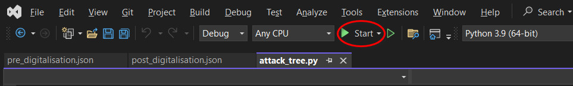
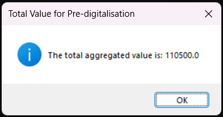

### [Assignment 2: README – Attack Tree Visualization Application](ISM_A2_README.pdf)

 

🔗[Attack Tree Visualization Application - Python Scripts](attack_tree\index.md)

 

#### Overview
This application was developed to analyze the risks associated with Pampered Pets, a business considering digital transformation. The goal was to evaluate both the current operational risks (Pre-digitalisation) and the potential risks introduced by digitalisation (Post-digitalisation).

This Python application visualizes an attack tree based on a JSON input specification. The attack tree represents potential threats to a system, and users can assign values (monetary amounts or probabilities) to the leaf nodes. The application aggregates these values to determine the overall impact of identified threats. It uses the PyVis library to create an interactive graphical representation of the attack tree. The application is designed to be user-friendly and interactive, leveraging Python libraries to handle graph structures and visualizations. Users can easily input data and receive meaningful visual and numerical outputs.

Below Figure 1 illustrates the threats assessed by the OCTAVE-S method in the previous Risk Identification Report.

Figure 1: Threats of Pre-digitalisation and Post-digitalisation

#### Key Features
1.	Interactive Visualization: The PyVis library enables an interactive attack tree visualization, making it easy to explore node relationships and values. Users can zoom, pan, and click on nodes for detailed information (Pyvis, N.D.).
2.	User Input Handling: The application uses Tkinter for user input, ensuring a smooth and intuitive data entry process. This allows users to assign values to leaf nodes easily, without needing to modify the JSON directly (Acsany, 2024; Boff Nunes, 2024; Python, N.D.a).
3.	Value Aggregation: The application accurately sums the values provided by the user to reflect the overall threat assessment. This offers a clear and concise overview of the total risk associated with the system.

#### Execution Instructions
1.	Ensure Python 3.x is installed on your IDE.
2.	Ensure the required Python libraries (networkx, pyvis, json, tkinter) are installed. If not, install the packages using pip.
3.	Save the provided Python code in a file named attack_tree.py.
4.	Save the provided JSON files as pre_digitalisation.json and post_digitalisation.json in the same directory as your Python script.
5.	Execute the attack_tree.py script.
   
    

6.	The application will open a series of dialogs asking for input values for each leaf node.  Enter the values as prompted.
   
     

7.	After entering all values, the script will display the total aggregated value and create HTML files for visualizing the attack trees:
    
     

     
 
8.	The HTML files will be saved in the same directory where you run the Python script. Ensure you know the path to this directory.
    
  

9.	Open the HTML files in a web browser to view the attack tree before and after user inputs.

#### Input
1.	**JSON files:** The application accepts an attack tree specification in JSON format. The JSON structure should define the hierarchy of nodes and their relationships (Figure 2 and Figure 3).
   
    Figure 2: JSON input specification of Pre-digitalisation	

    

    Figure 3: JSON input specification of Post-digitalisation 	 

    

2.	**User Input:** During execution, the application will prompt the user to enter values (monetary amounts or probabilities) for each leaf node. User can measure an organization’s loss from a single threat using the Single Loss Exposure (SLE) formula:

        SLE = AV × EF
  	
    Asset Value (AV) is a synthetic measure of the cost of creating, developing, supporting, replacing, and owning an asset.  Exposure Factor (EF) is a measure of the magnitude of loss or impact on the value of an asset from a threat event, expressed as a percentage of the asset value (Bistarelli et al., 2011).
  
    Due to limitations in the financial information of Pampered Pets, the demonstration provided is just a sample figure and does not consider SLE.

#### Output
The application produces two sets of HTML files:
1.	Visualizes the initial attack tree with default values – zero (Figure 4 and Figure 5).
2.	Visualizes the final attack tree with user-provided values and aggregated results (Figure 6 and Figure 7).

Figure 4: Initial attack tree of Pre-digitalisation

*attack_tree_initial_pre_digitalisation.html*	

Figure 5: Initial attack tree of Post-digitalisation

*attack_tree_initial_post_digitalisation.html*

 	 
Figure 6: Final attack tree of Pre-digitalisation

*attack_tree_final_pre_digitalisation.html*	

Figure 7: Final attack tree of Post-digitalisation

*attack_tree_final_post_digitalisation.html*

#### Dependencies and libraries

| **Import** |	**Description** |
| :--------- | :-------------- |
| json |	A module for parsing JSON data, used to load attack tree structures from JSON files. The attack tree is specified in JSON format (Acsany, 2024; Boff Nunes, 2024; Python, N.D.a). |
| networkx |	A library for creating and manipulating complex networks, used to create and manage the attack tree graph (NetworkX, N.D.). |
| pyvis.network	| A module from the PyVis library that enables the creation of interactive network visualizations in a web browser (Pyvis, N.D.). |
| tkinter	| A standard GUI library for Python, used to create dialogs for user input (Amos, N.D.; Klein, 2022; Python, N.D.b). |
| simpledialog	| A submodule of Tkinter for simple dialog boxes, used to prompt the user for input values (Python, N.D.c; W3resource, 2023). |
| messagebox	| A submodule of Tkinter for message boxes, used to display information to the user (Python, N.D.d; Tutorialspoint, 2024). |

#### Code Explanation

| **Appendix** |	**Function** |	**Arguments** |	**Description** |
| :----------- | :----------- | :------------ | :-------------- |
| **1** |	parse_attack_tree	| **data** (dict): The JSON data representing the attack tree.   **parent** (str): The parent node name.   **G** (networkx.DiGraph): The NetworkX graph object.	| This function converts the JSON into a NetworkX graph by recursively parses the JSON structure, adding nodes and edges to the graph. |
| **2** |	visualize_attack_tree |	**G** (networkx.DiGraph): The NetworkX graph object.  **filename** (str): The name of the output HTML file. |	This function uses PyVis to create an HTML visualization of the attack tree. |
| **3** |	input_values	| **G** (networkx.DiGraph): The NetworkX graph object. |This function prompts the user to input values for the leaf nodes using Tkinter dialogs. |
| **4** |	aggregate_values	| **G** (networkx.DiGraph): The NetworkX graph object. |	This function calculates the total value of the attack tree by using depth-first search to traverse the tree and aggregate values from the leaf nodes to the root. |
| **5** |	main	| |	The main function ties everything together. It parses the JSON, visualizes the initial tree, collects user inputs, aggregates the values, and finally visualizes the updated tree. |
 
#### Conclusion
The Attack Tree Visualization Application is an essential tool for cybersecurity professionals and risk managers. It helps analyze and visualize the risks associated with Pampered Pets' digital transformation, both pre-digitalisation and post-digitalisation.

By leveraging Python libraries like NetworkX and PyVis, the application provides an interactive and user-friendly interface to explore potential threats. Users can easily input data and receive meaningful visual and numerical outputs, facilitating a better understanding of the risk landscape.

By following the provided installation and execution instructions, users can quickly set up the application. This enables them to visualize their system's vulnerabilities and potential threats effectively.

In conclusion, the Attack Tree Visualization Application is a powerful and valuable resource for anyone involved in risk management. It helps stakeholders make informed decisions about mitigation strategies, ensuring a comprehensive understanding of potential threats to their systems.

  

---

#### References
Abouelnaga, M. & Jakobs, C. (2023) Security Risk Analysis Methodologies for Automotive Systems. Available from: https://www.researchgate.net/publication/372137168_Security_Risk_Analysis_Methodologies_for_Automotive_Systems [Accessed 9 July 2024]. 

Acsany, P. (2024) Working with JSON Data in Python. Available from: https://realpython.com/python-json/ [Accessed 10 July 2024].

Amos, D. (N.D.) Python GUI Programming with Tkinter. Available from: https://realpython.com/python-gui-tkinter/ [Accessed 14 July 2024].

Bistarelli, S. et al. (2011) Evaluation of complex security scenarios using defense trees and economic indexes. Journal of Experimental & Theoretical Artificial Intelligence 24(2):1-32. DOI: https://doi.org/10.1080/13623079.2011.587206

Boff Nunes, F. (2024) A Practical Guide to JSON Parsing with Python.  Available from: https://www.zyte.com/blog/json-parsing-with-python/ [Accessed 10 July 2024]

Isograph (N.D.) AttackTree. Available from: https://www.isograph.com/software/attacktree/ [Accessed 9 July 2024].

Khan, A. et al. (2023) Integrated Attack Tree in Residual Risk Management Framework. Information 2023 14(12): 639. DOI: https://doi.org/10.3390/info14120639

Klein, B. (2022) Tkinter - the Python interface for Tk.  Available from: https://python-course.eu/tkinter/ [Accessed 14 July 2024]

NetworkX. (N.D.) Tutorial. Available from: https://networkx.org/documentation/stable/tutorial.html [Accessed 13 July 2024]. 

Python. (N.D.a) Json – JSON encoder and decoder. Available from: https://docs.python.org/3/library/json.html [Accessed 10 July 2024]

Python. (N.D.b) Tkinter – Python interface to Tcl/Tk. Available from: https://docs.python.org/3/library/tkinter.html [Accessed 14 July 2024].

Python. (N.D.c) Tkinter Dialogs. Available from: https://docs.python.org/3/library/dialog.html [Accessed 14 July 2024] 

Python. (N.D.d) Tkinter.messagebox – Tkinter message prompts. Available from: https://docs.python.org/3/library/tkinter.messagebox.html [Accessed 14 July 2024]. 

Pyvis. (N.D.) Interactive network visualizations. Available from: https://pyvis.readthedocs.io/en/latest/index.html [Accessed 13 July 2024].

Saini, V. et al. (2008) Threat Modeling Using Attack Trees. Consortium for Computing Sciences in Colleges: Mid-South Conference 23(4): 124-131. Available from: https://www.researchgate.net/publication/234738557_Threat_Modeling_Using_Attack_Trees  [Accessed 11 July 2024].

Shevchenko, N. (2018) Threat Modeling: 12 Available Methods. Available from: https://insights.sei.cmu.edu/blog/threat-modeling-12-available-methods/ [Accessed 27 June 2024].

Shevchenko, N. et al. (2018) Threat Modeling: A Summary of Available Methods.  Available from: https://insights.sei.cmu.edu/library/threat-modeling-a-summary-of-available-methods/ [Accessed 24 June 2024].

Shostack, A. (2014) Threat Modeling: Designing for Security. 1st ed. Indianapolis:
John Wiley & Sons.

Tidmarsh, D. (2023) What You Need to Know About Attack Trees. Available from: https://www.eccouncil.org/cybersecurity-exchange/threat-intelligence/attack-trees-cybersecurity/ [Accessed 9 July 2024].

Tutorialspoint. (2024) Tkinter tkMessageBox. Available from: https://www.tutorialspoint.com/python/tk_messagebox.htm#:~:text=The%20tkMessageBox%20module%20is%20used,askokcancel%2C%20askyesno%2C%20and%20askretryignore [Accessed 14 July 2024]

Vitkus, D. et al. (2020) Method for Attack Tree Data Transformation and Import into IT Risk Analysis Expert Systems. Applied Sciences 10(23): 8423. DOI: https://doi.org/10.3390/app10238423

W3resource. (2023) Python Tkinter: Creating a custom input dialog. Available from: https://www.w3resource.com/python-exercises/tkinter/python-tkinter-dialogs-and-file-handling-exercise-5.php [Accessed 14 July 2024]

  

-----

Appendix 1 parse_attack_tree

 

Appendix 2 visualize_attack_tree

 

Appendix 3 input_values

 

Appendix 4 aggregate_values

 

Appendix 5 main

 

  

--- 

[Return to Module 4](ISM_main.md)
