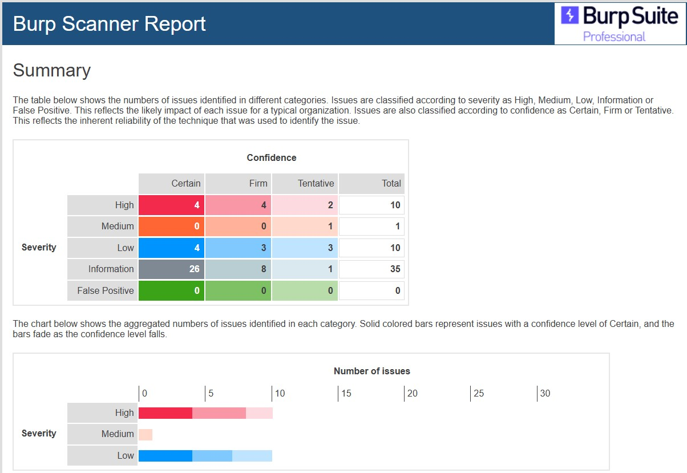

### [Vulnerability Audit and Assessment - Results and Executive Summary](Module03_ResultsandExecutiveSummary.pdf)

 

#### Table of Contents
1.	Executive Summary
2.	Scan Results
3.	Methodology
4.	Network-level Information
5.	Findings
6.	Risk Assessment
7.	Recommendations
8.	Conclusions
Reference

#### 1.	Executive Summary
The Gin & Juice Shop website (G&J) (https://ginandjuice.shop/) underwent a thorough vulnerability audit aimed at identifying security risks and ensuring compliance with critical standards such as the General Data Protection Regulation (GDPR) and Web Content Accessibility Guidelines (WCAG).

The automated scanning was conducted on 1 June 2024 using Burp Suite Professional (Figure 1), uncovering several critical vulnerabilities including SQL Injection, XML External Entity Injection (XXE), HTTP Response Header Injection, and Cross-Site Scripting (XSS). These vulnerabilities present significant security threats that require immediate remediation to protect the website and its users.

Figure 1: Burp Scanner Report Summary

#### 2.	Scan Results
The scan results provide detailed insights into each identified vulnerability, categorized by severity level. An expanded definition of the known threats and their remediation solutions is also available.

| **Severity**	| **Count** |
| :----------- | :-------- |
| High	| 10 |
| Medium | 1 |
| Low	| 10 |

The completed [Burp Scanner Report](BurpSuiteReport_Deep_20240601.html) is provided as supplementary.

#### 3.	Methodology
The assessment employed both automated scanning and manual testing to verify findings and ensure compliance with GDPR and WCAG standards. Basic network-level information was also collected. The primary limitations included using trial versions of tools and focusing solely on disclosed website functionalities.

| **Methodology** | **Tool used** | **Objective** |
| :-------------- | :------------ | :------------ |
| Automated Scanning	Burp Suite Professional	Identify potential security vulnerabilities like SQL injection, XSS, and others.
Manual Testing	Manual	Verify findings and check compliance with GDPR and WCAG.
	TPGi.	Colour Contrast Analyzer (CCA) is used to determine the accessibility of the contrast ratio of two colours for WCAG compliance.
	WAVE	Web Accessibility Evaluation Tools are used to identify accessibility and WCAG errors.
Basic Scanning	Traceroute	Identify the path taken by packets from the source to the destination.
	Nslookup	Identify DNS records associated with the website.
	ICANN Lookup	Provide registration details and contact information for a given IP address.

#### 4.	Network-level Information

| **Information** | **Detail** |
| :-------------- | :--------- |
IP Address	 
Name Server	 
Registered Contact	Amazon Data Services Ireland Limited
MX Record	awsdns-hostmaster.amazon.com
Hosting Location	Ireland
Hops from Source to Destination	12 hops
Biggest Delay in Route	Averaging 304.67ms 

#### 5.	Findings
The assessment found several vulnerabilities, summarized below:

| **Severity** | **Issue** | **Description** | **Count** |
| :----------- | :-------- | :-------------- | :-------- |
High	SQL Injection	Identified in various parameters, allowing manipulation of SQL queries.	2
High	XXE	Vulnerable to XXE injection, allowing external entity definitions in XML.	1
High	HTTP Response Header Injection	Allows injection of newline characters.	1
High	XSS 	Reflected XSS vulnerabilities enabling execution of malicious scripts.	3
High	Client-side Template Injection	Allows session hijacking, credential theft, and unauthorized actions.	2
High	External Service Interaction 	Enables server-side HTTP requests to arbitrary domains.	1
Medium	Password Returned in Later Response	Returns users' passwords in clear form in later responses.	1
Low	Vulnerable JavaScript Dependencies	Outdated JavaScript libraries with known vulnerabilities.	1
Low	Open Redirection (DOM-based)	Potential for redirecting users to malicious sites.	2
Low	Link Manipulation (Reflected DOM-based)	Multiple instances of Reflected DOM-based vulnerabilities.	3
Low	Strict Transport Security Not Enforced	Allows connections over unencrypted HTTP.		4

#### 6.	Risk Assessment
The risk assessment evaluates compliance with GDPR and WCAG standards to ensure comprehensive security and accessibility for users. 

**_GDPR Compliance_**
The GDPR compliance evaluation identified the following gaps:

| **Measures** | **Description** | **GDPR Standard** |
| :----------- | :-------------- | :---------------- |
Lack of Privacy Policy	No privacy policy displayed on the webpage.	Article 12
Consent Mechanisms	No cookie consent or mechanisms for managing cookie preferences.	Article 7
User Data Collection Disclosure	No information on data collection, storage, or processing.	Articles 13 – 14
User Rights	Insufficient mechanisms for users to access, rectify, and delete their data.	Articles 15 – 22 

**_WCAG Compliance_**
The WCAG evaluation, conducted with TPGi and WAVE, identified the following gaps:

| **Measures** | **Description** | **WCAG Guideline** |
| :----------- | :-------------- | :---------------- |
Language of Page	The language of the page is not identified.	3.1.1 (Level A)
Text Alternatives	Missing alternative text for many images.	1.1.1 (Level A)
Labels or
Instructions	Missing text label in form controls.	3.3.2 (Level A)
Unordered list	An unordered (bulleted) list is present.	1.3.1 (Level A)
Contrast Errors	Low contrast between text and background colours.		1.4.3 (Level AA)
 
#### 7.	Recommendations
Recommendations are based on the findings and include immediate actions to fix vulnerabilities by applying patches and adjusting system configurations as necessary.

| **Action to Take** |	**Justification** |
| **Immediate Remediation of High Severity Vulnerabilities** |
Use parameterized queries to prevent SQL injection.	Prevents user input from interfering with SQL query structure.
Disable processing of external entities in the XML parser.	Prevents XXE vulnerabilities, avoiding data exfiltration and denial of service attacks.
Validate and sanitize user input before including it in response headers.		Prevents header injection attacks.
Validate and HTML-encode user input for reflected XSS. Avoid dynamically writing untrusted data to the DOM for DOM-based XSS.	Prevents execution of malicious scripts, avoiding data theft, session hijacking, and unauthorized actions.
Implement input filtering to remove template expression syntax from user input before embedding in client-side templates.		Prevents client-side template injection, avoiding XSS attacks and related risks.
Implement a whitelist of permitted services and hosts for external interactions.		Prevents unauthorized external service interactions, avoiding server misuse.
 
| **Immediate Remediation of Medium Severity Vulnerabilities** |
Do not return passwords in application responses. Implement user impersonation with proper logging if needed.	Prevents credential theft, protecting user accounts and the application.
| **Immediate Remediation of Low Severity Vulnerabilities** |
Regularly update and secure JavaScript libraries to the latest versions.  Remove any unused libraries to reduce the attack surface.	Prevents exposure to attacks through outdated libraries.
Avoid dynamically setting redirection targets and target URLs with untrusted data. Implement URL whitelisting.	Prevents phishing attacks, unintended actions, and browser defense bypassing.
Enable HTTP Strict Transport Security (HSTS) by adding the Strict-Transport-Security header with an appropriate max-age value.	Ensures browsers only connect over HTTPS, preventing SSL stripping attacks.
| **Improve GDPR Compliance** |
Create a privacy policy page and add a prominent link to it on the homepage and footer.	Ensures transparency in data processing as required by Article 12.
Add a cookie consent banner and a settings page where users can manage their cookie preferences.	Ensures explicit consent for data processing activities as required by Article 7.
Provide clear disclosures about data collection, storage, and processing practices.	Ensures transparency about data practices per Articles 13-14.
Provide user account settings or a contact form for users to manage their personal data rights.	Ensures users can access, correct, and delete their data as per Articles 15-22.
| **Improve WCAG Compliance** |
Specify the language of the page using the lang attribute in the HTML tag.	Ensures primary language identification for accessibility as per Guideline 3.1.1.
Review all images on the website and ensure they have appropriate alt text.	Ensures text alternatives for non-text content as required by Guideline 1.1.1.
Review all form controls and ensure they have descriptive labels.	Ensures labels or instructions for form controls as required by Guideline 3.3.2.
Ensure that lists are correctly marked up and accessible.	Ensures programmatic conveyance of information and relationships as per Guideline 1.3.1.
Adjust text and background colors to meet minimum contrast standards.	Ensures readability for users with visual impairments  as per Guideline 1.4.3.

#### 8.	Conclusions
The vulnerability assessment of the G&J website found critical security issues that could lead to data breaches and user security problems. The website also shows significant non-compliance with GDPR and WCAG standards.

By addressing the identified vulnerabilities and following the recommended measures, G&J can improve its security, comply with GDPR and WCAG standards, and provide a safer and more accessible user experience. Immediate action on these recommendations is crucial to reduce the identified risks and ensure the website's integrity and user trust.

  

---

#### Reference
A2 Hosting. (2024) How to troubleshoot network connectivity using ping and traceroute.  Available from: https://www.a2hosting.com/kb/getting-started-guide/internet-and-networking/troubleshooting-network-connectivity-with-ping-and-traceroute/ [Accessed 28 May 2024].

Acunetix. (2024) Negative Impacts of Automated Vulnerability Scanners and How to Prevent them.  Available from: https://www.acunetix.com/support/docs/faqs/negative-impacts-of-automated-vulnerability-scanners-and-how-to-prevent-them/#:~:text=Excessive%20server%20logging,unexpected%20and%20sometimes%20random%20data [Accessed 17 May 2024].

CWE. (2024) CWE List Version 4.14.  Available from: https://cwe.mitre.org/data/index.html [Accessed 16 May 2024].

GDPR. (2024) General Data Protection Regulation.  Available from: https://gdpr.eu/tag/gdpr/ [Accessed 14 May 2024].

ICANN Lookup. (2024) Registration data lookup tool.  Available from: https://lookup.icann.org/en [Accessed 28 May 2024].

Margau, A. (January 29, 2024) E-Commerce Web Accessibility: 2024 Essentials & 20 Tips for Businesses.  Clym. Available from: https://clym.io/accessibility-news/e-commerce-web-accessibility-2024-essentials-and-20-tips-for-businesses [Accessed 14 May 2024].

NsLookup. (2023) How does online nslookup work?.  Available from: https://www.nslookup.io/ [ Accessed 15 May 2024]

OWASP Top10. (2021) OWASP Top 10 - 2021. Available from: https://owasp.org/Top10/ [Accessed 14 May 2024]

PortSwigger. (2024) Vulnerabilities detected by Burp Scanner. Available from: https://portswigger.net/burp/documentation/scanner/vulnerabilities-list [Accessed 17 May 2024]

Priyawati, D. et al. (2022) Website Vulnerability Testing and Analysis of Internet Management Information System Using OWASP.  International Journal of Computer and Information System 3(3): 143-147.  DOI: https://doi.org/10.29040/ijcis.v3i3.90

PurpleSec. (2019) Sample Network Vulnerability Assessment Report 2019/03.  Available from: https://purplesec.us/wp-content/uploads/2019/03/Sample-Network-Security-Vulnerability-Assessment-Report-Purplesec.pdf [Accessed 1 June 2024].

PurpleSec. (2019) Sample Vulnerability Assessment Report - Example Institute 2019/12.  Available from: https://purplesec.us/wp-content/uploads/2019/12/Sample-Vulnerability-Assessment-Report-PurpleSec.pdf [Accessed 1 June 2024].

TPGi. (2024) Colour Contrast Analyzer (CCA). Available from: https://www.tpgi.com/color-contrast-checker [Accessed 2 June 2024].

WAVE. (2024) WAVE Web Accessibility Evaluation Tools. Available from: https://wave.webaim.org [Accessed 2 June 2024].

WCAG. (2023) How to Meet WCAG-Quick Reference.  Available from: https://www.w3.org/WAI/WCAG22/quickref/?versions=2.2&currentsidebar=%23col_overview [Accessed 14 May 2024].

  

----

[Return to Module 3](NS_main.md)
