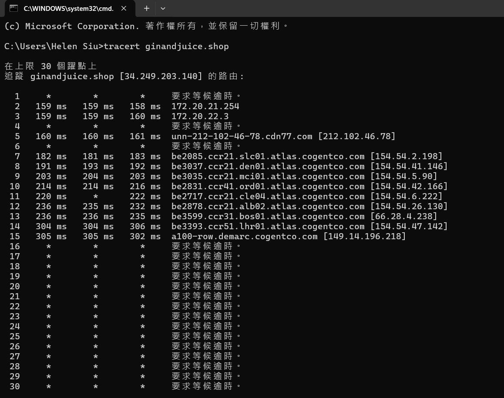
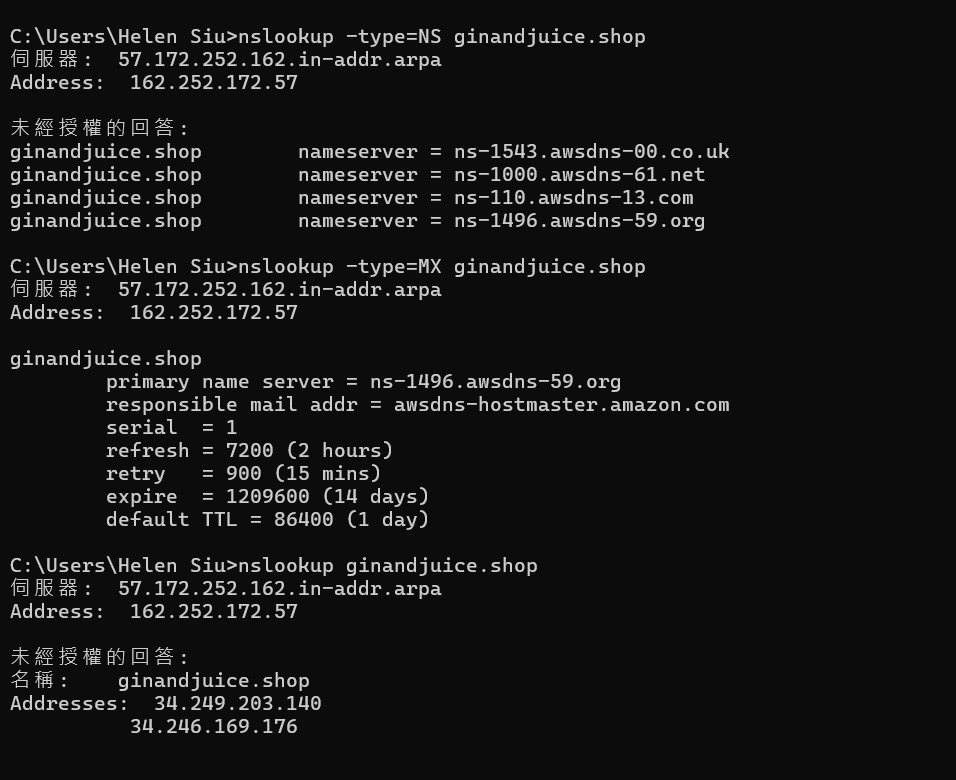
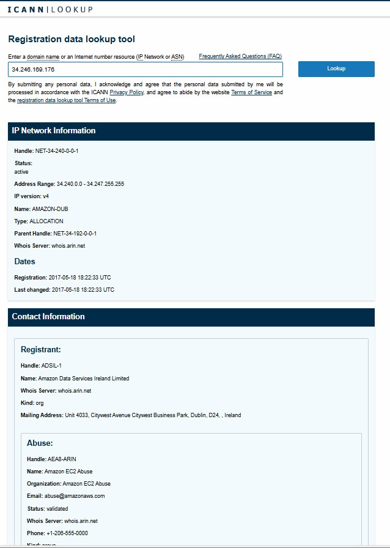
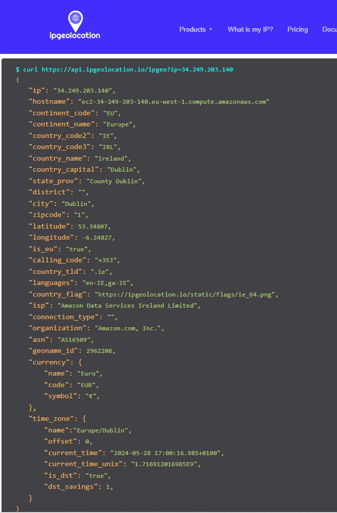

# Scanning Activity

### Introduction
This activity conducts the basic scan using standard tools such as Traceroute / Tracert and Nslookup as preparation for the Assignment 2 "Vulnerability Audit and Assessment - Results and Executive Summary" on [Gin & Juice Shop Ecommerce](https://ginandjuice.shop/).

### Scanning Output
#### Tracert (Windows)

#### Nslookup

#### Whois from [ICANN Whois](https://lookup.icann.org/en/lookup) 

#### IP geolocation from [IP geolocation service](https://ipgeolocation.io) 

### Analysis
1. How many hops from your machine to your assigned website?
   - From the Tracert output, we can see that the command reached 12 hops.
     
2. Which step causes the biggest delay in the route? What is the average duration of that delay?
    - From the Tracert output, we can identify the hop 14 has the highest delay.
    - Average Duration of the Delay: (304 + 304 + 306) / 3 = 304.67 ms
      
3. What are the main nameservers for the website?
    - From the Nslookup output for NS records, below are the main nameservers:
       - ns-1543.awsdns-00.co.uk
       - ns-1000.awsdns-61.net
       - ns-110.awsdns-13.com
       - ns-1496.awsdns-59.org
      
4. Who is the registered contact?
   - Use [ICANN Whois](https://lookup.icann.org/en/lookup) to search the contact information of below IP addresses:
     
   | **IP** | **Name** | **Mailing address** |
   | :----- | :---------- | :---------------------------------- |
   | 34.249.203.140 | Amazon Data Services Ireland Limited | Unit 4033, Citywest Avenue Citywest Business Park, Dublin, D24, Ireland |
   | 34.246.169.176 | Amazon Data Services Ireland Limited | Unit 4033, Citywest Avenue Citywest Business Park, Dublin, D24, Ireland |

5. What is the MX record for the website?
   - From the Nslookup output for MX records, the responsible mail address is: awsdns-hostmaster.amazon.com
 
6. Where is the website hosted?
   - Use [IP geolocation service](https://ipgeolocation.io) to identify the physical location of below IP addresses:
   
   | **IP** | **Country** | **Internet service provider (ISP)** |
   | :----- | :---------- | :---------------------------------- |
   | 34.249.203.140 | Ireland | Amazon Data Services Ireland Limited |
   | 34.246.169.176 | Ireland | Amazon Data Services Ireland Limited |

### Reflections
1. Did you have any issues or challenges with the scans?
   - I use Windows, and Nslookup in Windows does not directly support whois functionality. I tried to download and install third-party tools like the whois command-line utility from [Sysinternals by Microsoft](https://learn.microsoft.com/en-us/sysinternals/downloads/whois), but it also did not work.
  
2. How did you overcome them?
   - Therefore, I use online whois services like [ICANN Whois](https://lookup.icann.org/en/lookup) to get the same information.

3. How will they affect your final report?
   - For the final report, I will also try alternative ways if I cannot get the requested information in the Windows working environment.

---

### Reference
[Instructions on using traceroute, etc](https://www.a2hosting.com/kb/getting-started-guide/internet-and-networking/troubleshooting-network-connectivity-with-ping-and-traceroute/). 

---

[Return to Module 3 Unit 3](NS_Unit03.md)
