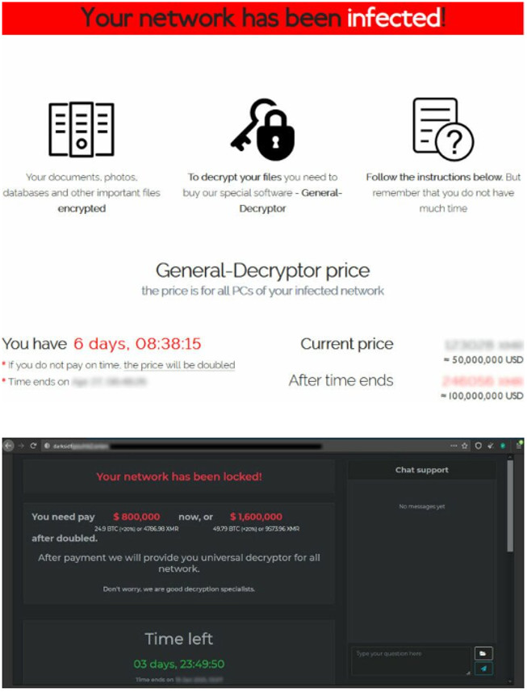
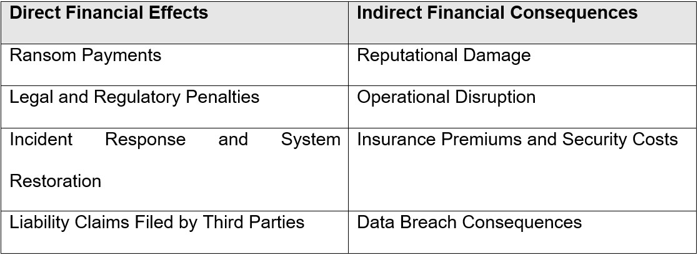
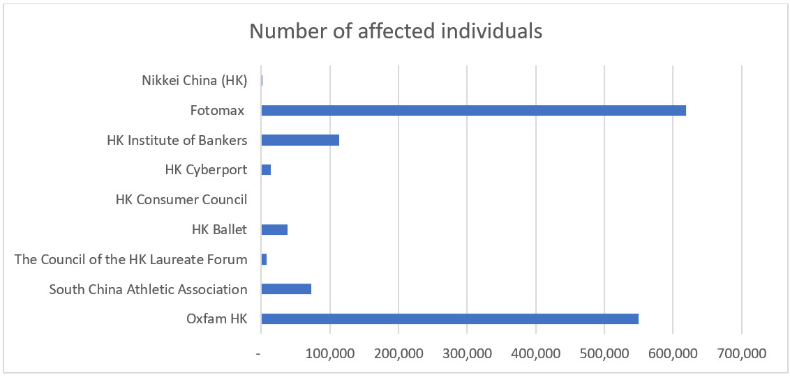
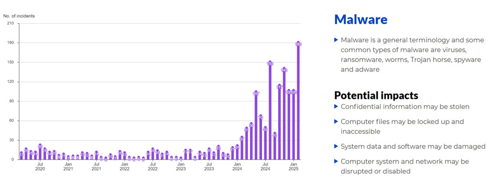

### [Literature Review](RMPP_A1.pdf)
_(Word count: 2187)_
 

### Topic
Financial Impact of Ransomware and Malware in Hong Kong.

### Table of Contents
1. Introduction
   
2. Main Discussion\
    2.1. Defining Ransomware and Malware\
    2.2. Overview of Financial Impacts\
    2.3. Hong Kong Context and Regulatory Framework\
    2.4. Synthesis of Key Themes and Gaps

3. Conclusion

Reference

Bibliography

  

### 1. Introduction
Cybersecurity incidents, particularly ransomware and malware attacks, have become increasingly sophisticated and widespread (August et al., 2022; Verizon Business, 2024). Although such threats are globally pervasive, Hong Kong’s position as a foremost financial hub (HKIMR, 2023) magnifies the repercussions of cyber intrusions, given the city’s dense network of multinational corporations, financial institutions, and small-to-medium enterprises (SMEs).

This literature review investigates the financial implications of such threats in Hong Kong by focusing on both direct and indirect financial impacts. It synthesises existing research on:
1.	Defining ransomware and malware.
2.	Financial effects directly linked to an attack (Anderson et al., 2019; Krivokapić et al., 2023).
3.	Indirect financial consequences that extend beyond the individual victim, often affecting society at large (Anderson et al., 2019; Krivokapić et al., 2023).

By examining both international and locally focused studies, this review identifies the current state of knowledge and highlights important research gaps. The discussion is framed within broader scholarship on cybersecurity risk management, thereby contextualising Hong Kong’s situation within global perspectives.

### 2. Main Discussion
#### 2.1 Defining Ransomware and Malware
Ransomware is commonly characterised as malicious software that encrypts a victim’s digital systems and demands payment (Figure 1), often in cryptocurrency, to restore data access (Möller, 2023; Tailor & Patel, 2017). Malware serves as an encompassing term for various harmful programs, including trojans, worms, viruses, and spyware (Sharma & Arora, 2021). These attacks frequently target organisations aiming to obtain financial gain, exfiltrate sensitive data, or disrupt standard business operations.

Researchers have noted that ransomware has progressed from early forms reliant on rudimentary encryption to more advanced variants featuring double or multiple extortion. In a double extortion scenario, the attack combines data theft with ransomware. A triple extortion refers to data-theft-capable ransomware that not only extracts sensitive information and encrypts an organisation’s files, but also deliberately applies multiple, staged extortion techniques, either against the same organisation or additional stakeholder parties whose information may have been captured in the initial attack (Payne & Mienie, 2021). 

Within Hong Kong, widespread internet usage, extensive data connectivity, and a significant concentration of financial services create an enticing target for cybercriminals   (FSDC, 2021). Indeed, the city’s financial market infrastructure is both intricate and highly interlinked, meaning a compromise in one entity can produce cascading repercussions for its partners and clients (Payne & Mienie, 2021).

   

Figure 1: Demonstration of ransomware gangs demanding ransom payment (Hong Kong Computer Emergency Response Team Coordination Centre (HKCERT), 2021)

#### 2.2. Overview of Financial Impacts
Anderson et al. (2019) propose a framework for examining the costs of cybercrime, distinguishing direct and indirect losses. Direct financial losses include the measurable expenses victims encounter when attacks succeed, such as ransom payments (criminal revenue) and system recovery outlays. Indirect losses signify broader societal or economic repercussions that arise beyond a single organisation, for example reputational harm and compliance obligations.

While Krivokapić et al. (2023) concentrate on ransomware and financial crimes, describing direct losses as expenses clearly connected to an incident, such as ransom fees, legal penalties and liability claims. Indirect losses as broader consequences that cannot be traced to one attacker or event, such as long-term reputational damage, higher insurance premiums, or the resource-intensive recovery process.

Other researchers, including August et al. (2022), Dupont et al. (2023), Aldaraani & Begum (2018), Tailor & Patel (2017), and Möller (2023), employ various definitions and offer differing statistics on the financial effects of ransomware and malware. Despite focusing on distinct aspects, ranging from market-based effects to smaller-scale organisational impacts, they collectively underscore the potential for heavy economic burdens.

After synthesising and critically evaluating the available studies, Table 1 summarise the possible financial impacts by distinguishing direct financial effects from indirect financial consequences. This typology aids risk management planning, clarifies potential outcomes, and shapes strategic cybersecurity responses.

  

Table 1: Financial Impact of Ransomware and Malware

**Ransom Payments**
The most evident direct cost in a ransomware incident is the ransom payment. In 2024, the average ransom demand rose to US$2.73 million, while the largest single payment publicly disclosed during the first half of that year reached US$75 million (Elgan, 2024). 

Although paying a ransom might expedite data decryption, it does not guarantee that perpetrators will fully restore compromised files (August et al., 2022; Cartwright & Cartwright, 2019). Furthermore, organisations that comply with ransom demands may inadvertently brand themselves as vulnerable, potentially inviting subsequent attacks (Aldaraani & Begum, 2018; Cartwright & Cartwright, 2019).

Hong Kong Although numerous ransomware attacks have occurred in Hong Kong, confirmed details regarding actual ransom payments are limited due to confidentiality and reputational sensitivities, resulting in scarce official disclosures. According to data breach investigations disclosed by the Office of the Privacy Commissioner for Personal Data (PCPD), no ransom payments have been confirmed thus far (PCPD, n.d.b).

**Legal and Regulatory Penalties**
Legal and regulatory frameworks represent another category of direct costs. Under the Personal Data (Privacy) Ordinance (PDPO), the PCPD can fine organisations up to HKD 1 million if they fail to safeguard personal data with an intent to obtain gain or cause specific harm to the data subject or their relatives (PCPD, 2022). Proposals to amend the law are also underway (Cole & Leung, 2024; Lau, 2025).

Where data breaches involve European Union (EU) citizens, organisations may face additional penalties under the General Data Protection Regulation (GDPR), which stipulates fines of up to 20 million euros or 4% of global turnover (EU, 2016). Following an incident, regulators may mandate additional measures, such as improved encryption systems or external audits (PCPD, n.d.b), leading to direct, incremental technology and consulting costs. 

**Incident Response and System Restoration**
Even if no ransom is paid, the technical repercussions can be substantial. System restoration typically involves reformatting affected hardware, rebuilding server environments, and applying updated software patches, all of which require specialised cybersecurity expertise (Krivokapić et al., 2023). Incident-response teams may spend weeks or even months analysing the root causes (IBM, 2024), frequently collaborating with government or legal departments such as the PCPD (PCPD, n.d.a), the Cyber Security and Technology Crime Bureau (CSTCB) (Hong Kong Police Force, n.d.), the Government Computer Emergency Response Team Hong Kong (GovCERT.HK) (GovCERT.HK, n.d.), and the HKCERT (HKCERT, n.d.).

Forensic investigations are crucial for understanding precisely how threats penetrate systems and for implementing preventative measures to mitigate future incursions (IBM, 2024).  The downtime occasioned by such procedures can interrupt trading activities or client-facing services, resulting in immediate and direct revenue losses (Anderson et al., 2019; Krivokapić et al., 2023).

**Liability Claims Filed by Third Parties**
If business partners believe that protective measures were inadequate, they may file lawsuits for negligence or withdraw future business. Clients whose personal or financial information has been compromised may also lodge compensation claims, particularly if identity theft or financial fraud occurs. Settlement amounts, legal representation, and court fees can escalate organisational expenditure (Federal Trade Commission, 2024).

**Reputational Damage**
A significant theme in the literature is the enduring impact of eroding stakeholder trust, which can surpass the immediate aftermath of a ransomware payment (Anderson et al., 2019). Given Hong Kong’s prominence as a global financial centre, media and public scrutiny tend to intensify following any serious cyber incident. Banks or multinational corporations that fail to secure client data risk seeing investors and customers migrate to competitors perceived as more secure. Although difficult to measure precisely, reputational damage can lead to depreciated goodwill (IBM, 2024).

**Operational Disruption**
Once data are potentially compromised, organisations generally suspend normal operations to verify system integrity. Prolonged interruptions entail hidden costs: employees may be diverted to disaster recovery tasks, clients could experience service delays, and critical projects may be put on hold (Anderson et al., 2019; Dupont et al., 2023; Krivokapić et al., 2023). Even after the restoration of essential systems, lingering performance issues or subsequent data breaches can hinder an organisation’s ability to function optimally (IBM, 2024). 

**Insurance Premiums and Security Costs**
According to the QBE Hong Kong SME Survey, the proportion of Hong Kong SMEs purchasing cyber insurance increased from 39% to 43%. Chief among the reasons for procuring coverage are defraying legal expenses, hiring security or forensic specialists, and addressing costs associated with data breaches (QBE, 2025). However, frequent or large-scale insurance claims may trigger premium hikes. Moreover, insurance providers often require rigorous security evaluations before renewing coverage, prompting organisations to implement new firewalls, network segmentation solutions, and continuous threat monitoring (Moser Consulting, 2022). 

**Data Breach Consequences**
A data breach can be integral to ransomware or malware intrusions, in which attackers gain unauthorised access to sensitive personal, business, or intellectual property data (IBM, 2024). Even if stolen information is not immediately released publicly, the threat of future disclosure remains significant. Hong Kong entities holding confidential client data risk severe repercussions if this information is leaked or misused (Figure 2). Once the public becomes aware of a data breach, a decline in trust can resonate across stakeholder communities, potentially giving competitors a strategic edge and jeopardising alliances if partners suspect persistent vulnerabilities (IBM, 2024).

  

Figure 2: Number of individuals affected by data breaches in Hong Kong over the past five years arising from malware or ransomware attacks (Information summarised from PCPD’s Enforcement Reports (PCPD, n.d.b)).

#### 2.3. Hong Kong Context and Regulatory Framework
A Microsoft report indicates that in 2019, malware attacks in Hong Kong ranked eleventh in the Asia-Pacific region at 2.28%, while the local incidence of ransomware placing ninth at 0.02% (Ngai, 2020). However, these figures have increased significantly since 2024 (Figure 3).  In February 2025, Invest Hong Kong (InvestHK) – the Hong Kong Special Administrative Region (HKSAR) Government department responsible for foreign direct investment (InvestHK, n.d.), further underscored the issue by publicly confirming a ransomware attack on part of its computer systems (HKSAR, 2025). 
 
  

Figure 3: Statistics from HKCERT (HKCERT, 2025)

Given its dense financial network (HKIMR, 2023), Hong Kong remains a prime target for cybercriminals (FSDC, 2021; Tsang, 2025). Although HKCERT publishes quarterly Security Watch Reports spotlighting new threats (HKCERT, 2024), sophisticated attacks can still evade even stringent regulatory checks. Even when major ransomware syndicates are dismantled, smaller but more agile groups rapidly move to fill the gap (Tsang, 2025).  Hong Kong’s SME data, such as client credit card information or unique local market insights, remains valuable to cybercriminals (Anderson et al., 2019), Unfortunately, many SMEs lack the resources and expertise to implement robust cybersecurity defences, leaving them especially vulnerable (HKCERT, 2022).

With respect to regulation, the PDPO sets out the core requirements for collecting and processing personal data in Hong Kong, including directives on consent, data retention, and security measures. Meanwhile, the Hong Kong Monetary Authority (HKMA) has introduced the Cybersecurity Fortification Initiative 2.0 to guide financial institutions in strengthening their defensive capabilities (HKMA, 2020). Yet, while compliance is crucial, it does not, by itself, guarantee immunity from rapidly evolving cyber threats.

#### 2.4. Synthesis of Key Themes and Gaps
Scholars and industry experts consistently underscore that direct and indirect costs are deeply intertwined (Anderson et al., 2019; Krivokapić et al., 2023). Although paying a ransom may temporarily mitigate operational disruptions, it can trigger reputational backlash, encourage heightened ransom demands in future attacks, and create a moral hazard by funding further criminal activity (Aldaraani & Begum, 2018; Cartwright & Cartwright, 2019). 

While some studies offer broad estimates of potential financial losses, more nuanced assessments of intangible costs, such as reputational damage and diminished long-term business growth, remain underexplored.

Moreover, data breach outcomes in Hong Kong demand closer scrutiny, given that many existing analyses rely on large-scale cases from other jurisdictions. The city’s unique blend of Eastern and Western cultural, legal, and business practices, together with its status as a global trading hub, adds further complexity. Since cross-border data transfer regulations in Hong Kong have yet to be enforced (DLA Piper, 2025) and relevant cybersecurity legislation remains pending (Cole & Leung, 2024), the current literature, research, and frameworks, premised on this evolving legal environment, could inadvertently amplify risk exposures.

### 3. Conclusion
In conclusion, this review has illustrated the intricate financial repercussions of ransomware and malware attacks in Hong Kong, emphasising both their direct and indirect impacts. While organisations directly bear costs through ransom payments, system restoration, and legal liabilities, the broader, indirect ramifications, including reputational harm, operational disruption, and escalating insurance premiums, present equally significant challenges. The city’s status as a global hub for finance and commerce heightens its exposure to advanced cyber threats, yet local regulatory frameworks, though evolving, may not fully protect against increasingly sophisticated attacks. Moreover, the city’s distinctive blend of cultural and legal systems underscores the need for more Hong Kong-specific studies, particularly on the intangible and long-term implications of data breaches. Despite growing cybersecurity awareness and heightened compliance measures, the persistent adaptability of ransomware and malware actors indicates that vulnerabilities remain. Consequently, future research and policy development should extend beyond regulatory compliance, seeking to anticipate and mitigate evolving risks through a holistic cybersecurity strategy that addresses both immediate financial losses and the broader, long-term consequences of cyber intrusions.

  

-----
### References
Aldaraani, N., & Begum, Z. (2018) ‘Understanding the impact of ransomware: A survey on its evolution, mitigation and prevention techniques’, 2018 21st Saudi Computer Society National Computer Conference (NCC). Riyadh, Saudi Arabia, 25-26 April 2028.  IEEE. 1-5.

Anderson, R., Barton, C., Bölme, R., Clayton, R., Ganán, C., Grasso, T., Levi, M., Moore, T & Vasek, M. (2019). Measuring the changing cost of cybercrime. DOI: https://doi.org/10.17863/CAM.41598

August, T., Dao, D. & Niculescu, MF. (2022) Economics of Ransomware: Risk Interdependence and Large-Scale Attacks. Management Science. 68(12):8979-9002. DOI: https://doi.org/10.1287/mnsc.2022.4300

Cartwright, A., & Cartwright, E. (2019) Ransomware and reputation. Games 10(2): 26. DOI: https://doi.org/10.3390/g10020026

Cole, J. & Leung, H.T. (2024) Hong Kong's new cybersecurity law – what you need to know. Available from: https://www.ashurst.com/en/insights/hong-kongs-new-cybersecurity-law-what-you-need-to-know/#:~:text=%22To%20address%20the%20increasing%20risks,for%20this%20purpose%20in%202024.%22 [Accessed 14 March 2025].

DLA Piper. (2025) Transfer in Hong Kong, SAR. Available form: https://www.dlapiperdataprotection.com/index.html?t=transfer&c=HK [Accessed 15 March 2025].

Dupont, B., Shearing, C., Bernier, M. & Leukfeldt, R. (2023) The tensions of cyber-resilience: From sensemaking to practice. Computers & Security. 132(103372): 1-17. DOI: https://doi.org/10.1016/j.cose.2023.103372

Elgan, M. (2024) Roundup: The top ransomware stories of 2024. Available from: https://securityintelligence.com/articles/roundup-the-top-ransomware-stories-of-2024/ [Accessed 2 March 2025].

European Union (EU) (2016) Regulation (EU) 2016/679 of the European Parliament and of the Council of 27 April 2016 (General Data Protection Regulation). Official Journal of the European Union, L119, 4 May, pp. 1–88.

Federal Trade Commission. (2024) Equifax Data Breach Settlement. Available from: https://www.ftc.gov/enforcement/refunds/equifax-data-breach-settlement [Accessed 12 March 2025].

FSDC. (2021) Cybersecurity Strategy for Hong Kong’s Financial Services Industry. Available from: https://www.fsdc.org.hk/en/insights/cybersecurity-strategy-for-hong-kong-s-financial-services-industry [Accessed 16 February 2025].

GovCERT.HK. (n.d.) About us. Available from: https://www.govcert.gov.hk/en/about.html [Accessed 16 February 2025].

HKCERT. (2021) Fight ransomware. Available from: https://www.hkcert.org/publications/fight-ransomware [Accessed 10 March 2025].

HKCERT. (2022) Incident Response Guideline for SMEs. Available from: https://www.hkcert.org/security-guideline/incident-response-guideline-for-smes [Accessed 17 February 2025].   

HKCERT. (2024) Hong Kong Security Watch Report 2024 Q3. Available from: https://www.hkcert.org/watch-report/hong-kong-security-watch-report-q3-2024 [Accessed 17 February 2025].   

HKCERT. (2025) Statistics. Available from: https://www.hkcert.org/statistic [Accessed 15 March 2025].

HKCERT. (n.d.) About us: Mission. Available form: https://www.hkcert.org/about-us/mission [Accessed 16 February 2025].

HKIMR. (2023) The Digitalisation of Financial Services in Hong Kong – Recent experience, regulatory developments and considerations for sustainable innovation and growth. Available from: https://www.aof.org.hk/docs/default-source/hkimr/applied-research-report/drep.pdf [Accessed 13 March 2025].

HKMA. (2020) HKMA launches Cybersecurity Fortification Initiative 2.0. Available from: https://www.hkma.gov.hk/eng/news-and-media/press-releases/2020/11/20201103-4/ [Accessed 13 March 2025].

HKSAR. (2025) Press Releases: Invest Hong Kong reports information security incident. Available from: https://www.info.gov.hk/gia/general/202502/23/P2025022300511.htm?fontSize=1 [ Accessed 15 March 2025].

Hong Kong Police Force. (n.d.) Cyber Security and Technology Crime Bureau (CSTCB). Available form: https://www.police.gov.hk/ppp_en/04_crime_matters/tcd/tcd.html [Accessed 10 March 2025].

IBM. (2024) Cost of a Data Breach Report. Available from: https://www.ibm.com/reports/data-breach [Accessed 17 February 2025].  

InvestHK. (n.d.) About InvestHK. Available from: https://www.investhk.gov.hk/en/about-investhk/ [Accessed 15 March 2025]

Krivokapić, Đ., Nikolic, A., Stefanovic, A., & Milosavljevic, M. (2023). Financial, accounting and tax implications of ransomware attack. Studia Iuridica Lublinensia 32(1): 191-211. 

Lau, C. (2025) Hong Kong alert to data protection challenges as technology evolves: a 2025 update on privacy laws. Available from: https://www.rs-lawyers.com.hk/post/hong-kong-privacy-laws-update [Accessed 13 March 2025].

Moser Consulting. (2022) Cyber Insurance Assessments. Available from: https://www.moserit.com/cyber-insurance-assessments
[Accessed 10 March 2025].

Möller, D.P.F. (2023) ‘Ransomware Attacks and Scenarios: Cost Factors and Loss of Reputation’, In: Guide to Cybersecurity in Digital Transformation. Advances in Information Security, vol 103 . Springer Cham. 273-303.

Ngai, R. (2020) Microsoft Security Endpoint Threat Report: Hong Kong had recorded the lowest number of malware and ransomware attacks ever before the pandemic. Available from:
https://news.microsoft.com/zh-hk/2020/06/17/microsoft%e5%ae%89%e5%85%a8%e7%ab%af%e9%bb%9e%e5%a8%81%e8%84%85%e5%a0%b1%e5%91%8a%ef%bc%9a%e9%a6%99%e6%b8%af%e6%9b%be%e6%96%bc%e7%96%ab%e6%83%85%e5%89%8d%e9%8c%84%e5%be%97%e6%ad%b7%e4%be%86%e6%9c%80/ [Accessed 12 March 2025].

Payne, B., & Mienie, E. (2021) ‘Multiple-extortion ransomware: The case for active cyber threat intelligence’, ECCWS 2021 20th European Conference on Cyber Warfare and Security. University of Chester, UK, 24-25 June 2021. Reading, UK: Academic Conferences International Limited. 331-336.

PCPD. (2022) The Ordinance: Personal Data (Privacy) Ordinance (Cap. 486). Government of the Hong Kong Special Administrative Region. Available from: https://www.pcpd.org.hk/english/data_privacy_law/ordinance_at_a_Glance/ordinance.html [Accessed 2 March 2025].

PCPD. (n.d.a) What we do. Available from: https://www.pcpd.org.hk/english/about_pcpd/our_role/what_we_do.html [Accessed 12 March 2025].

PCPD. (n.d.b) Enforcement Reports. Available from: https://www.pcpd.org.hk/english/enforcement_reports/report.html [Accessed 2 March 2025].

QBE. (2025) Hong Kong SMEs face rising business costs and rapidly evolving cyber risks, while AI is thought to significantly impact business productivity, finds QBE Hong Kong annual SME survey. Available from: https://www.qbe.com/hk/en/newsroom/press-releases/qbe-hong-kong-sme-survey-results-business-outlook-2025 [Accessed 13 March 2025].

Sharma, N. & Arora, B. (2021) ‘Data Mining and Machine Learning Techniques for Malware Detection’, In: Rathore, V.S., Dey, N., Piuri, V., Babo, R., Polkowski, Z., Tavares, J.M.R.S. (eds) Rising Threats in Expert Applications and Solutions. Advances in Intelligent Systems and Computing, vol 1187. Singapore: Springer. 557-567.

Tailor, J.P. & Patel, A.D. (2017) A comprehensive survey: ransomware attacks prevention, monitoring and damage control. International Journal of Research and Scientific 4(15): 116-121.

Tsang, H.M. (2025) Cybersecurity: 2024 Becomes the Year with the Most Frequent Ransomware Attacks in History; Institutions Say Education/Research Sector Remains Hong Kong’s Primary Target. Available from: https://topick.hket.com/article/3894435/%E7%B6%B2%E7%B5%A1%E5%AE%89%E5%85%A8%EF%BD%9C2024%E5%B9%B4%E6%88%90%E6%AD%B7%E5%8F%B2%E4%B8%8A%E5%8B%92%E7%B4%A2%E8%BB%9F%E4%BB%B6%E6%94%BB%E6%93%8A%E6%9C%80%E7%82%BA%E9%A0%BB%E7%B9%81%E4%B8%80%E5%B9%B4%E3%80%80%E6%A9%9F%E6%A7%8B%EF%BC%9A%E6%95%99%E8%82%B2-%E7%A0%94%E7%A9%B6%E8%A1%8C%E6%A5%AD%E4%BB%8D%E6%98%AF%E9%A6%99%E6%B8%AF%E9%A6%96%E8%A6%81%E6%94%BB%E6%93%8A%E7%9B%AE%E6%A8%99 [Accessed 15 March 2025].

Verizon Business. (2024) Data Breach Investigations Report.  Available from: https://www.verizon.com/business/resources/reports/dbir/ [Accessed 3 March 2025].

  

### Bibliography
Everett, C. (2016) Ransomware: to pay or not to pay? Computer Fraud & Security. 2016(4): 8-12. DOI: https://doi.org/10.1016/S1361-3723(16)30036-7

George, E. (2023) How to Write a Thematic Literature Review: A Beginner’s Guide. Available from: https://researcher.life/blog/article/how-to-write-a-thematic-literature-review-a-beginners-guide/ [Accessed 20 February 2025].

Healey, M., Matthews, K., & Cook-Sather, A. (2020) Writing about learning and teaching in higher education: Creating and contributing to scholarly conversations across a range of genres. Center for Engaged Learning Open-Access Books, Elon University. 142-152. 

HKCERT. (2024) Ransomware's New Front: Uncovering the Latest Threats Facing Hong Kong. Available from: https://www.hkcert.org/blog/ransomware-s-new-front-uncovering-the-latest-threats-facing-hong-kong [Accessed 15 March 2025].

HKMA. (n.d.) Welcome to Hong Kong Monetary Authority. Available form: https://www.hkma.gov.hk/eng [Accessed 16 February 2025].

Marsh & McLennan. (n.d.) Cyber Insurance – Innovative insurance brokerage services and tools can help companies effectively transfer cyber risk. Available at: https://www.marsh.com/en/services/cyber-risk/expertise/cyber-insurance.html [Accessed 17 Feb. 2025].

Paavilainen, E. & Raukko, M. (2008) ‘Longitudinal Research Methods Approaches in International Business - A Typology’, 7th European Conference on Research Methodology for Business and Management Studies. Regent’s College, London, 19-20 June 2008. UK: Academic Publishing Limited. 237-244.

Shackelford, SJ. (2012) Should your firm invest in cyber risk insurance? Business Horizons. 55(4): 349-356. DOI: https://doi.org/10.1016/j.bushor.2012.02.004

Tobin, P., McKeever, M., Blackledge, J., Whittington, M., & Duncan, B. (2017). UK Financial Institutions Stand to Lose Billions in GDPR Fines: How can They Mitigate This? Available from: https://www.researchgate.net/publication/323200166 [Accessed 2 March 2025].

  

---

[Return to Module 7 Main Page](RMPP_main.md)
