### Assignment 2: Research Proposal Presentation
###  - [Presentation](RMPP_A2_Presentation.pdf)
###  - [Transcript](RMPP_A2_Transcript.pdf)

---

### Slide 1: Opening
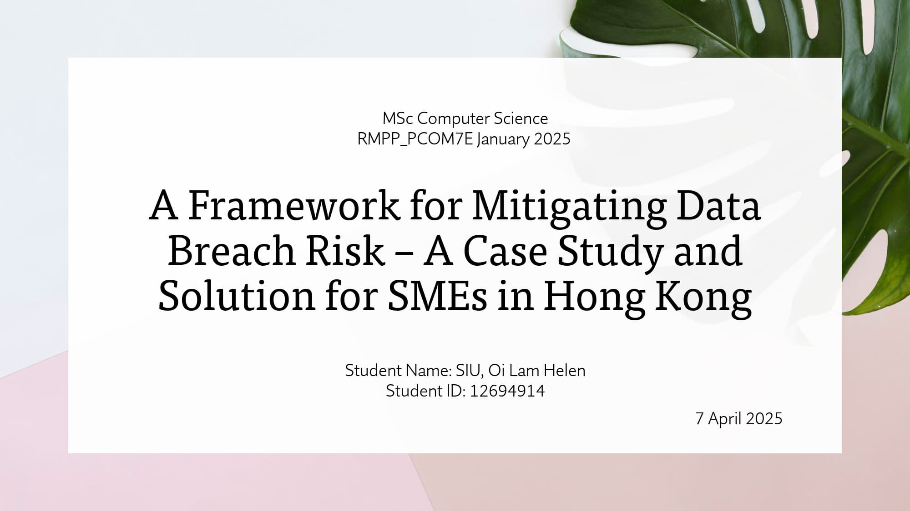
 

Hello everyone, My name is Helen, Siu Oi Lam
Today, I will be presenting my research proposal titled “A Framework for Mitigating Data Breach Risk – A Case Study and Solution for SMEs in Hong Kong.”

---

### Slide 2: Agenda
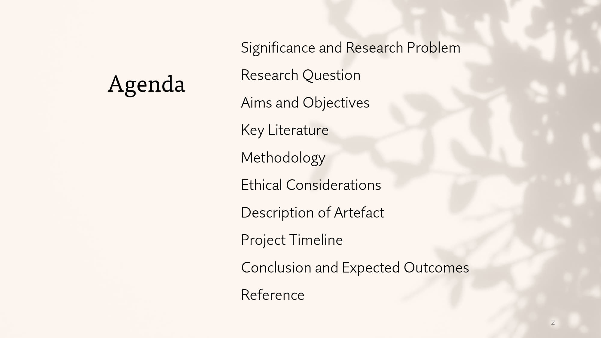
 

This presentation will outline the significance of my research, the research questions, aims and objectives, key literature, methodology and ethical considerations, as well as a description of the artefact I plan to develop, the project timeline, and expected outcomes.

---

### Slide 3: Significance and Research Problem
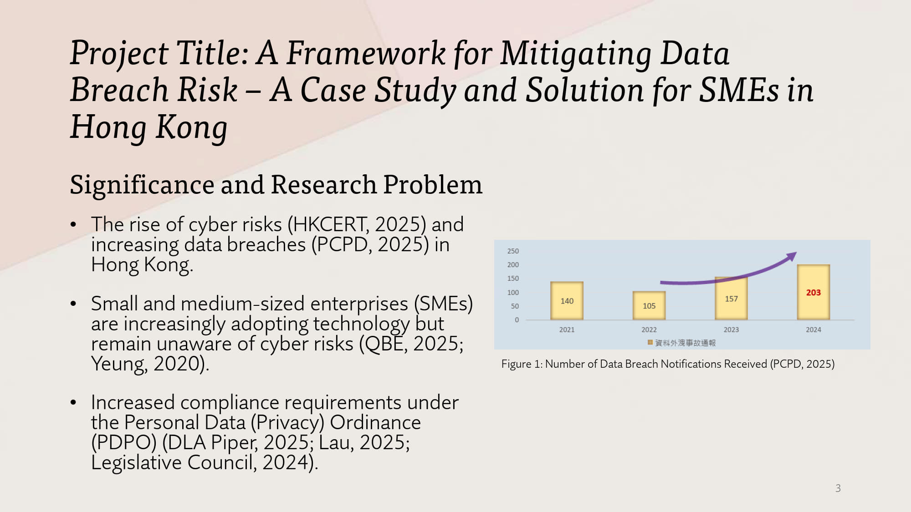
 

In recent years, there has been a concerning rise in cyber risks and data breaches affecting organisations of all sizes in Hong Kong (HKCERT, 2025; PCPD, 2025).

Surveys indicate that small and medium-sized enterprises, commonly referred to as SMEs, are increasingly adopting technology but remain largely unaware of the associated cyber risks (Yeung, 2020). This lack of awareness leaves them particularly vulnerable.

Many SMEs, however, struggle to meet these requirements due to limited resources and technical expertise (QBE, 2025).

Additionally, compliance requirements under the Personal Data (Privacy) Ordinance, hereafter referred to as PDPO, have been recently reviewed by the Office of the Privacy Commissioner for Personal Data Hong Kong, also known as PCPD, to address these evolving risks (DLA Piper, 2025; Lau, 2025; Legislative Council, 2024).

This research aims to bridge this gap by developing a practical and resource-efficient framework that SMEs can adopt to better protect themselves against data breaches.

---

### Slide 4: Research Question
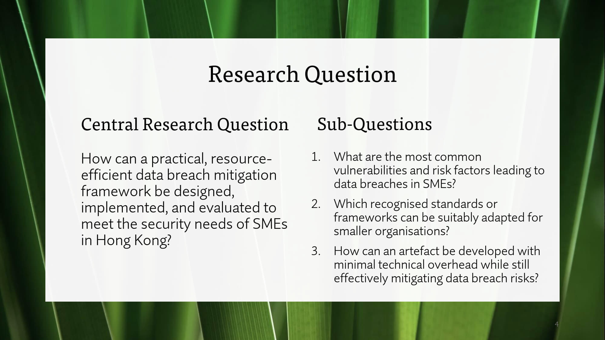
 

The central research question guiding this study is:
"How can a practical, resource-efficient data breach mitigation framework be designed, implemented, and evaluated to meet the security needs of SMEs in Hong Kong?"

To answer this question, I have developed three sub-questions:
1.	What are the most common vulnerabilities and risk factors leading to data breaches in SMEs?
2.	Which recognised standards or frameworks can be suitably adapted for smaller organisations?
3.	How can an artefact be developed with minimal technical overhead while still effectively mitigating data breach risks?

These questions will guide the research process and ensure the framework is both practical and effective.

---

### Slide 5: Aims and Objectives
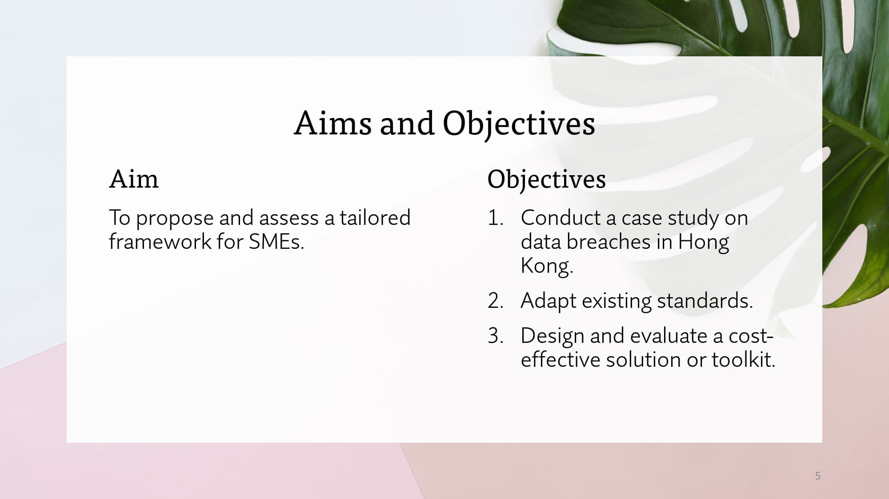
 

The overall aim of this research is to propose and assess a tailored data breach mitigation framework for SMEs in Hong Kong.

To achieve this aim, I have identified three key objectives:
1.	Conduct a case study on data breaches in Hong Kong to understand the specific challenges faced by SMEs.
2.	Adapt existing standards and frameworks to create a solution that is both practical and resource-efficient.
3.	Design and evaluate a cost-effective toolkit or solution that SMEs can use to implement the framework.

---

### Slide 6: Key Literature
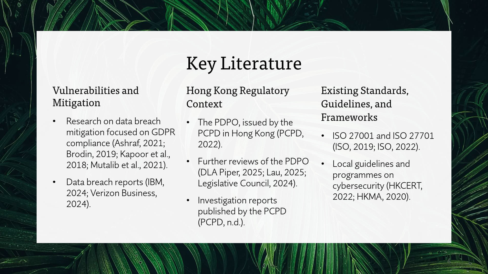
 

Now, let’s move on to the key literature that informs this research.

In terms of vulnerabilities, previous studies have focused on data breach mitigation in the context of GDPR compliance. For example, Ashraf (2021) and Brodin (2019) proposed frameworks tailored to SMEs, while Kapoor et al. (2018) explored strategies to help SMEs manage data breaches. Additionally, Mutalib et al. (2021) proposed a mitigation solution to address malware threats for SMEs.

Global data breach reports have been instrumental in identifying common vulnerabilities associated with data breaches, such as IBM (2024) and Verizon Business (2024), 

For the Hong Kong regulatory context, the PDPO, issued by PCPD in Hong Kong, is a key focus (PCPD, 2022). This ordinance provides guidelines for personal data protection and has recently been reviewed to address emerging cyber risks (DLA Piper, 2025; Lau, 2025; Legislative Council, 2024).

Investigation reports published by the PCPD (PCPD, n.d.) offer valuable insights into the regulatory challenges faced by SMEs.

Additionally, existing standards such as ISO 27001 (2022) and ISO 27701 (2019) provide comprehensive guidelines for implementing an Information Security Management System. Local guidelines, such as those provided by HKCERT (2022) and the Hong Kong Monetary Authority (2020), also play a crucial role in shaping the proposed framework.

This body of literature provides a strong foundation for understanding the vulnerabilities, regulatory requirements, and potential solutions for improving SME data security.

---

### Slide 7: Methodology
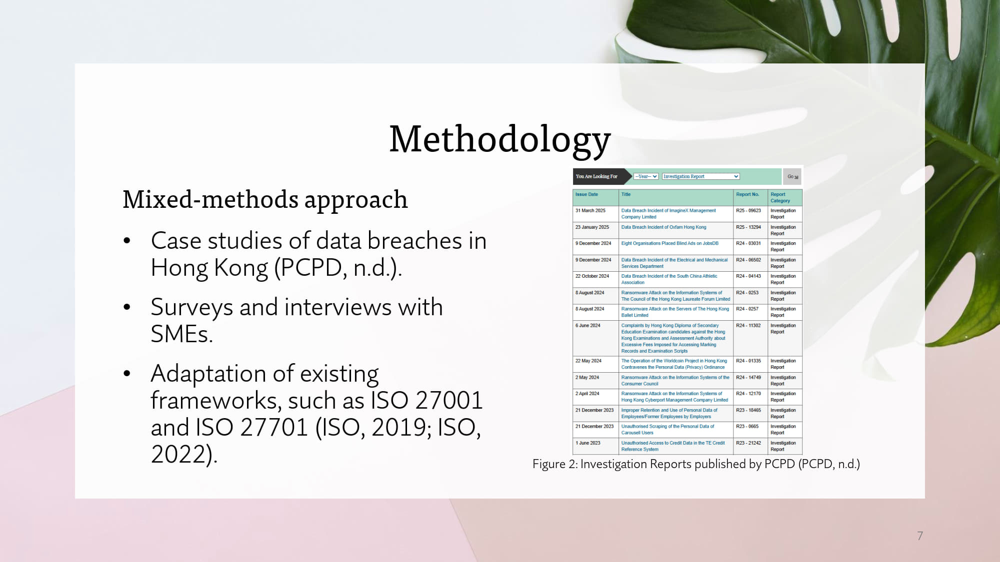
 

The research will use a mixed-methods approach, combining qualitative and quantitative methods to ensure a comprehensive analysis.

Firstly, I will conduct case studies of real-world data breaches in Hong Kong (PCPD, n.d.). These case studies will provide insights into the specific vulnerabilities and risk factors that SMEs face.

Secondly, I will conduct surveys and interviews with SMEs to gather primary data on their current cybersecurity practices, challenges, and needs.

Finally, I will adapt existing frameworks, such as ISO 27001 (2022) and ISO 27701 (2019), to create a tailored solution for SMEs. 

By combining these methods, the research will ensure that the proposed framework is both evidence-based and practical.

---

### Slide 8: Ethical Considerations
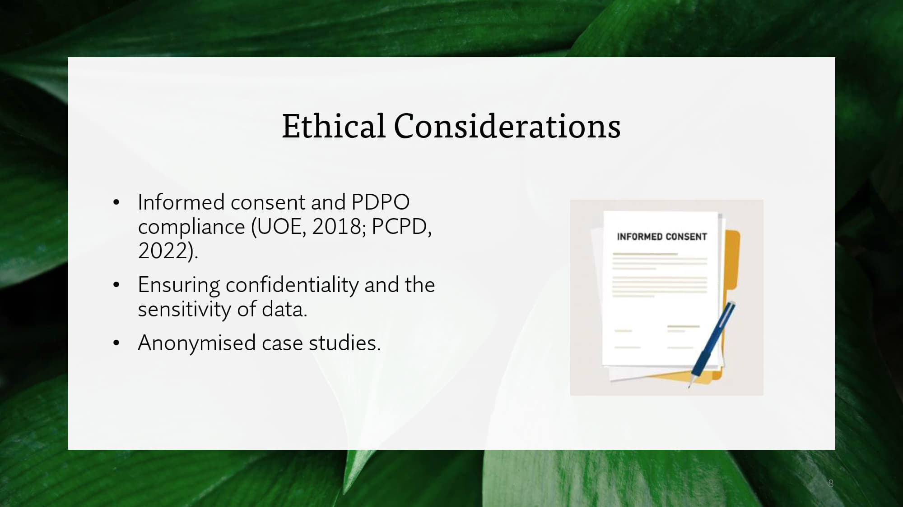
 

Ethical considerations are a critical aspect of this research.

To ensure compliance with ethical guidelines, I will obtain informed consent from all participants (UOE, 2018) and comply with PCPD regulations (PCPD, 2022), ensuring that no confidential or sensitive details are disclosed beyond what is necessary for the study.

For real breaches that are studied, any case details not published by statutory authorities will be anonymised to protect the identities of the organisations involved.

---

### Slide 9: Description of Artefact
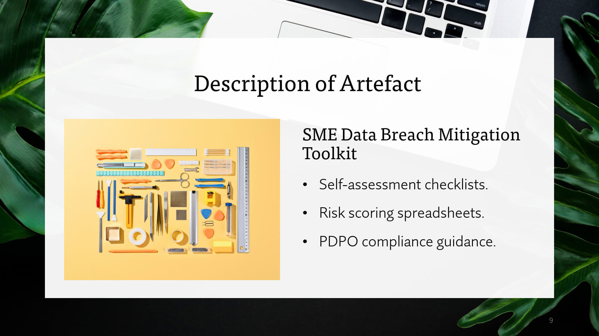
 

The primary output of this research will be a practical SME Data Breach Mitigation Toolkit.

This toolkit will include:
**Self-assessment checklists:** These will help SMEs identify potential vulnerabilities in their systems.
**Risk scoring spreadsheets:** These will allow SMEs to prioritise their cybersecurity efforts based on the level of risk.
**PDPO compliance guidance:** This will provide SMEs with clear instructions on how to meet regulatory requirements.

The toolkit will be designed to be user-friendly and require minimal technical expertise, making it accessible to SMEs with limited resources.

---

### Slide 10: Project Timeline
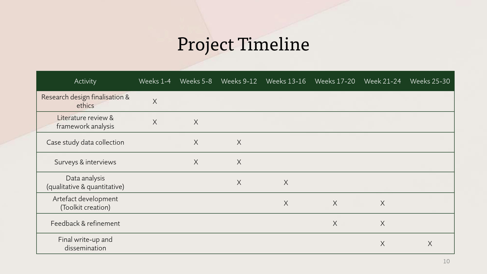
 

The project will be carried out over a period of 25 to 30 weeks.

In the first couple of months, I will finalise the research design, obtain ethics approvals, and conduct a thorough literature review.
Between weeks 5 and 12, I will collect data through case studies, surveys, and interviews.
From weeks 9 to 20, I will analyse the data and develop the toolkit.
The final write-up and evaluation will take place from week 21 onwards.

---

### Slide 11: Conclusion and Expected Outcomes
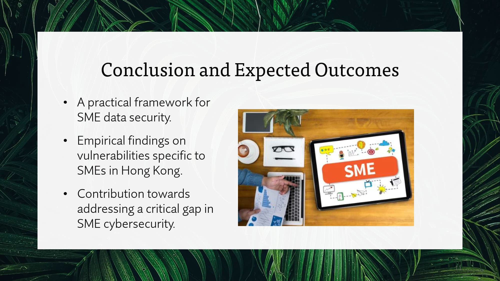
 

To conclude, this research aims to develop a practical, resource-efficient framework for mitigating data breach risks in SMEs.

The expected outcomes include:
A tailored framework that addresses the specific vulnerabilities of SMEs in Hong Kong.
Empirical findings that provide insights into the unique challenges faced by SMEs in the region.
A contribution to bridging the gap in SME cybersecurity by providing a practical toolkit that promotes both security and compliance.

I believe this research will have a meaningful impact on improving data security for SMEs in Hong Kong and will serve as a valuable resource for both businesses and policymakers.

---

### Slide 12: Reference
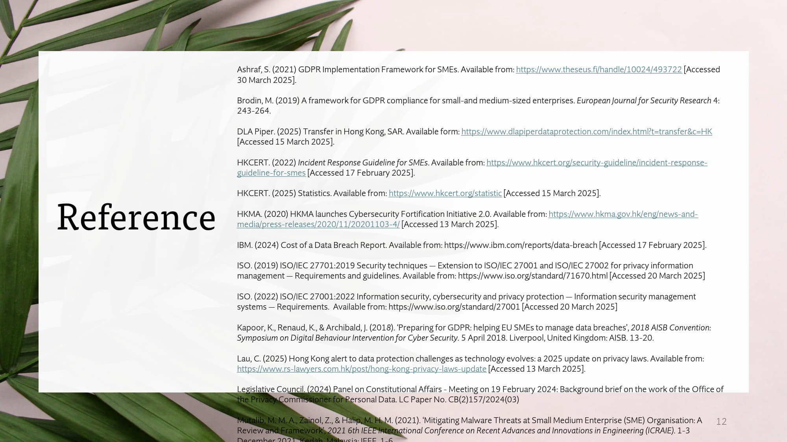
 

The references used in this presentation are provided on this slide. These include key studies, regulatory documents, and guidelines that have informed the research proposal.

---

### Slide 13: Closing
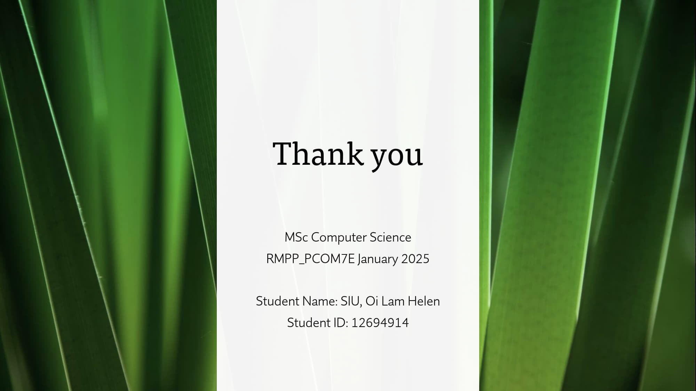
 

Thank you for your time and attention. I am happy to answer any questions or provide further clarification on any aspect of the research proposal.

Please feel free to reach out after this session if you would like to discuss the research in more detail.

Have a great day!

---

#### References
Ashraf, S. (2021) GDPR Implementation Framework for SMEs. Available from: https://www.theseus.fi/handle/10024/493722 [Accessed 30 March 2025].

Brodin, M. (2019) A framework for GDPR compliance for small-and medium-sized enterprises. European Journal for Security Research 4: 243-264.

DLA Piper. (2025) Transfer in Hong Kong, SAR. Available form: https://www.dlapiperdataprotection.com/index.html?t=transfer&c=HK [Accessed 15 March 2025].
 
HKCERT. (2022) Incident Response Guideline for SMEs. Available from: https://www.hkcert.org/security-guideline/incident-response-guideline-for-smes [Accessed 17 February 2025].   
 
HKCERT. (2025) Statistics. Available from: https://www.hkcert.org/statistic [Accessed 15 March 2025].
 
HKMA. (2020) HKMA launches Cybersecurity Fortification Initiative 2.0. Available from: https://www.hkma.gov.hk/eng/news-and-media/press-releases/2020/11/20201103-4/ [Accessed 13 March 2025].

IBM. (2024) Cost of a Data Breach Report. Available from: https://www.ibm.com/reports/data-breach [Accessed 17 February 2025]. 

ISO. (2019) ISO/IEC 27701:2019 Security techniques — Extension to ISO/IEC 27001 and ISO/IEC 27002 for privacy information management — Requirements and guidelines. Available from: https://www.iso.org/standard/71670.html [Accessed 20 March 2025] 

ISO. (2022) ISO/IEC 27001:2022 Information security, cybersecurity and privacy protection — Information security management systems — Requirements.  Available from: https://www.iso.org/standard/27001 [Accessed 20 March 2025]

Kapoor, K., Renaud, K., & Archibald, J. (2018). ‘Preparing for GDPR: helping EU SMEs to manage data breaches’, 2018 AISB Convention: Symposium on Digital Behaviour Intervention for Cyber Security. 5 April 2018. Liverpool, United Kingdom: AISB. 13-20.

Lau, C. (2025) Hong Kong alert to data protection challenges as technology evolves: a 2025 update on privacy laws. Available from: https://www.rs-lawyers.com.hk/post/hong-kong-privacy-laws-update [Accessed 13 March 2025].

Legislative Council. (2024) Panel on Constitutional Affairs - Meeting on 19 February 2024: Background brief on the work of the Office of the Privacy Commissioner for Personal Data. LC Paper No. CB(2)157/2024(03)

Mutalib, M. M. A., Zainol, Z., & Halip, M. H. M. (2021). ‘Mitigating Malware Threats at Small Medium Enterprise (SME) Organisation: A Review and Framework’, 2021 6th IEEE International Conference on Recent Advances and Innovations in Engineering (ICRAIE). 1-3 December 2021. Kedah, MaIaysia: IEEE. 1-6.

PCPD. (2022) The Ordinance: Personal Data (Privacy) Ordinance (Cap. 486). Government of the Hong Kong Special Administrative Region. Available from: https://www.pcpd.org.hk/english/data_privacy_law/ordinance_at_a_Glance/ordinance.html [Accessed 2 March 2025].
 
PCPD. (2025) Prevention of Cyber Attacks for SMEs.  Available from: https://www.pcpd.org.hk/english/news_events/speech/files/20250320_pcpd.pdf [Accessed 31 March 2025]

PCPD. (n.d.) Enforcement Reports. Available from: https://www.pcpd.org.hk/english/enforcement_reports/report.html [Accessed 2 March 2025].
 
QBE. (2025) Hong Kong SMEs face rising business costs and rapidly evolving cyber risks, while AI is thought to significantly impact business productivity, finds QBE Hong Kong annual SME survey. Available from: https://www.qbe.com/hk/en/newsroom/press-releases/qbe-hong-kong-sme-survey-results-business-outlook-2025 [Accessed 13 March 2025].

University of Essex (UOE). (2018) Research participant information and consent. Available from:  https://www.essex.ac.uk/staff/research-governance/research-participant-information-and-consent [ Accessed 2 April 2025].

Yeung, P. (2020) Cyber Risk for SMEs. Available from: https://www.chamber.org.hk/en/information/the-bulletin_detail.aspx?id=511 [Accessed 2 April 2025] 
 
Verizon Business. (2024) Data Breach Investigations Report.  Available from: https://www.verizon.com/business/resources/reports/dbir/ [Accessed 3 March 2025].

  

---

[Return to Module 7 Main Page](RMPP_main.md)
