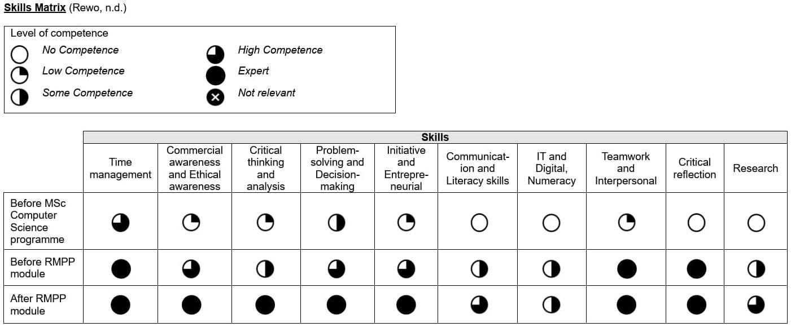

### [Assignment 3: e-Portfolio Submission - Final Reflection](RMPP_A3_Reflection.pdf)
_(Word count: 1046)_
 

e-Portfolio: [https://helenhelene.github.io/eportfolio/](https://helenhelene.github.io/eportfolio/)

#### Introduction
This reflection analyses my experiences during the [Research Methods and Professional Practice (RMPP) module](RMPP_main.md), following Gibbs’ (1988) six-stage framework (Gibbs, 1988; The University of Edinburgh, 2024). I draw on the artefacts produced for the module, as documented in the [List of Artefacts](RMPP_ArtefactsSummary.md), along with insights recorded in the [Professional Skill Matrix](RMPP_Unit11_Activity.md), to illustrate my academic and professional development.

### Description 
Throughout the [RMPP module](RMPP_main.md), I undertook a range of activities aimed at strengthening my academic writing, research methods, data analysis, and professional professionalism. I gained firsthand experience in inferential statistics by completing exercises in the [Statistical Worksheet](RMPP_Unit10_Activity.md). Alongside these methods-focused tasks, I composed a [Literature Review](RMPP_A1.md) examining the financial impact of ransomware. I then developed a [Research Proposal](RMPP_A2.md) intended to assist small and medium-sized enterprises (SMEs) in Hong Kong in mitigating data breach risks, aligning with global standards such as ISO while adhering to local statutory requirements.

In addition to participating in [Collaborative Discussion 1](RMPP_Unit03_Summary.pdf) and [2](RMPP_Unit09_Summary.pdf), I completed Reflective Activities that addressed [ethical considerations in the AI era](RMPP_Unit01_Activity.md), as well as a [Case Studies on Privacy](RMPP_Unit04_Seminar.md) and the [Inappropriate Use of Surveys](RMPP_Unit05_Activity.md). All these activities underscored the importance of ethical questions concerning codes of conduct and compliance. These discussions highlighted the need to stay up to date with the British Computer Society (BCS), the Association for Computing Machinery (ACM), and the General Data Protection Regulation (GDPR) in an era of rapid change. The module required me to compile the outcomes of these activities into an [e-Portfolio](https://helenhelene.github.io/eportfolio/) and produce a [Reflective piece](RMPP_A3.md). My [SWOT Analysis](RMPP_Unit11_SWOTAnalysis.pdf) enabled me to recognise strengths, such as my capacity for organization, and weaknesses including a reliance on point-form notes. The [Action Plan](RMPP_Unit11_ActionPlan.pdf) supported my progress by guiding my efforts to address these limitations at each stage, and all essential competencies were recorded in the [Matrix](RMPP_Unit11_Matrix.pdf).

### Feelings 
At the start of the module, I experienced both enthusiasm and apprehension. The idea of enhancing my research design and data analysis skills, whilst also developing stronger academic writing and project management abilities, seemed professionally beneficial. Nevertheless, the challenge of managing a significant workload alongside existing job commitments led to some concerns about time management. Over time, however, my confidence grew. By drawing on my organisational and time management skills, I was able to meet key deadlines effectively..

Examining ethical standards and codes of conduct, particularly relating to data protection practices, heightened my sense of purpose, given the clear alignment with practical professional contexts. After completing the Literature Review, Research Proposal and assembling the e-Portfolio, I felt both a sense of accomplishment and relief. Although some aspects of the tutor’s feedback were demanding, the guidance was mostly encouraging, prompting me to refine my methods and skills.

### Evaluation 
Overall, the module provided a meaningful and worthwhile experience. Engaging with statistical exercises improved my competence in interpreting datasets and presenting them in a structured, visually coherent format. My Literature Review prompted a more thorough enquiry into ransomware issues, which not only enriched my academic insight but also expanded my awareness of the broader challenges faced by organisations. Perhaps most importantly, the module enhanced my appreciation of ethical considerations within the computing field.

Despite these successes, I did encounter some difficulties. The tutor’s [“umbrella” feedback](https://www.my-course.co.uk/mod/forum/discuss.php?d=282677) on the Collaborative Discussions gave me the opportunity to reflect on my tendency to rely on outline or list-based formats. Although these approaches kept my work concise, they also limited the scope for demonstrating deeper integration of ideas. Balancing my professional duties with the research-focused expectations of the Research Proposal was another hurdle, and on occasion, I underestimated the challenges of linking theoretical arguments to real-world structures. Nonetheless, these issues ultimately served as opportunities for reflection, enabling me to refine both my academic expression and my research approaches.

### Analysis 
Incorporating tutor feedback and undertaking work-driven tasks enhanced my understanding of how classroom learning directly applies to professional scenarios. The Skill Matrix (Figure 1) showed improvements in critical thinking, ethical decision-making, and other professional skills. My reading of scholarly articles revealed the importance of accurate referencing, thorough argumentation, and synthesising diverse perspectives, rather than relying on simplistic summaries.

I also noticed that my newly acquired theoretical insights informed my [role as a Data Protection Officer](https://helenhelene.github.io/eportfolio/Aboutme.html), particularly when forming persuasive arguments and drafting detailed policy documentation. The Action Plan reminded me of my developmental objectives, such as engaging more extensively with qualitative methodologies. I believe that exploring these methods further would enable me to examine real-world data breaches with even greater rigour. These observations support the view, espoused by Rolfe, Freshwater and Jasper (2001), that critical reflection can be a vital means of professional growth.

   
_Figure 1: My Skill Matrix_  
For additional details, please refer to the [Matrix](RMPP_Unit11_Matrix.pdf) in the e-Portfolio.

### Conclusion 
Reflecting on the varied tasks in this module indicates that I have made progress in both conceptual and practical domains. While I initially worried that time constraints and multiple commitments would be overwhelming, a well-structured study schedule allowed me to continue making headway. Engaging with ethical debates and working on the Research Proposal strengthened my awareness of how academic frameworks align with industry practices, and responding to feedback on my writing style encouraged me to move away from bullet points towards fully developed paragraphs. By reflecting on these successes and challenges, I have identified ways to further improve my performance in the future.

### Action Plan 
I intend to maintain this level of growth by continuously refining my academic writing and broadening my research knowledge. My first objective is to improve my writing skills through reading additional scholarly articles, thereby honing both the structure and content of my assignments. Incorporating multiple sources within each piece of work will also help me reach the level of complexity expected at postgraduate study.

In terms of managing competing priorities, I will continue to rely on structured schedules and apply recognised project management methodologies to my capstone project. I will break down goals and deliverables into realistic, manageable phases. Finally, I plan to maintain an active role in professional forums and organisations, which will help me remain informed about evolving regulations in data protection and equip me for future challenges and projects.

#### Reference
Gibbs, G. (1988) _Learning by Doing: A guide to teaching and learning methods._ Further Education Unit. Oxford Polytechnic: Oxford.

Rewo. (n.d.) What is a skills matrix. Available from: https://www.rewo.io/skills-matrix-for-manufacturing/ [Accessed 13 April 2025].   

Rolfe, G., Freshwater, D. & Jasper, M. (2001) _Critical reflection in nursing and the helping professions: a user’s guide._ Basingstoke: Palgrave Macmillan.

The University of Edinburgh. (2024) Gibbs’ Reflective Cycle.  Available from https://reflection.ed.ac.uk/reflectors-toolkit/reflecting-on-experience/gibbs-reflective-cycle [Accessed 12 April 2025].

  

---

[Return to Module 7](RMPP_main.md)
