### [Assignment 1: Development Team Project: Project Report - Synputer](SEPM_A1_ProjectReport_final.pdf)

 
Team Name: MASH (Group 1) 
Team Members: Anda Ziemele, Mario Butorac, OiLam Siu, Samuel Harrison

#### [Minutes of Meeting (MoM) and Team Contract](SEPM_A1_MoM.md)

 

### 1. Introduction
English Digital Computers has contracted Synful Computing to develop a computer for personal and business use. Our main competitors are IBM and Microsoft.

### 2. Methodology
The Synputer will be developed using Scrum rather than Waterfall (Nagl, 2023) due to its adaptability through short sprints that allow for frequent feedback and changes, its high quality ensured by iterative development and continuous testing, customer satisfaction from regular feedback aligning the product with specifications (Layton et al., 2022), continuous improvement through sprint retrospectives, and streamlined communication via standups. To address hardware development constraints (Schmidt et al., 2017), the product will be developed in a VUCA environment (Atzberger & Paetzold, 2019), enhancing adaptability, innovation, risk mitigation, and collaboration (Weichbroth, 2022).

### 3. Statement of Work
Key deliverables: 
 - A PC
 - A Compatible OS.

#### 3.1 Gathered Requirements
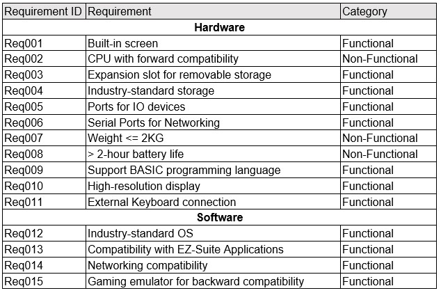

Table 1. Gathered requirements.	

#### 3.2 Missing Requirements
A domain model was created to ensure the completeness of requirements (Appendix 1). This approach proved fruitful in requirements gathering (Arora et al., 2019). 

Table 2 lists the missing requirements identified. 

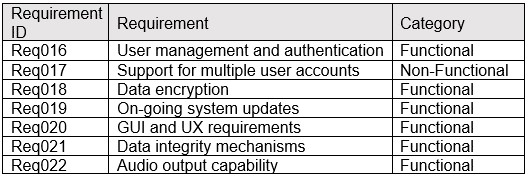

Table 2. Missing requirements.

#### 3.3 Components List
The components list includes the elements for the proposed design, tailored to transform the gathered requirements into a practical solution (Appendix 2).

### 4. Gherkin Specifications
Figure 1 shows the Gherkin requirements for some of the critical functionality of our system (Rice et al., n.d.):

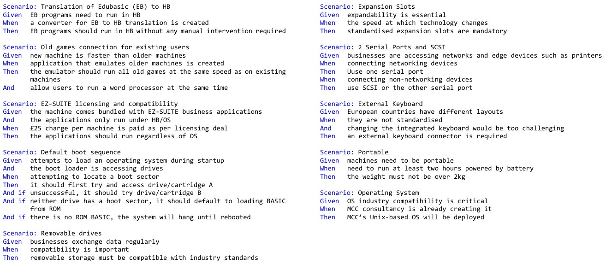

Figure 1: Gherkin statements

### 5. Assumptions and Dependencies
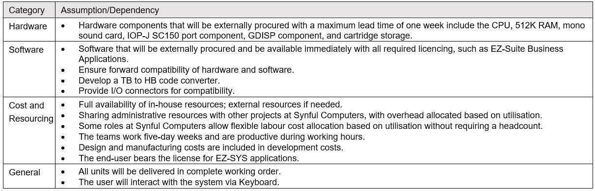

Table 3. Project Assumptions and Dependencies.

### 6. Development Plan
 - Budget: £500,000 provided by EDC
 - Timeline: 13 months
 - Deliverables: 2,000 Synputers purchased by EDC for £250 per machine

#### 6.1 Estimates and Project Schedule
The project will be delivered in 13 months. This timeline uses Brooks (1995) calculations to estimate the duration of the project's major stages (Appendix 3):
 - Planning Time: Tp = 13/3 = 4.3 months
 - Development Time: Td = 13/6 = 2.2 months
 - System Test Time: Ts = 13/4 = 3.3 months
 - Testing Time: Tt = 13/6 = 2.2 months (3.2 months, see explanation below)

Since the sum of the above values is less than 13, and studies show that inadequate quality control is one of the major contributors to project failures (Jones, 2004), the additional time will be devoted to testing, bringing it up to 3.2 months.	

#### 6.2 Cost Plan
The material cost is £157 per machine (Appendix 4).  
Assuming that the initial design, development, manufacturing, and testing costs are included (Appendix 5), the cost of the first 2,000 machines can be controlled at **£250 per unit**.

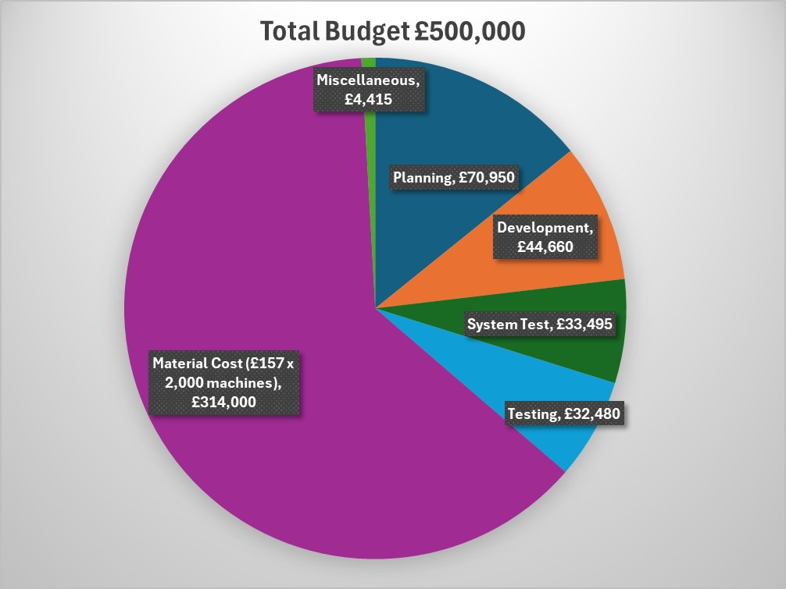

Figure 2: Total budget allocation for the project

#### 6.3 Milestones and Deliverables 
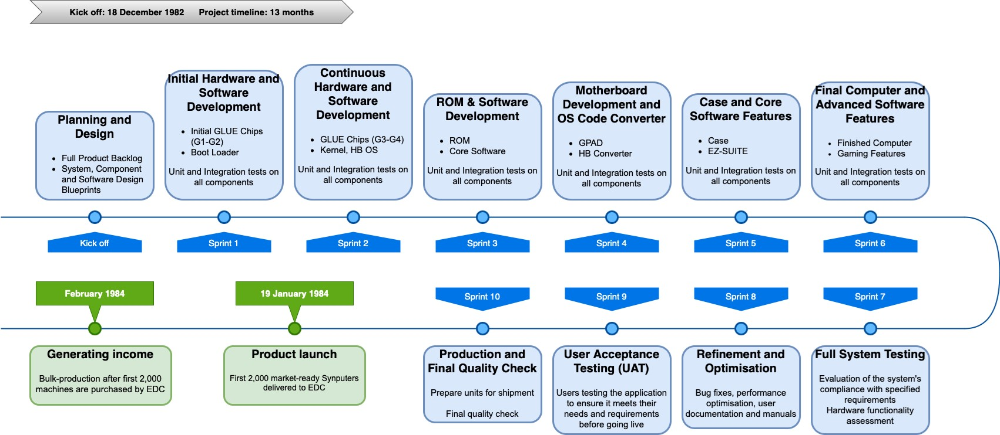

Figure 3: Key deliverables for each milestone (Negi, 2019; Schwaber, 1997)

### 7. Testing Strategy
 - Prototype Testing: To obtain early feedback, we’ll perform prototype testing (Camburn et al., 2017) at various stages during the system's development.
 - Software Testing: Before release, all software development will go through rigorous testing by developers, QA Engineers, and QE Engineers (Beizer, 1984)
 - Hardware Testing: To meet customer expectations, hardware will go through reliability, functional, user acceptance, and certification testing (Hartman, 2005).

### 8. Pricing Strategy
To determine the pricing strategy for the Synputer, we considered the market price for PCs in the 1980s (Appendix 6), the production costs, and the industry average Gross Profit Margin (GP%) (Polymer, 2024).
Calculation: 
 - Unit Cost: £250
 - GP%: 50% for a competitive edge and healthy profit.
 - Sales Price: £250 / (1-50%) = **£500 per unit**

### 9. Conclusion
The Synputer aims to deliver a competitive, market-ready product within budget and timeline constraints, leveraging Agile methodologies to ensure flexibility and stakeholder engagement throughout the project lifecycle. This proposal outlines the strategic approach, requirements, and comprehensive plan we will follow to ensure the project's success. 

  

-----
### 10. Appendix
Appendix 1: Domain model of the proposed system
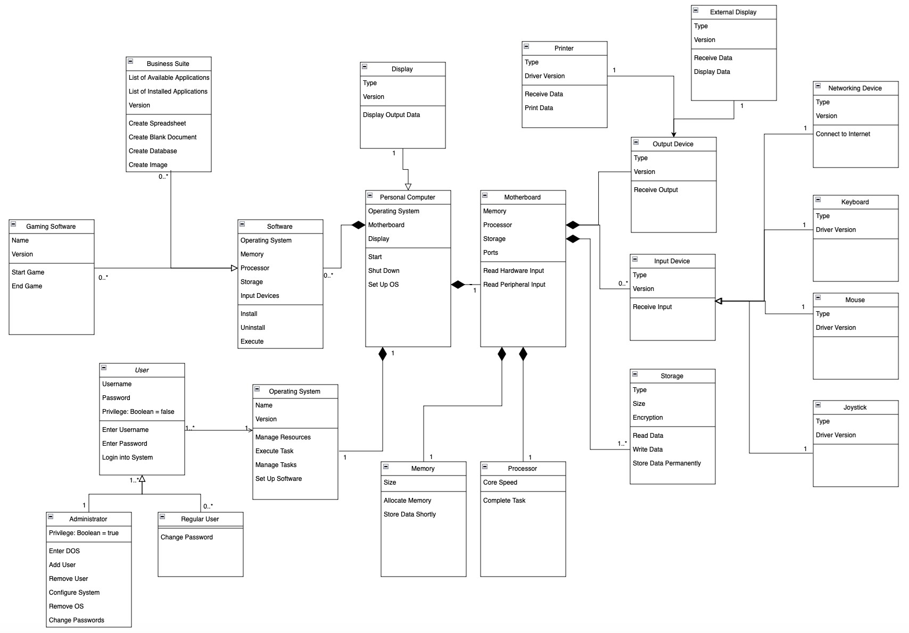
 

Appendix 2: Components list
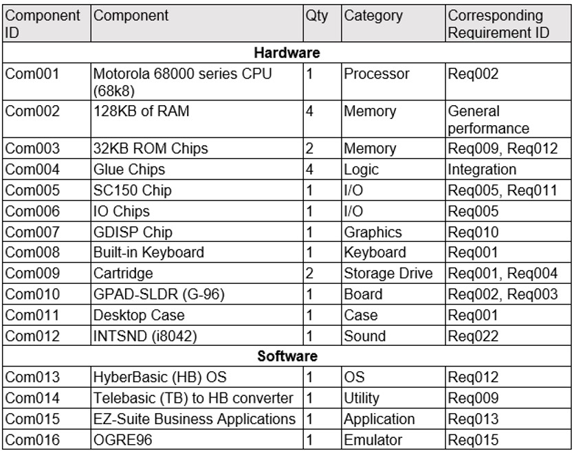
 

Appendix 3: Extracted Gantt Chart
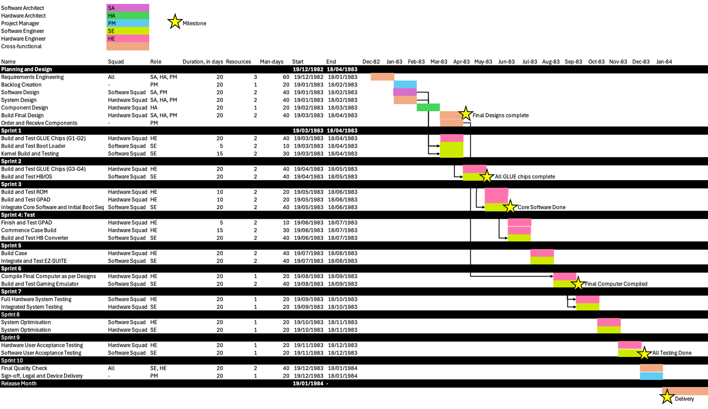
 

Appendix 4: Breakdown of Material cost per machine
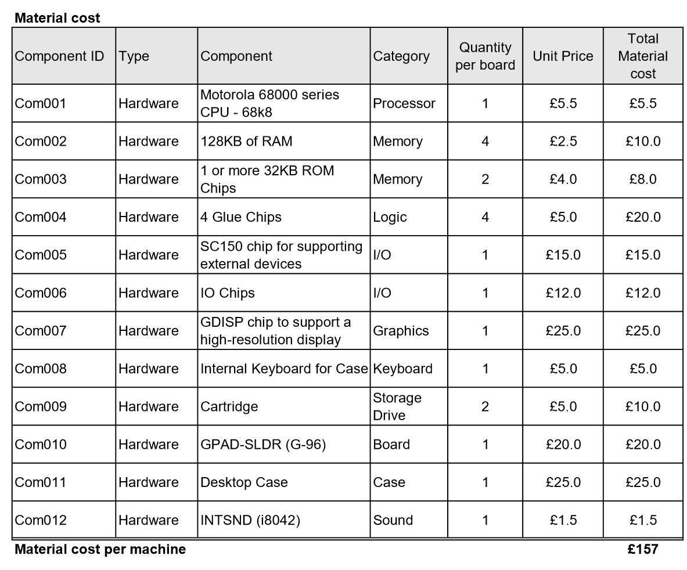
 

Appendix 5: Breakdown of Role allocation and personnel cost calculation
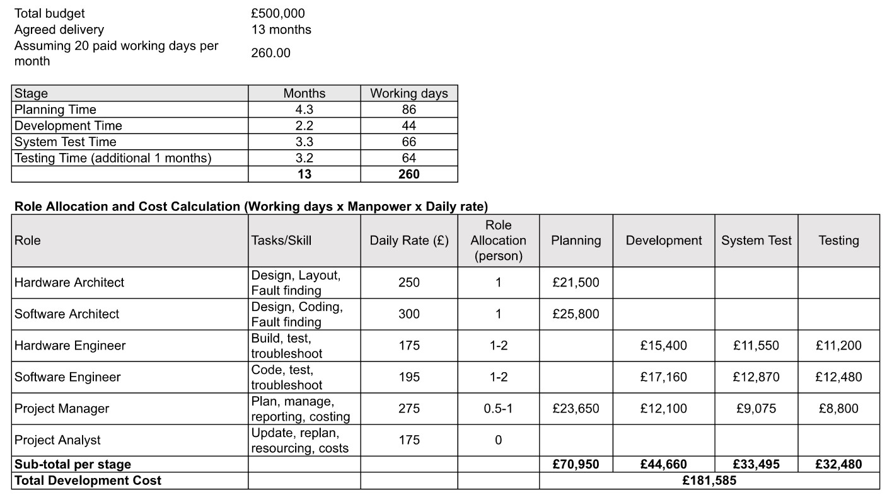
 

Appendix 6: Table of Home Micro costs and specifications in the 1980s given in the Case Study document
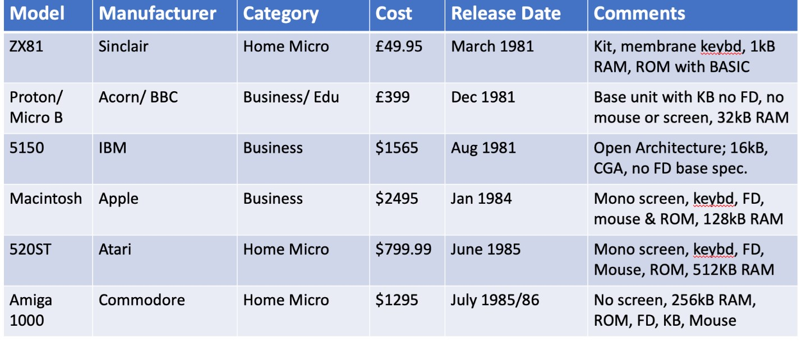

  

-----
### References
Alshamrani, A. & Bahattab, A. (2015) A Comparison Between Three SDLC Models Waterfall Model, Spiral Model, and Incremental/Iterative Model. 2015 International Journal of Computer Science Issues 12(1): 106-111. Available from: https://www.academia.edu/10793943/A_Comparison_Between_Three_SDLC_Models_Waterfall_Model_Spiral_Model_and_Incremental_Iterative_Model?auto=download [Accessed 12 August 2024]

Arora, C., Sabetzadeh, M. & Briand, L.C. (2019) An empirical study on the potential usefulness of domain models for completeness checking of requirements. Empirical Software Engineering, 24: 2509-2539.

Atzberger, A. & Paetzold, K. (2019) Current challenges of agile hardware development: What are still the pain points nowadays?. In Proceedings of the design society: international conference on engineering design. 1(1): 2209-2218. Cambridge University Press.

Beizer, B. (1984) Software system testing and quality assurance. London: Van Nostrand Reinhold.

Brooks, F.P. (1995) The Mythical Man-Month. Anniversary Edition. Philippines: Addison-Wesley.

Camburn, B., Viswanathan, V., Linsey, J., Anderson, D., Jensen, D., Crawford, R., Otto, K. & Wood, K. (2017)  Design prototyping methods: state of the art in strategies, techniques, and guidelines. Design Science, (3): 1-13.

Hartman, A. (2005) Software and hardware testing using combinatorial covering suites. In Graph Theory, Combinatorics and Algorithms: Interdisciplinary Applications (237-266). Boston, MA: Springer US.

Jones, C. (2004) Software project management practices: Failure versus success. CrossTalk: The Journal of Defense Software Engineering, 17(10): 5-9 [Accessed 19 August 2024].

Layton, M.C., Ostermiller, S.J. & Kynaston, D.J. (2022). Scrum For Dummies. John Wiley & Sons. [Accessed 18 August 2024].

Nagl, S. (2023). 5 Benefits of Agile Project Management. School of Professional Studies at Wake Forest University. Available at: https://sps.wfu.edu/articles/benefits-agile-project-management [Accessed 18 August 2024].

Negi, K. (2019) The Scrum Software Development Process. Available from: https://medium.com/@kunalnegi0003/the-scrum-software-development-process-6e48bb021d9f [Accessed 17 August 2024]

Polymer. (2024) What is a Good Gross Profit Margin?. Available from: https://www.polymersearch.com/blog/profit-margin-by-industry [Accessed 22 August 2024]

Rice, B., Jones, R., & Engel, J. (n.d.) Behavior Driven Development. Available from:  https://behave.readthedocs.io/en/stable/philosophy.html#the-gherkin-language [Accessed 13 August 2024]

Schmidt, T.S., Chahin, A., Kößler, J. & Paetzold, K. (2017) Agile development and the constraints of physicality: a network theory-based cause-and-effect analysis. In DS 87-4 Proceedings of the 21st Int
ernational Conference on Engineering Design (ICED 17) Vol 4: Design Methods and Tools, Vancouver, Canada, 21-25.08. 2017 (199-208).

Schwaber, K. (1997) Scrum development process. Business object design and implementation. In 10th Annual Conference on Object Oriented Programming Systems, Languages, and Applications Addendum to the Proceedings. ACM/SIGPLAN October (117-134).

Srivastava, A., Bhardwaj, S. & Saraswat, S. (2017) SCRUM model for agile methodology. In 2017 International Conference on Computing, Communication and Automation (ICCCA) (864-869). IEEE.

Weichbroth, P. (2022) A case study on implementing agile techniques and practices: Rationale, benefits, barriers and business implications for hardware development. Applied Sciences, 12(17): 8457.

  

-----
### Bibliography
Agile Manifesto (2010) Manifesto for Agile Software Development. Agile Manifesto. Available from: https://agilemanifesto.org [Accessed 13 August 2024]

Alshamrani, A. & Bahattab, A. (2015) A Comparison Between Three SDLC Models Waterfall Model, Spiral Model, and Incremental/Iterative Model. 2015 International Journal of Computer Science Issues, 12(1): 106-111. Available from: https://www.academia.edu/10793943/A_Comparison_Between_Three_SDLC_Models_Waterfall_Model_Spiral_Model_and_Incremental_Iterative_Model?auto=download [Accessed 12 August 2024]

⁠Axelos (2017). Managing Successful Projects with PRINCE2. 6th ed. London: Tso [Accessed 17 August 2024].

Balaji, S. & Murugaiyan, M.S. (2012) Waterfall vs V-Model vs Agile: A Comparative Study on SDLC. International Journal of Information Technology and Business Management, 2(1): 26-30. Available from: https://www.studocu.com/row/document/comsats-university-islamabad/software-engineering-concepts/wateerfallvs-v-model-vs-agile-a-comparative-study-on-sdlc/42694547 [Accessed 13 August 2024]

Burek, J. (2024) How to Build a PC: The Ultimate Beginner’s Guide. PCMag. Available from: https://www.pcmag.com/how-to/how-to-build-a-pc-the-ultimate-beginners-guide [Accessed 17 August 2024]

Cohen, D., Lindvall, M. & Costa, P. (2004) An introduction to agile methods. Advances in Computers, 62(3): 1-66.

Figueroa-Lorenzo, S., Añorga, J. & Arrizabalaga, S. (2020) A survey of IIoT protocols: A measure of vulnerability risk analysis based on CVSS. ACM Computing Surveys (CSUR), 53(2): 1-53.

First (2013) CVSS v3.0 Specification Document. FIRST — Forum of Incident Response and Security Teams. Available at: https://www.first.org/cvss/specification-document [Accessed 19 August 2024].

Khan, S. & Mahadik, S. (2022) A Comparative Study of Agile and Waterfall Software Development Methodologies. International Journal of Advanced Research in Science, Communication and Technology, 2(1): 399-402.

Leung, H.K. & White, L. (1990) A study of integration testing and software regression at the integration level. In Proceedings. Conference on Software Maintenance 1990, (290-301). IEEE.

Luna, J., Suri, N. & Krontiris, I., 2012, October. Privacy-by-design based on quantitative threat modeling. In 2012 7th International Conference on Risks and Security of Internet and Systems (CRiSIS), (1-8). IEEE.

MCS (2023). Quantitative vs. Qualitative: Choosing the Right Approach for Cybersecurity Risk Management and Assessment. Microminder Cybersecurity. Available at: https://www.micromindercs.com/blog/quantitative-vs-qualitative-choosing-the-right-approach-for-cyber-security-risk-management-and-assessment [Accessed 19 August 2024].

Micron Technology. (N.D.) How to build your own PC. Crucial. Available from: https://www.crucial.com/articles/pc-builders/how-to-build-a-computer [Accessed 17 August 2024]

Visual Paradigm. (N.D.) What is Agile? What is Scrum? Visual Paradigm. Available from: https://www.visual-paradigm.com/scrum/what-is-agile-and-scrum/ [Accessed 13 August 2024]

  

---

[Return to Module 5](SEPM_main.md)
