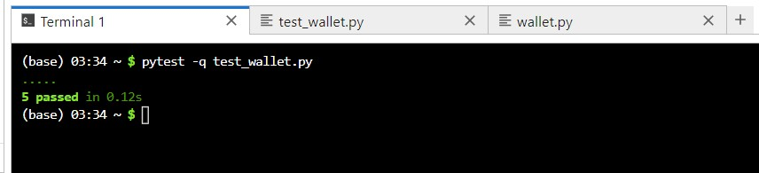
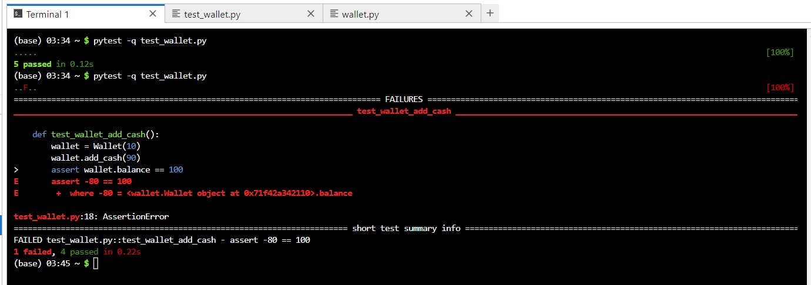

# Jupyter Notebook Activity - pytest

## Introduction
The following task involves experimenting with pytest using the Python programming language. <br> 
<br>

### Copy the following code into a file named _wallet.py_
```python
# code source: https://semaphoreci.com/community/tutorials/testing-python-applications-with-pytest
# wallet.py

class InsufficientAmount(Exception):
    pass

class Wallet(object):
    def __init__(self, initial_amount=0):
        self.balance = initial_amount

    def spend_cash(self, amount):
        if self.balance < amount:
            raise InsufficientAmount('Not enough available to spend {}'.format(amount))
        self.balance -= amount

    def add_cash(self, amount):
        self.balance += amount
```

<br>

### Copy the following code into a file named _test_wallet.py_
```python
# code source: https://semaphoreci.com/community/tutorials/testing-python-applications-with-pytest
# test_wallet.py

import pytest
from wallet import Wallet, InsufficientAmount

def test_default_initial_amount():
    wallet = Wallet()
    assert wallet.balance == 0

def test_setting_initial_amount():
    wallet = Wallet(100)
    assert wallet.balance == 100

def test_wallet_add_cash():
    wallet = Wallet(10)
    wallet.add_cash(90)
    assert wallet.balance == 100

def test_wallet_spend_cash():
    wallet = Wallet(20)
    wallet.spend_cash(10)
    assert wallet.balance == 10

def test_wallet_spend_cash_raises_exception_on_insufficient_amount():
    wallet = Wallet()
    with pytest.raises(InsufficientAmount):
        wallet.spend_cash(100)
```

<br>

### First Run the tests using the command: _$ pytest -q test_wallet.py_ without amend the code<br>


<br>

---

### Amend the code in _wallet.py_ so that the test fail.
```python
# code source: https://semaphoreci.com/community/tutorials/testing-python-applications-with-pytest
# wallet.py

class InsufficientAmount(Exception):
    pass

class Wallet(object):
    def __init__(self, initial_amount=0):
        self.balance = initial_amount

    def spend_cash(self, amount):
        if self.balance < amount:
            raise InsufficientAmount('Not enough available to spend {}'.format(amount))
        self.balance -= amount

    def add_cash(self, amount):
        self.balance -= amount  # change the add_cash method from "self.balance += amount" to cause a test to fail
```

<br>

### Second Run the tests using the command: _$ pytest -q test_wallet.py_ with amended code<br>


<br>

## Reflections
...

<br><br>

---

## Reference
Gathuku, K. (2024) Testing Python Applications with Pytest. Available from: https://semaphoreci.com/community/tutorials/testing-python-applications-with-pytest

Jupter. (N.D.) Try Jupyter. Available from: https://jupyter.org/try

<br><br>

---

[Return to Module 5 Unit 6](SEPM_Unit06.md)
