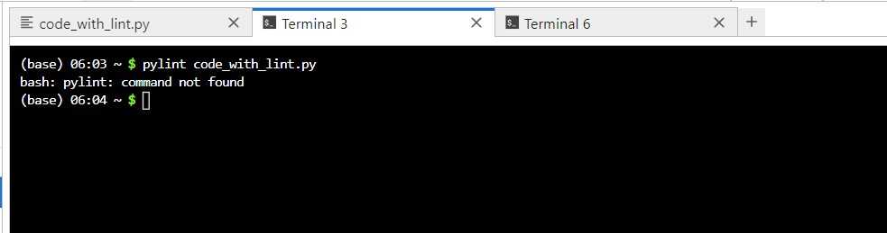
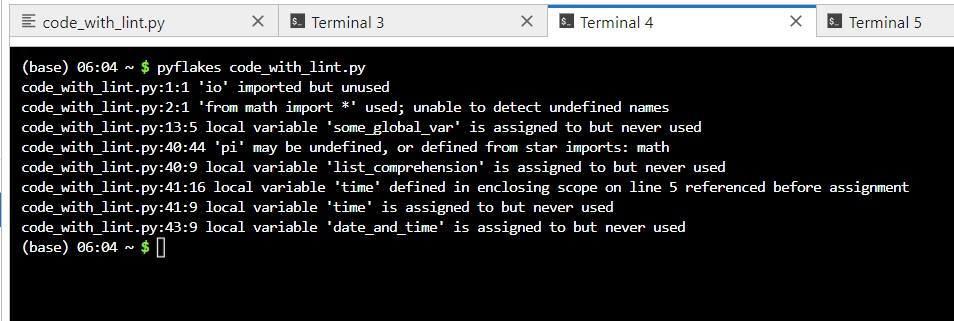
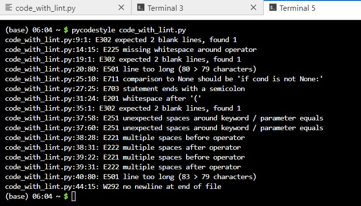
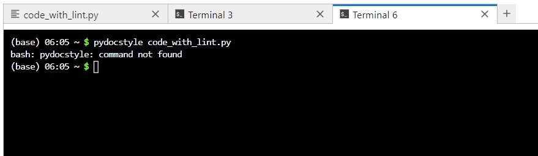

# Activity: Using Linters to Achieve Python Code Quality

## Introduction
This activity request us to run the code against a variety of linters to test the code quality. 

<br>

### _code_with_lint.py_

```python
import io
from math import *


from time import time

some_global_var = 'GLOBAL VAR NAMES SHOULD BE IN ALL_CAPS_WITH_UNDERSCOES'

def multiply(x, y):
    """
    This returns the result of a multiplation of the inputs
    """
    some_global_var = 'this is actually a local variable...'
    result = x* y
    return result
    if result == 777:
        print("jackpot!")

def is_sum_lucky(x, y):
    """This returns a string describing whether or not the sum of input is lucky
    This function first makes sure the inputs are valid and then calculates the
    sum. Then, it will determine a message to return based on whether or not
    that sum should be considered "lucky"
    """
    if x != None:
        if y is not None:
            result = x+y;
            if result == 7:
                return 'a lucky number!'
            else:
                return( 'an unlucky number!')

            return ('just a normal number')

class SomeClass:

    def __init__(self, some_arg,  some_other_arg, verbose = False):
        self.some_other_arg  =  some_other_arg
        self.some_arg        =  some_arg
        list_comprehension = [((100/value)*pi) for value in some_arg if value != 0]
        time = time()
        from datetime import datetime
        date_and_time = datetime.now()
        return
```
Code source: https://realpython.com/python-code-quality/

<br>


### Pylint
 - Provides comprehensive feedback, covering both logical and stylistic issues.
 - Reports unused imports, variable naming conventions, and unreachable code.
 - Tends to be verbose but thorough.
   
**pylint _code_with_lint.py_** <br>



### Pyflakes
 - Focuses on logical errors, such as unused imports and variables.
 - Does not emphasize style issues, making it faster but less comprehensive for style checks.
   
**pyflakes _code_with_lint.py_** <br>


### Pycodestyle
 - Concentrates on PEP 8 style violations.
 - Highlights formatting issues like spacing and line length.
 - Useful for enforcing consistent code style.
   
**pycodestyle _code_with_lint.py_** <br>


### Pydocstyle
 - Checks compliance with PEP 257 for docstrings.
 - Identifies missing or incorrectly formatted docstrings.
 - Important for maintaining documentation consistency.
   
**pydocstyle _code_with_lint.py_** <br>


## Conclusion
Each linter has its strengths:

 - **Pylint** is the most comprehensive, catching a wide range of issues but can be overwhelming due to verbosity.
 - **Pyflakes** is efficient for detecting logical errors without concerning style, making it faster.
 - **Pycodestyle** is essential for ensuring code adheres to style guidelines, promoting readability.
 - **Pydocstyle** is crucial for maintaining proper documentation practices.

Using a combination of these tools provides a balanced approach to improving both the logical correctness and stylistic consistency of Python code.


<br><br>

## Reflections
In this activity, I learned the importance of using linters like Pylint, Pyflakes, Pycodestyle, and Pydocstyle to improve code quality. They help identify logical errors, style violations, and documentation inconsistencies, ensuring cleaner, more maintainable code.

In future assignments, I'll use these tools to enforce consistent coding styles and integrate linter checks into my workflow to catch errors early. Setting up continuous integration pipelines will help maintain code quality in team projects, and using Pydocstyle will ensure my code is well-documented. These practices will enhance the overall robustness and efficiency of my code.

<br><br>

---

## Reference
Jupter. (N.D.) Try Jupyter. Available from: https://jupyter.org/try

VanTol, A. (N.D.) Python Code Quality: Tools & Best Practices. Available from: https://realpython.com/python-code-quality/

<br><br>

---

[Return to Module 5 Unit 10](SEPM_Unit10.md)
