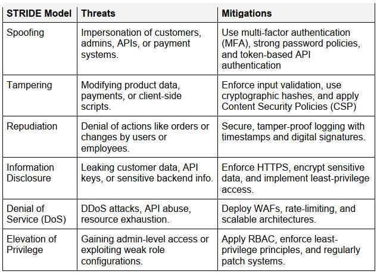

### [Assignment 1: Development Team Project: Project Report - Synputer](SSD_A1_DesignDocument_final.pdf)

 
Team Name: GAZHA 
Team Members: George Koridze, Andrius Busilas, Zukiswa Tuso, Helen Oi Lam Siu, Anda Ziemele, Seyun Hur

#### [Meeting records and Team contract](SSD_A1_MoM.md)

#### Contents
1. Introduction
2. Retail Domain
3. System Requirements and Assumptions\
 3.1. System Requirements\
 3.2. Assumptions
4. Design Decisions and Approaches\
 4.1. Methodology\
 4.2. Software Design\
 4.3. Data Structures\
 4.4. API
5. Security Concerns and Mitigations
6. UML Designs\
 6.1. Class Diagram\
 6.2. Use Case Diagram\
 6.3. Misuse Case Diagram\
 6.4. Activity Diagram
7. Tools and Libraries
8. Testing Strategy
9. Compliance and Privacy
10. Appendices\
 Appendix 1: Domain requirements table\
 Appendix 2: User stories\
 Appendix 3: OWASP Top 10 2021\
 Appendix 4: OWASP Top 10 2024 Proactive Controls\
 Appendix 5: STRIDE Model\
 Appendix 6: Correspond GDPR Compliance\
 Appendix 7: Correspond PCI DSS Compliance
11. References
12. Bibliography

### 1. Introduction
This design document outlines the development of a secure management application for an online retailer. The application provides a Command-Line Interface (CLI) for authorised users to perform Create, Read, Update, and Delete (CRUD) operations. Security and compliance with the General Data Protection Regulation (GDPR) (GDPR, N.D.) and the Payment Card Industry Data Security Standard (PCI DSS) (PCI Security Standards Council, 2024) are key priorities.

The business model chosen is a B2B eShop for beauty products, targeting individual hair stylists working at salons. Customers must specify their associated companies during registration for platform access. The system uses role-based access control (RBAC) for admins, clerks, and customers.

### 2. Retail Domain
Consumer trust is critical for retail websites, (D’Adamo et al., 2021), and this application prioritises cybersecurity, privacy, and compliance to meet industry expectations (Appendix 1). 

### 3. System Requirements and Assumptions
#### 3.1 System Requirements and Assumptions
The application meets the following functional and non-functional requirements, supported by user stories (Appendix 2).
 - Enabling user authentication and authorisation with RBAC.
 - REST Application Programming Interface (API) integration.
 - CRUD operations.
 - Security capability toggle via CLI.
 - Logging and monitoring of interactions.
 - Input validation to prevent vulnerabilities.
 - Inventory stored in JSON file format.
 - Protect Personal data using encryption.
 - CLI-based access.

#### 3.2 Assumptions
 - Third-party libraries will be used for development.
 - Compatible with on-premise infrastructure.
 - Not hosted on a live web server.
 - Focus on security features, not complete eShop functionality.

### 4. Design Decisions and Approaches
#### 4.1 Methodology
The Scrum Solo methodology (Pagotto et al., 2016; Brito et al., 2020) is used, dividing the project into iterative sprints for incremental development. SOLID design principles (Singh & Hassan, 2015) and PEP-8 style guide for Python ensure high code quality.

#### 4.2 Software Design
The Model-View-Controller (MVC) pattern separates concerns, enabling rapid prototyping and customisability (Pop & Altar, 2014). The Strategy pattern is used for user validation, ensuring appropriate strategies for authentication and authorisation based on the user (Hays et al. (2000), as cited in Uzunov, 2012; Blancarte, 2021). The two design patterns go hand-in-hand as the controller decides what to send to the view, depending on the strategy applied (Sellares, n.d.).

#### 4.3 Data Structures
Key data structures include:  

 

_Table 1. Data Structures_

#### 4.4 API
The application incorporates a REST API to validate user input during registration.  It integrates with an internal repository of company IDs for legitimate user verification (Moore. et al, 2023).
Flask is used for the REST API to create a microservice without requiring additional decisions, such as data storage (Martinez & Krebs, 2022).

### 5. Security Concerns and Mitigations
Key security challenges and mitigations are summarised below:  

 

_Table 2: Key attack vectors and proposed mitigations, in alignment with OWASP Top Ten and STRIDE. _

### 6. UML Designs
#### 6.1 Class Diagram

 

#### 6.2 Use Case Diagram

 

#### 6.3 Misuse Case Diagram
6.3.1	Misuse Case (Pauli & Xu, 2005)

 

6.3.2	Misuse Case with Mitigation

 

#### 6.4 Activity Diagram
Separate diagrams for login and CRUD operations. 

6.4.1	User login activities 

 

6.4.2	Administration user CRUD activities 

 

6.4.3	Customer user activities 

 

### 7. Tools and Libraries

 

_Table 3: Tools and Libraries_

### 8. Testing Strategy
The following will be used to test the software application:  

 

_Table 4: Testing strategy_

The following source code analysis tools for static application security testing (SAST) will aid secure code development:  

 
_Table 5: SAST_

### 9. Compliance and Privacy
This application limits personal data collection to essential information under Article 6(1)(f) (GDPR, 2024a), ensures GDPR compliance for user rights and data handling (Appendix 6), and adheres to PCI DSS standards for secure payment data handling and transmission (Appendix 7). 

  

-----
### 10. Appendices
Appendix 1: Domain requirements table  

 

Appendix 2: User stories  

 

Appendix 3: OWASP Top 10 2021  

 

Appendix 4: OWASP Top 10 2024 Proactive Controls  

 

Appendix 5: STRIDE Model  

 

Appendix 6: Correspond GDPR Compliance  

 

Appendix 7: Correspond PCI DSS Compliance  

  

-----
### 11. References
Ada (n.d.) Dictionaries. Ada Computer Science. Available from: https://adacomputerscience.org/concepts/struct_dictionary [Accessed 21 November 2024].

Alsharnouby, M., Abuadbba, M.A., Ahmed, M., Nepal, S. & Camtepe, S., 2021. Phishing attacks and defences. Frontiers in Computer Science. [online] Available at: https://www.frontiersin.org/articles/10.3389/fcomp.2021.563060/full [Accessed 21 November 2024].

Bailey, C. (2019) Pros and Cons of Type Hints. Real Python. Available from: https://realpython.com/lessons/pros-and-cons-type-hints/ [Accessed 21 November 2024].

Barbosa, L. & Hora, A. (2022) How and why developers migrate Python tests. In 2022 IEEE International Conference on Software Analysis, Evolution and Reengineering (SANER) (538-548). IEEE.

Bienkowski, T. (2018) GDPR is Explicit About Protecting Availability. Netscout. Available from: https://www.netscout.com/blog/gdpr-availability-protection [Accessed 25 November 2024]

Blancarte, O. (2021) Strategy - Behavioural Pattern. Oscar Blancarte. Available from: https://reactiveprogramming.io/blog/en/design-patterns/strategy [Accessed 21 November 2024].

Brito, J.N., Rebelo, C. & Brito, M.A. (2020) Scrum solo application in a project with a strong integration component. Available from: https://repositorium.sdum.uminho.pt/handle/1822/71816 [Accessed 9 November 2024].

Codecademy. (n.d.) What is CRUD? Available from: https://www.codecademy.com/article/what-is-crud [Accessed 7 November 2024].

D'Adamo, I., González-Sánchez, R., Medina-Salgado, M. S. & Settembre-Blundo, D. (2021) ‘E-Commerce Calls for Cyber-Security and Sustainability: How European Citizens Look for a Trusted Online Environment’, Sustainability, 13(12), p. 6752. doi:10.3390/su13126752.

GDPR. (n.d.) General Data Protection Regulation. Available from: https://gdpr.eu/tag/gdpr/ [Accessed 20 November 2024].

GDPR. (2024a) General Data Protection Regulation (GDPR). Available at: https://gdpr.eu/article-6-how-to-process-personal-data-legally/ [Accessed on 24th November 2024].

GDPR. (2024b) General Data Protection Regulation (GDPR). Available at: https://gdpr.eu/article-17-right-to-be-forgotten/ [Accessed on 24th November 2024].

Hays, V., Loutrel, M. & Fernandez, E.B. (2000) ‘The object filter and access control framework’, Proceedings of the Pattern Languages of Programs (PLoP2000) Conference.

Krebs, B. & Martinez, J. (2022) Developing RESTful APIs with Python and Flask. Available from: https://auth0.com/blog/developing-restful-apis-with-python-and-flask/ [Accessed 1 December 2024].

Lin, K. (2023) Search Trees. University of Washington. Available from: https://courses.cs.washington.edu/courses/cse373/23au/lessons/search-trees/ [Accessed 19 November 2024].

Madden, N. (2020) API Security in Action. Manning Publications.

Moore, B., McDougall, A., Rolshausen, E., Smith, S. & Stehle, B. (2003) B2B e-commerce with WebSphere Commerce Business Edition V5.4. 1st ed. Research Triangle Park, NC: IBM, International Technical Support Organization.

OWASP. (2021) OWASP Top Ten 2021: The Ten Most Critical Security Risks to Web Applications. Available from: https://owasp.org/www-project-top-ten/.

OWASP. (2024a) OWASP Cheat Sheet Series, Introduction - OWASP Cheat Sheet Series. Available from: https://cheatsheetseries.owasp.org/index.html [Accessed 6 November 2024].

OWASP. (2024b) OWASP Top Ten Proactive Controls 2024: The Ten Most Critical Security Practices for Developers. Available from: https://top10proactive.owasp.org/archive/2024/the-top-10/ [Accessed 5 November 2024].

Pagotto, T., Fabri, J., Lerario, A. & Gonçalves, J. (2016) ‘Scrum solo: Software process for individual development’, 2016 11th Iberian Conference on Information Systems and Technologies. doi:10.1109/CISTI.2016.7521555.

Pallets (2010) Flask. Available from: https://flask.palletsprojects.com/en/stable/ [Accessed 1 December 2024].

Pauli, J.J. & Xu, D. (2005) ‘Misuse case-based design and analysis of secure software architecture’, Proceedings of the International Conference on Information Technology: Coding and Computing. doi:10.1109/ITCC.2005.199.

PCI Security Standards Council. (2024) Payment Card Industry (PCI) Data Security Standard – Requirements and Testing Procedures Version 4.0.1. Available from: https://www.pcisecuritystandards.org/standards/pci-dss/ [Accessed 20 November 2024].

Ranjan, R. (n.d.) Password Spraying. OWASP. Available from: https://owasp.org/www-community/attacks/Password_Spraying_Attack [Accessed 21 November 2024].

Reitz, K. & Schlusser, T. (2016). The Hitchhiker’s Guide to Python: Best Practices for Development. 1st ed.. O’Reilly Media.

Sellares, T. (n.d.) The Model View Controller: a Composed Pattern. Universitat de Girona. Available from: https://imae.udg.edu/~sellares/EINF-ES1/MVC-Toni.pdf [Accessed 27 November].

Singh, H. & Hassan, S.I. (2015) Effect of solid design principles on quality of software: An empirical assessment. International Journal of Scientific & Engineering Research, 6(4): 1321-1324.

Sonar (n.d.) Why you should use a linting tool. SonarSource. Available from: https://www.sonarsource.com/learn/why-linter/ [Accessed 25 November].

Uzunov, A.V., Fernandez, E.B. & Falkner, K. (2012) ‘Securing distributed systems using patterns: A survey’, Computers & Security, 31(5), pp. 681–703.

Vugdelija, N., Nedeljković, N., Kojić, N., Lukić, L. & Vesić, M. (2021) Review of brute-force attack and protection techniques. In 13th International Conference, ICT Innovations 2021 (220-230).

  

-----
### 12. Bibliography
Albuquerque, C. & Correia, F.F. (2023) ‘Deployment Tracking and exception tracking: Monitoring Design Patterns for cloud-native applications’, Proceedings of the 28th European Conference on Pattern Languages of Programs [Preprint]. doi:10.1145/3628034.3628038.

Almashor, M., Pranggono, B. & Khan, I. (2021) ‘Phishing Attacks: A Recent Comprehensive Study and a New Anatomy Model’, IEEE Access, 9, pp. 114402–114422.

Bishop, M. (2002) Computer Security: Art and Science. Boston: Addison-Wesley.

Bonneau, J., Herley, C., Van Oorschot, P.C. & Stajano, F. (2012) ‘The Quest to Replace Passwords: A Framework for Comparative Evaluation of Web Authentication Schemes’, IEEE Symposium on Security and Privacy (S&P), IEEE, pp. 553–567.

Dougherty, C., Sayre, K., Seacord, R.C., Svoboda, D. & Togashi, K. (2009) Secure design patterns. Software Engineering Institute. Available from: https://insights.sei.cmu.edu/documents/813/2009_005_001_15110.pdf [Accessed 13 November 2024].

Eskandari, M., Khorsandroo, S. & Clark, J. (2020) ‘Botnet Command and Control Architecture Analysis’, Journal of Cyber Security and Mobility, 9(3), pp. 335–354.

GDPR. (2022) Complete guide to GDPR compliance. Available from: https://gdpr.eu/ [Accessed on 24th November 2024].

GDPR. (2024c) What is considered personal data under the EU GDPR? Available at: https://gdpr.eu/eu-gdpr-personal-data/ [Accessed on 24th November 2024].

Google Developers. (2024) Cloud Vision API Documentation. Available at: https://cloud.google.com/vision [Accessed 23 November 2024].

Gunawan, J. & Kosala, R.R. (2020) ‘Genie Enterprise Resource Planning for Small Medium Enterprises Implementing Single Page Web Application’, The 3rd International Conference on Eco Engineering Development. Solo, Indonesia, 13–14 November 2019. IOP Publishing Ltd.

Haddaraa, M., Salazar, A. & Langsetha, M. (2023) Exploring the Impact of GDPR on Big Data Analytics Operations in the E-Commerce Industry. Procedia Computer Science 219(2023):767-777. DOI: https://doi.org/10.1016/j.procs.2023.01.350.

Jakimoski, K., Stefanovska, Z. & Stefanovski, V. (2022) ‘Optimization of Secure Coding Practices in SDLC as part of Cybersecurity Framework’, Journal of Computer Science Research, 4(2), pp. 31–41. doi:10.30564/jcsr.v4i2.4048.

Khan, S. (2019) ‘Cyber Security Issues and Challenges in E-Commerce’, Proceedings of the 10th International Conference on Digital Strategies for Organizational Success. doi:10.2139/ssrn.3323741.

Kollát, S. (2023) ‘Beyond Basics: Building Scalable TypeScript Applications with Chain of Responsibility Design Pattern’, DevOpsCookie. Available from: https://samuelkollat.hashnode.dev/beyond-basics-building-scalable-typescript-applications-with-chain-of-responsibility-design-pattern [Accessed 13 November 2024].

Kumaraguru, P., Rhee, Y., Sheng, S., Hong, J., Downs, J. & Cranor, L.F. (2007) ‘Getting Users to Pay Attention to Anti-Phishing Education: Evaluation of Retention and Transfer’, Proceedings of the Anti-Phishing Working Groups eCrime Researchers Summit. New York: ACM, pp. 70–81.

Lucassen, G., Dalpiaz, F., Werf, J.M.E.V.D. & Brinkkemper, S. (2016) ‘The use and effectiveness of user stories in practice’, Requirements Engineering: Foundation for Software Quality: 22nd International Working Conference, REFSQ 2016, Gothenburg, Sweden, March 14–17, 2016. Proceedings, 22, pp. 205–222. Springer International Publishing.

Lucidchart (2024) UML Activity Diagram Tutorial. Available from: https://www.lucidchart.com/pages/uml-activity-diagram [Accessed 20 November 2024].

Mai, P.X., Goknil, A., Shar, L.K., Pastore, F., Briand, L.C. & Shaame, S. (2018) ‘Modeling Security and Privacy Requirements: A Use Case-Driven Approach’, Information and Software Technology, 100, pp. 165–182. doi:10.1016/j.infsof.2018.04.007.

MarshMcLennan (2020) Cyberattacks: The increasing risk for retail. Available at: https://www.marshmclennan.com/assets/insights/publications/2020/may/Cyberattacks_The_Increasing_Risk_For_Retail_Oliver_Wyman.pdf [Accessed 21 November 2024].

McDermott, J. & Fox, C. (1999) ‘Using abuse case models for security requirements analysis’, 15th Annual Computer Security Applications Conference. Phoenix, AZ, USA, 6–10 December 1999. IEEE, pp. 55–64.

Moyo, S. & Mnkandla, E. (2019) ‘A metasynthesis of solo software development methodologies’, 2019 International Multidisciplinary Information Technology and Engineering Conference (IMITEC). IEEE, pp. 1–8.

Moyo, S. & Mnkandla, E. (2020) ‘A Novel Lightweight Solo Software Development Methodology With Optimum Security Practices’, IEEE Access. doi:10.1109/ACCESS.2020.2971000.

Parabol (n.d.) 45 User Story Examples to Inspire Your Agile Team. Available from: https://www.parabol.co/blog/user-story-examples/ [Accessed 15 November 2024].

PayPal Developers. (2024) PayPal REST API Documentation. Available at: https://developer.paypal.com/docs/api/overview/ [Accessed 23 November 2024].

Pillai, R. (2023) API Rate Limiting. Available from: https://medium.com/@rajeshpillai/api-rate-limiting-2542c2a90b38 [Accessed 14 November 2024].

Ponemon Institute (2021) Cost of a Data Breach Report. IBM Security. Available from: https://www.ibm.com/security/data-breach [Accessed 12 November 2024].

Priyawati, D., Rokhmah, S. & Utomo, I. (2022) ‘Website Vulnerability Testing and Analysis of Internet Management Information System Using OWASP’, International Journal of Computer and Information System, 3(3), pp. 143–147. doi:10.29040/ijcis.v3i3.90.

Refactoring Guru. (n.d.) Chain of Responsibility in Java. Refactoring.Guru. Available from: https://refactoring.guru/design-patterns/chain-of-responsibility/java/example [Accessed 13 November 2024].

ResearchGate. (2024) The impact of data breaches on consumer trust in e-commerce. Available at: https://www.researchgate.net/publication/383398469 [Accessed 21 November 2024].

RFC 4732 (2006) Internet Denial-of-Service Considerations. Available from: https://www.ietf.org [Accessed 13 November 2024].

Sandhu, R.S., Coyne, E.J., Feinstein, H.L. & Youman, C.E. (1996) ‘Role-Based Access Control Models’, IEEE Computer, 29(2), pp. 38–47.

Shostack, A. (2014) Threat Modeling: Designing for Security. Indianapolis: Wiley.

Sindre, G. & Opdahl, A.L. (2005) ‘Eliciting security requirements with misuse cases’, Requirements Engineering, 10, pp. 34–44. doi:10.1007/s00766-004-0194-4.

Sparx Systems (2024) UML 2 Tutorial - Activity Diagram. Available from: https://sparxsystems.com/resources/tutorials/uml2/activity-diagram.html [Accessed 20 November 2024].

Sravani, D., Reddy, J.R., Viswas, P.S., Jyothi, N.M. & Chandukiran, P. (2023) ‘Python security in devops: Best practices for secure coding, configuration management, and continuous testing and monitoring’, 2023 4th International Conference on Electronics and Sustainable Communication Systems (ICESC), pp. 514–520. doi:10.1109/icesc57686.2023.10193128.

Stallings, W. (2016) Cryptography and Network Security: Principles and Practice. 7th ed. Boston: Pearson Education.

Twilio Developers. (2024) Twilio API Documentation. Available at: https://www.twilio.com/docs/usage/api [Accessed 23 November 2024].

Vihovde, E.H. & Meng, Q. (2024) ‘Test-driven development: Ensuring code quality in integration with CI/CD’, 2024 8th International Conference on Management Engineering, Software Engineering and Service Sciences (ICMSS), pp. 8–11. doi:10.1109/icmss61211.2024.00009.

Whittle, J., Wijesekera, D. & Hartong, M. (2008) ‘Executable misuse cases for modeling security concerns’, 2008 ACM/IEEE 30th International Conference on Software Engineering. Leipzig, Germany, 10–18 May 2008. IEEE, pp. 121–130.

Yadav, A. & Sehgal, J. (2023) ‘Concurrent data processing in Microsoft Dynamics CRM using python’, International Journal of Innovative Research in Computer Science and Technology, 11(5), pp. 18–22. doi:10.55524/ijircst.2023.11.5.3.

Zacharias, A. (2023) Learn How to Fill Out a Software Design Document Template. Available from: https://www.notion.so/blog/design-document-template [Accessed 4 November 2024].

  

---

[Return to Module 6](SSD_main.md)
