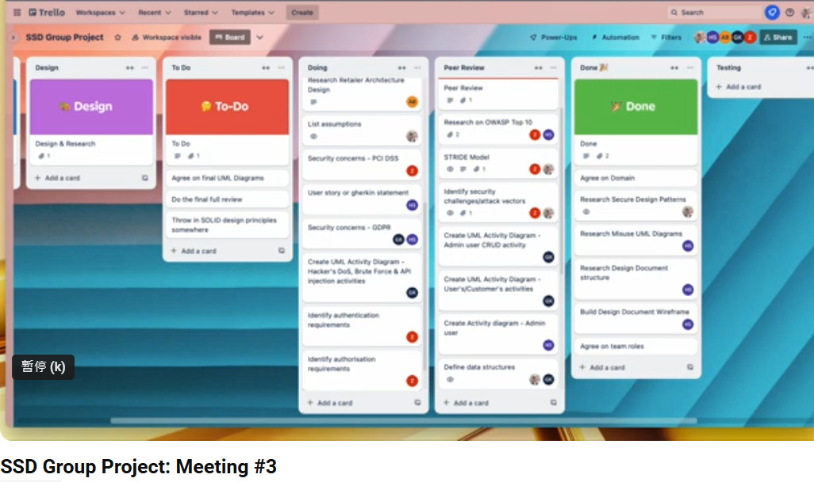

# Team Contract

### 28 October 2024   
[Group - GAZHA](SSD_A1_TeamContract.pdf)   

# Meeting Recordings

### 2 November 2024	  
First meeting for member introductions, project outline, and strategy.  

🔗 Clicking the image will redirect you to YouTube.  

  

### 17 November 2024   
Regular meeting to provide updates and follow up on missing tasks.  

🔗 Clicking the image will redirect you to YouTube.   

  

### 24 November 2024   
Regular meeting to provide updates and follow up on missing tasks.  

  

### 26 November 2024   
We have scheduled a meeting with the professor to discuss the design document and clarify any questions. 
  

### 28 November 2024   
A small group meeting is scheduled to follow up on the points discussed after the meeting with the professor.  
  

### 1 December 2024   
Final meeting to agree on the design document and submission arrangement.  

</a>
  

---

[Return to Assignment 1 - Design Document](SSD_A1.md)  
[Return to Assignment 3 - e-Portfolio](SSD_A3.md)  
[Return to Module 6](SSD_main.md)
