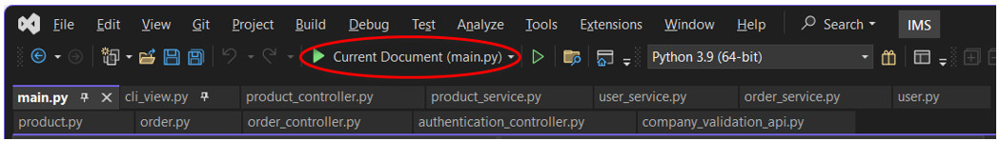

### Assignment 2: Development Individual Project - Output and Evidence of Testing
 

###  - [Demonstration](SSD_A2_Demo.pdf)
###  - [Test Output](SSD_A2_TestOutput.pdf)
 

---

## [README – Inventory Management System (IMS)](SSD_A2_README.pdf)

#### Background
The Inventory Management System (IMS) is designed for a beauty shop group’s internal use to track and manage product inventories across multiple locations. It is a command-line interface (CLI) based application enabling Administrators (Admin), Clerks, and authorised Customers to perform basic Create, Read, Update and Delete (CRUD) operations. 

#### Assumptions
1.	Designed for internal use only.
2.	Contains limited commercial functionality.
3.	Focuses on security features for user authentication, data integrity, and basic inventory management.
4.	Does not integrate payment processes or external payment gateways.
5.	Avoids storing sensitive personal data.

#### Key Features
1.	Secure User Authentication with Multiple Roles
    - Admin can manage users and products, and view system logs.
    - Clerk can manage products.
    - Customer can place orders and view order histories.
2.	Account Lockouts and Multiple Failed Login Attempt Handling
    - Users are locked after multiple failed attempts.
    - The account remains locked for a set duration before unlocking automatically or manually.
3.	Inventory Management Features
    - Includes adding new products, updating stock, deleting products, and listing all products.
4.	Basic Order Placement and Order History
    - Customers can place an order for multiple products in one session.
    - The system records orders in a local JSON file for retrieval.
5.	API Interaction
    - The company validation API ensures only authorised companies are permitted to create new customer accounts, helping prevent unauthorised usage.

#### Security Measures
1.	Password Hashing with bcrypt
    - Avoids storing plaintext passwords, thereby mitigating the risk of user credential leaks (OWASP, n.d.c)
2.	Account Lockout Mechanism
    - Locks user accounts after a configurable number of failed login attempts (default is 3), thus limiting brute-force attacks.
3.	Lockout Timer
    - Automatically unlocks accounts after a set duration (default is 5 minutes), eliminating manual administrative intervention unless desired.
4.	Multi-Factor Authentication (MFA) Simulation
    - Prompts users for an MFA code to complete login, preventing brute-force or password-spray attacks (OWASP, n.d.b)
5.	Validate Password Strength
    - Uses regular expressions to ensure passwords contain uppercase letters, lowercase letters, numbers, special characters, and meet minimum length requirements.
6.	Authorised Company Registration
    - Only customers associated with approved company IDs can register, verified via a simple Flask-based validation API (Madden, 2020).
7.	Role-Based Access Control (RBAC) 
    - Admin privileges are required for user management and system log viewing, while clerks and customers have restricted capabilities (OWASP, n.d.a).
8.	Logging
    - Admins can access logs of user login success and failure, among other events, aiding in the detection of suspicious activity.

#### System Architecture
The overall structure follows Model-View-Controller (MVC) pattern (Sellares, n.d.):
1.	Models
    - Define fundamental data structures such as User, Product, and Order.
2.	Views (CLIView)
    - Provide the command-line interface through which users interact with the system.
3.	Controllers
    - Encapsulate logic for authentication (AuthenticationController), product operations (ProductController), and order handling (OrderController).
4.	Services
    - Manage the loading, saving, and manipulation of user, product, and order data. The data is serialised and deserialised via JSON files, keeping everything lightweight and easy to maintain.

Below File Tree present the core modules in the IMS. 
 
_Figure 1: File Tree_

#### Dependencies and libraries

| **Library/Module** | **Details** | 
| :----------- | :--------- |
| _bcrypt_  (PyPI, 2024a) | Secure password hashing (salting + cost factor) for storing passwords. |
| _requests_  (PyPI, 2024e)	| Handles simple and efficient HTTP interactions with the Flask validation API. |
| _pytest_  (PyPI, 2024d)	| A popular framework for unit and integration tests with fixture support. |
| _Flask_  (Pallets, 2010; PyPI, 2024c)	| Quickly sets up a minimal API endpoint for company ID validation. |
| _logging_  (Python Software Foundation, n.d.c)	| Writes logs tracking critical application events. |
| _os, sys_  (GeeksforGeeks, 2024)	| Enables cross-platform file and system operations. |
| _uuid_  (UUID Generator,  n.d.)	| Generates reliable unique IDs for orders and other items. |
| _unittest.mock/patch_  (Python Software Foundation, n.d.f)	| Allows mocking inputs and isolating functionality during tests. |
| _datetime_, _time_  (Python Software Foundation, n.d.a)	| Manages timestamps and lockout timers with precise controls. |
| _re_  (Python Software Foundation, n.d.d)	| Performs regex-based checks for password strength. |
| _json_  (Python Software Foundation, n.d.b)	| Read/write and manipulating JSON data files. |
| _subprocess_  (Python Software Foundation, n.d.e)	| Executes shell commands for tasks like linting or deployment. |
| _flake8_  (PyPI, 2024b)	| Enforces code style and consistency for maintainable code. |

#### Data Structures
The IMS system primarily uses Python lists to store collections of custom objects in memory, with JSON files for persistence.
1.	_users.json_ holds a list of User objects. 
2.	_products.json_ holds a list of Product objects. 
3.	_orders.json_ holds a list of Order objects.
Although data is saved and loaded via JSON, it remains in memory (as lists of objects) while the application runs, allowing quick iteration, addition, and removal.

#### Execution Instructions
1.	Prerequisites
    - Python 3.9 or later version should be installed.
    - Ensure required libraries are installed (e.g., _bcrypt_, _requests_, _Flask_) via _pip install_.
      
2.	Initial Data
    - By default, sample Admin, Clerk, and Customer accounts and sample products exist.
    - Optionally, run _populate_data.py_ to reset or re-populate initial data.
      
3.	Run the Application
    - Launch main.py from your IDE or execute python main.py in your terminal. 
        

    - Follow on-screen prompts to log in (existing Admin, Clerk, or Customer) or register (new Customer) if you have a valid company ID. 
         

4.	Default User Credentials (For demonstration only) 
     
    **Important Note:** In a real production environment, passwords should not be hard-coded in README files.
  	
5.	MFA Code (For Simulation only)
    - When prompted, enter the MFA code _123456_ to simulate successful multi-factor authentication.  
       

6.	Creating New Users
    - Admin users can add new Clerk users 
      

    - A new Customer can self-register if they have a valid company ID recognised by the validation API. 
       

    - The Admin user must be created on the backend via populate_data.py.
      
7.	Username and Password Requirements
    - Usernames must contain only letters and digits (_A–Z_, _a–z_, _0–9_) and be within 5–20 characters in length.
    - Passwords must be at least 8 characters long and contain at least one uppercase letter (_A–Z_), one lowercase letter (_a–z_), one digit (_0–9_), and one special character (_@#$%^&+=_).
      
8.	Unlocking Users
    - Admin users can unlock blocked users manually. 
        

    - Alternatively, all blocked users can be automatically unlocked after a set duration (default is 5 minutes), eliminating manual steps. 
         

    - If the only Admin user is locked and cannot wait for the set duration to automatically unlock, it can be unblocked on the backend (e.g., via _unlock_admin.py_ or direct JSON editing).
      
9.	Validation API 
    - Run _company_validation_api.py_ in another terminal to allow company verification for new customer registration.  For the demonstration, only _COMPANY123_, _COMPANY456_, and _COMPANY789_ are accepted. 
          

10.	CLI Navigation
    - Once running, the CLI will guide you through the available actions for your user role (Admin, Clerk, Customer).     
           
          _Figure 2: Menu for different users_

11.	Termination
    - Log out from the current User Menu and select option 3 to exit. 
             

#### Testing Strategy
The IMS uses _pytest_ to confirm each unit (controllers, services, models) functions as intended. The main testing areas are:
1.	Authentication
    - Tests correct login, account lockouts, lockout release, MFA code entry, password validation, and registration flows.
2.	Product Management
    - Verifies adding, listing, updating stock quantity, and deleting products reflect correctly in JSON.
3.	Order Management
    - Ensures successful order placement, correct stock reductions, and accurate order history retrieval.
4.	Integration Tests
    - Checks that the complete flow (e.g., logging in as a user and then adding a product) works seamlessly.
5.	User Acceptance Tests
    - Perform manual testing by simulating user interaction through the CLI.
6.	Exception Handling
    - Examines how the system reacts to invalid user inputs, missing files, and network errors during API calls.
7.	Linting
    - _Flake8_ is used to detect style and formatting issues.

#### Test Results
1.	The core functionalities (login/logout, product addition and updates, order placement) passed the automated tests without major issues.
2.	Integration tests showed that the end-to-end workflows function as intended under typical conditions.
3.	Some exception handling scenarios revealed that error messages could be more descriptive, and additional edge cases (like extremely large stock values) need expanded testing.
4.	The linter originally flagged several style violations (e.g., E501 for line length, E302 for missing blank lines). All warnings have since been addressed, and the code now passes all checks.

Evidence of testing can be found in Appendix 15.

#### Future Enhancements
1.	Implement a password reset flow (via email link or security questions).
2.	Migrate from JSON to a relational or NoSQL database for large data.
3.	Mask user-entered passwords.
4.	Convert the CLI to a GUI interface.
5.	Improve error handling to reduce exceptions.
6.	Implement a proper MFA.

 
  

---

#### Reference
GeeksforGeeks. (2024) Os Module Vs. Sys Module in Python. Available from: https://www.geeksforgeeks.org/os-module-vs-sys-module-in-python/ [Accessed 8 December 2024]

Madden, N. (2020) API Security in Action. Manning Publications.

OWASP. (n.d.a) Authorization Cheat Sheet. Available from: https://cheatsheetseries.owasp.org/cheatsheets/Authorization_Cheat_Sheet.html [Accessed 3 December 2024]

OWASP. (n.d.b) Multifactor Authentication Cheat Sheet. Available from: https://cheatsheetseries.owasp.org/cheatsheets/Multifactor_Authentication_Cheat_Sheet.html [Accessed 3 December 2024]

OWASP. (n.d.c) Password Storage Cheat Sheet. Available from: https://cheatsheetseries.owasp.org/cheatsheets/Password_Storage_Cheat_Sheet.html [Accessed 3 December 2024]

Pallets. (2010) Flask. Available from: https://flask.palletsprojects.com/en/stable/ [Accessed 1 December 2024].

PyPI. (2024a) bcrypt: Modern password hashing for your software and your servers. Available from: https://pypi.org/project/bcrypt/ [Accessed 14 December 2024]

PyPI. (2024b) flake8: The modular source code checker: pep8 pyflakes and co. Available from: https://pypi.org/project/flake8/ [Accessed 24 December 2024].

PyPI. (2024c) Flask: A simple framework for building complex web applications. Available from: https://pypi.org/project/Flask/ [Accessed 8 December 2024].

PyPI. (2024d) pytest: Simple powerful testing with Python. Available from: https://pypi.org/project/pytest/ [Accessed 24 December 2024].

PyPI. (2024e) requests: Python HTTP for Humans. Available from: https://pypi.org/project/requests/ [Accessed 8 December 2024].

Python Software Foundation. (n.d.a) datetime — Basic date and time types. Available from: https://docs.python.org/3/library/datetime.html [Accessed 11 December 2024].

Python Software Foundation. (n.d.b) json — JSON encoder and decoder. Available from: https://docs.python.org/3/library/json.html [Accessed 11 December 2024].

Python Software Foundation. (n.d.c) logging — Logging facility for Python. Available from: https://docs.python.org/3/library/logging.html [Accessed 11 December 2024].

Python Software Foundation. (n.d.d) re — Regular expression operations. Available from: https://docs.python.org/3/library/re.html [Accessed 15 December 2024].

Python Software Foundation. (n.d.e) subprocess — Subprocess management. Available from: https://docs.python.org/3/library/subprocess.html#module-subprocess [Accessed 26 December 2024].

Python Software Foundation. (n.d.f) unittest.mock — mock object library. Available from: https://docs.python.org/3/library/unittest.mock.html [Accessed 23 December 2024].

Sellares, T. (n.d.) The Model View Controller: A Composed Pattern. Universitat de Girona. Available from: https://imae.udg.edu/~sellares/EINF-ES1/MVC-Toni.pdf [Accessed 27 November].

UUID Generator. (n.d.) Generate a UUID in Python.  Available from: https://www.uuidgenerator.net/dev-corner/python [Accessed 11 December 2024]  

#### Bibliography
30DayCodingInc. (2024) Building Scalable REST APIs with Flask and Python: A Comprehensive Guide. Available from: https://30dayscoding.com/blog/building-scalable-rest-apis-with-flask-and-python?srsltid=AfmBOorI6JNyf2XH7moOUKUGW5UacagzwqBiO_Yr2fIoyNO4vByK-ppG [Accessed 8 December 2024]

Barbosa, L. & Hora, A. (2022) How and why developers migrate Python tests. In 2022 IEEE International Conference on Software Analysis, Evolution and Reengineering (SANER) (538-548). IEEE.

GeeksforGeeks. (2023) Use jsonify() instead of json.dumps() in Flask. Available from: https://www.geeksforgeeks.org/use-jsonify-instead-of-json-dumps-in-flask/ [Accessed 1 December 2024].

Jaiswal, S. (2020) Python Regular Expression Tutorial. Available from: https://www.datacamp.com/tutorial/python-regular-expression-tutorial [Accessed 15 December 2024]

Krebs, B. & Martinez, J. (2022) Developing RESTful APIs with Python and Flask. Available from: https://auth0.com/blog/developing-restful-apis-with-python-and-flask/ [Accessed 1 December 2024].

Microsoft. (2024) Tutorial: Work with the Flask web framework in Visual Studio. Available from: https://learn.microsoft.com/en-us/visualstudio/python/learn-flask-visual-studio-step-01-project-solution?view=vs-2022 [Accessed 9 December 2024]

Norris, W. (2020) How To Integrate Unit Testing, Linting, and Continuous Integration Into Your Python Projects. Available from: https://www.earthdatascience.org/blog/unit-testing-linting-ci-python/ [Accessed 23 December 2024]

OWASP. (2021) OWASP Top Ten 2021: The Ten Most Critical Security Risks to Web Applications. Available from: https://owasp.org/www-project-top-ten/.

OWASP. (2024) OWASP Top Ten Proactive Controls 2024: The Ten Most Critical Security Practices for Developers. Available from: https://top10proactive.owasp.org/archive/2024/the-top-10/ [Accessed 5 November 2024].

OWASP. (n.d.a) Cryptographic Storage Cheat Sheet. Available from: https://cheatsheetseries.owasp.org/cheatsheets/Cryptographic_Storage_Cheat_Sheet.html [Accessed 15 December 2024]

OWASP. (n.d.b) Key Management Cheat Sheet. Available from: https://cheatsheetseries.owasp.org/cheatsheets/Key_Management_Cheat_Sheet.htm [Accessed 15 December 2024]

Patel, N. (2019) What are Evil Regexes? Available from: https://medium.com/@nitinpatel_20236/what-are-evil-regexes-7b21058c747e [Accessed 15 December 2024]

Saini, A. (2024) Understanding Flask Framework: Installation, features & Expert Insights. Available from: https://www.analyticsvidhya.com/blog/2021/10/flask-python/ [Accessed 8 December 2024]

Tutorialspoint. (n.d.) Cryptography with Python Tutorial. Available from: https://www.tutorialspoint.com/cryptography_with_python/cryptography_with_python_quick_guide.htm [Accessed 14 December 2024]

Visual Studio Code. (2024) Linting Python in Visual Studio Code. Available from: https://code.visualstudio.com/docs/python/linting [Accessed 26 December 2024]

  

---

#### Appendix	

[Appendix 1 - 14 Python Scripts](SSD_A2_Appendix1-14.pdf)

[Appendix 15 Test Result](SSD_A2_Appendix15.pdf)

  

---

[Return to Module 6](SSD_main.md)
