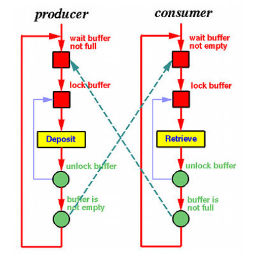

# Activity: The Producer-Consumer Mechanism

Producer/Consumer Problem (also known as the ‘bounded buffer’ problem):

 - A ‘producer’ is producing items at a particular (unknown and sometimes unpredictable) rate.
 - A ‘consumer’ is consuming the items – again, at some rate.
For example, a producer-consumer scenario models an application producing a listing that must be consumed by a printer process, as well as a keyboard handler producing a line of data that will be consumed by an application program.
This is shown in the picture below [(Shene, 2014)](https://pages.mtu.edu/~shene/NSF-3/e-Book/SEMA/TM-example-buffer.html).

Items are placed in a buffer when produced, so:

 - Consumer should wait if there isn’t an item to consume
 - Producer shouldn’t ‘overwrite’ an item in the buffer


<br>

Synchronisation is necessary because:

 - If the consumer has not taken out the current value in the buffer, then the producer should not replace it with another.
 - Similarly, the consumer should not consume the same value twice.

## Task
Run producer-consumer.py in your chosen Jupyter Notebook workspace (**Producer-Consumer Mechanism**), where the queue data structure is used.

You can also download the **'producer-consumer-mechanism'** zip file.

 - code source: https://techmonger.github.io/55/producer-consumer-python/

```python
from threading import Thread
from queue import Queue
 
q = Queue()
final_results = []
 
def producer():
    for i in range(100):
        q.put(i)
        
 
def consumer():
    while True:
        number = q.get()
        result = (number, number**2)
        final_results.append(result)
        q.task_done()
   
   
for i in range(5):
    t = Thread(target=consumer)
    t.daemon = True
    t.start()
    
producer()
 
q.join()
 
print (final_results)
```

Answer the following questions:
1. How is the queue data structure used to achieve the purpose of the code?
2. What is the purpose of q.put(I)?
3. What is achieved by q.get()?
4. What functionality is provided by q.join()?
5. Extend this producer-consumer code to make the producer-consumer scenario available in a secure way. What technique(s) would be appropriate to apply?


Remember to record your thoughts and answers in your e-portfolio.

## Learning Outcomes
 - Identify and critically analyse operating system risks and issues, and identify appropriate methodologies, tools and techniques to solve them.
 - Critically analyse and evaluate solutions produced.

## Reflections
xxx

<br><br>

---

## Reference
xxx

<br><br>

---

[Return to Module 6 Unit 3](SSD_Unit03.md)
