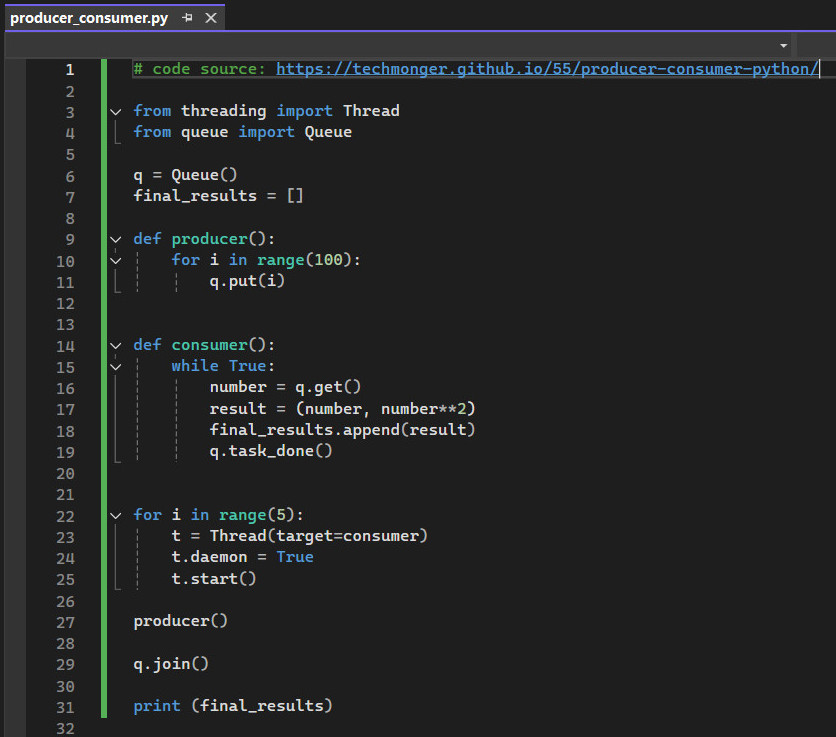
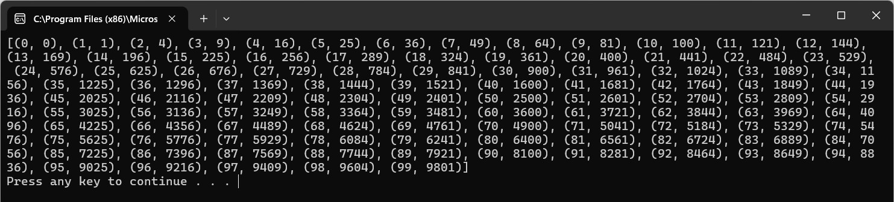
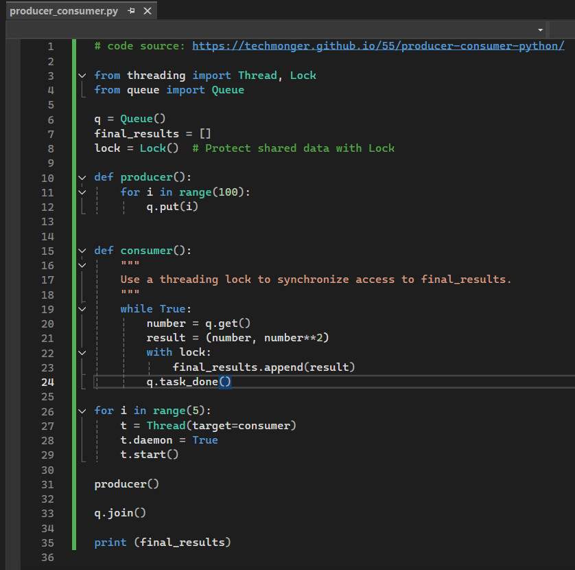
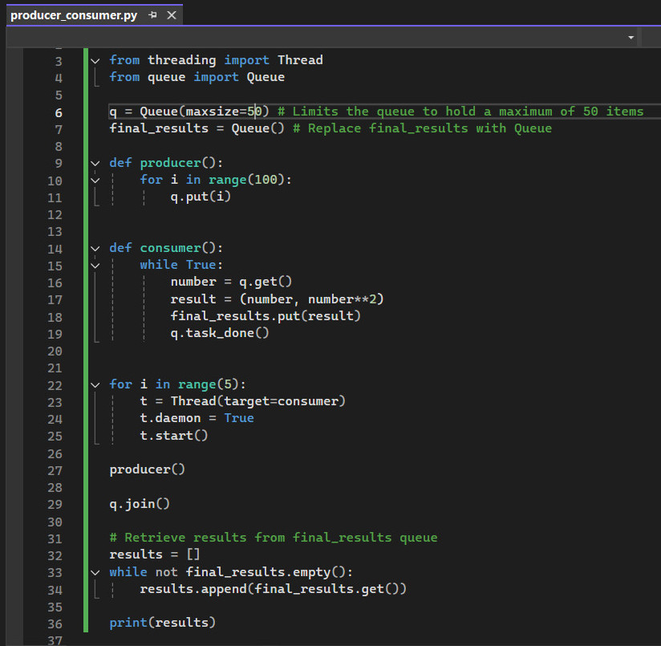

# Activity: The Producer-Consumer Mechanism

Producer/Consumer Problem (also known as the ‘bounded buffer’ problem):

 - A ‘producer’ is producing items at a particular (unknown and sometimes unpredictable) rate.
 - A ‘consumer’ is consuming the items – again, at some rate.
For example, a producer-consumer scenario models an application producing a listing that must be consumed by a printer process, as well as a keyboard handler producing a line of data that will be consumed by an application program.
This is shown in the picture below [(Shene, 2014)](https://pages.mtu.edu/~shene/NSF-3/e-Book/SEMA/TM-example-buffer.html).

Items are placed in a buffer when produced, so:

 - Consumer should wait if there isn’t an item to consume
 - Producer shouldn’t ‘overwrite’ an item in the buffer

 

Synchronisation is necessary because:

 - If the consumer has not taken out the current value in the buffer, then the producer should not replace it with another.
 - Similarly, the consumer should not consume the same value twice.

## Task
Run producer-consumer.py in chosen IDE, where the queue data structure is used.

  

Output:

  

## Answer the following questions:

### 1. How is the queue data structure used to achieve the purpose of the code?
In the provided code, the Queue data structure serves as a thread-safe buffer that facilitates communication between the producer and consumer threads. The producer function generates integers from 0 to 99 and places them into the queue using q.put(i). Multiple consumer threads retrieve these items from the queue using q.get(), process them (in this case, calculate the square of the number), and store the results.

The queue ensures that:

 - Synchronization: Access to shared data (the items in the queue) is safely managed without explicit locks, preventing race conditions.
 - Coordination: Producers and consumers operate at their own pace. If the queue is empty, consumers automatically wait until an item is available. Similarly, if the queue reaches a certain size (though not specified here), producers can wait, preventing overproduction.

By using a queue, the code effectively decouples the producer and consumer, allowing them to run concurrently without interfering with each other.

### 2. What is the purpose of q.put(I)?
The method q.put(i) is used by the producer to place an item i into the queue q. This action signifies that an item is ready to be consumed. Since Queue is thread-safe, q.put(i) ensures that the item is safely added to the queue even when multiple threads might be interacting with it simultaneously.

In this context:

 - Producer Function: Iterates over a range of numbers from 0 to 99.
 - Action: For each number i, it calls q.put(i), adding the number to the queue.
 - Purpose: Makes the number available for consumer threads to retrieve and process.

### 3. What is achieved by q.get()?
The method q.get() is used by consumer threads to retrieve the next available item from the queue q. If the queue is empty, q.get() will block the calling thread until an item becomes available. This ensures that consumers only proceed when there is actual data to process.

In this context:

 - Consumer Function: Contains a while True loop, continuously trying to get items.
 - Action: number = q.get() retrieves the next item from the queue.
 - Purpose: Provides consumers with the data produced by the producer, allowing them to process it (calculate squares in this case).

### 4. What functionality is provided by q.join()?
The method q.join() blocks the main thread (or calling thread) until all items in the queue have been processed and marked as done. Processing an item involves two steps:

1. Retrieval: Consumer fetches an item using q.get().
2. Completion Signal: After processing the item, the consumer calls q.task_done() to indicate that the item has been fully processed.
q.join() works in conjunction with q.task_done():

  - Waiting Mechanism: q.join() keeps the main thread waiting until the count of task_done() calls equals the number of items that had been queued with q.put().
  - Ensures Completion: It guarantees that all produced items have been consumed and processed before the program proceeds (or exits).
  - In This Code: Prevents the print(final_results) statement from executing until all numbers have been squared and added to final_results.

### 5. Extend this producer-consumer code to make the producer-consumer scenario available in a secure way. What technique(s) would be appropriate to apply?

In the provided code, final_results is a shared list that multiple consumer threads append results to. While Python's Global Interpreter Lock (GIL) provides some thread safety, operations that are not atomic (like list appends in the presence of complex objects) may still lead to race conditions.

To enhance the security and thread-safety of the producer-consumer code, especially concerning shared resources, using a threading lock to synchronize access to final_results.

Implementation:
 - A Lock object is created using lock = Lock().
 - In the consumer function, when appending to final_results, the code acquires the lock using with lock:, ensuring that only one thread modifies final_results at a time.

  
   

Alternatively, use a thread-safe data structure from queue module for final_results and limit Queue Size

Implementation:
 - Replace final_results with a Queue, which is thread-safe.
 - After processing, results are retrieved from final_results.
 - Prevent a potential Denial of Service (DoS) by limiting the size of the queue to avoid memory exhaustion.
   
  

By applying these techniques, the producer-consumer code becomes more robust, secure, and ready for use in environments where security and data integrity are critical.

## Reflections
Working on the producer-consumer mechanism assignment has significantly enhanced my understanding of concurrent programming and the role of synchronisation in multi-threaded applications. By implementing the producer-consumer problem using Python's threading and queue modules, I gained practical experience in enabling threads to communicate and coordinate tasks without interfering with each other.

One of the key lessons was the use of the Queue data structure as a thread-safe buffer. This allowed the producer and consumer threads to work independently while remaining synchronised through the queue. The automatic blocking behaviour of q.put() and q.get() ensured that producers did not overwrite unconsumed data, while consumers waited when the queue was empty. This demonstrated how effective synchronisation can prevent concurrency issues, such as race conditions and data corruption.

Understanding the importance of locks in protecting shared resources was another crucial aspect. By using a threading lock to manage access to the shared final_results list, I ensured that multiple threads could not modify it simultaneously, thereby avoiding inconsistent states or crashes. This reinforced the fact that, despite Python's Global Interpreter Lock (GIL), explicit synchronisation is still necessary when dealing with non-atomic operations.

Applying these concepts to future assignment - the online retailer management system, I now recognise the importance of managing concurrent processes effectively. For instance, handling multiple customer orders concurrently will require a reliable producer-consumer setup to ensure thread safety when accessing shared resources like inventory databases. This will be vital for maintaining data integrity and delivering a dependable user experience.

  

---

## Reference
Shene, C.K. (2014) ThreadMentor: The Producer/Consumer (or Bounded-Buffer) Problem. Available from: https://pages.mtu.edu/~shene/NSF-3/e-Book/SEMA/TM-example-buffer.html

  

---

[Return to Module 6 Unit 3](SSD_Unit03.md)
