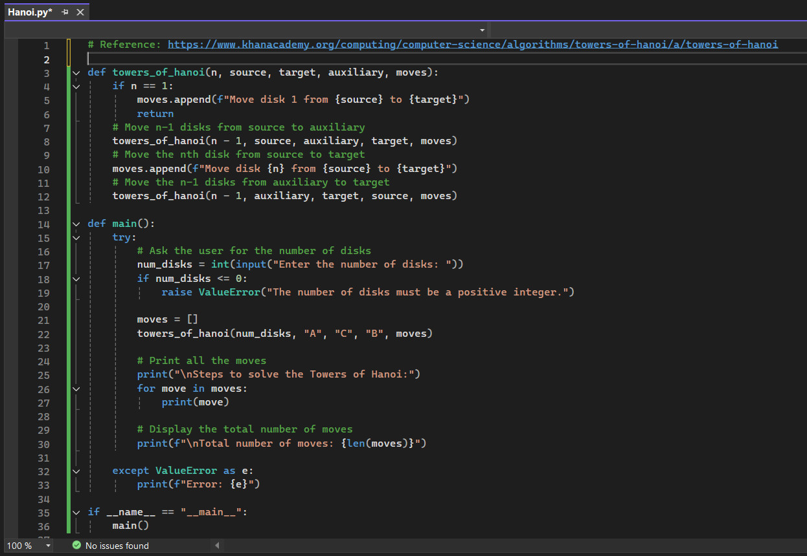
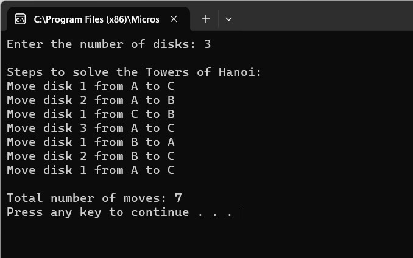
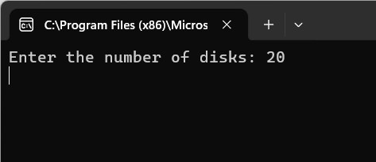
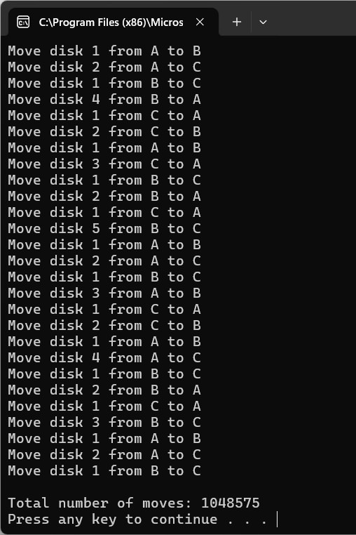

# Programming language concepts: Programming exercises – recursion and regex

## Requirement
This week there are two programming exercises that will help you understand two valuable language concepts – **recursion and regex**.

## Recursion
One of the classic programming problems that is often solved by recursion is the towers of Hanoi problem. 
A good explanation and walkthrough are provided by [Cormen & Balkcom (n.d.)](https://www.khanacademy.org/computing/computer-science/algorithms/towers-of-hanoi/a/towers-of-hanoi). (the code they used for their visual example is provided on their website as well).

### Read the explanation, study the code and then create your own version using Python. Create a version that asks for the number of disks and then executes the moves, and then finally displays the number of moves executed.
 <br>

 <br>

 <br>

 <br>


### What is the (theoretical) maximum number of disks that your program can move without generating an error?

In the Python Official Documentation - sys Module (Python, N.D.a), the getrecursionlimit() function is described as follows:

' **sys.getrecursionlimit()** <br>
Return the current value of the recursion limit, the maximum depth of the Python interpreter stack. This limit prevents infinite recursion from causing an overflow of the C stack and crashing Python. It can be set by _setrecursionlimit()_. '

' **sys.setrecursionlimit(limit)** <br>
Set the maximum depth of the Python interpreter stack to limit. This limit prevents infinite recursion from causing an overflow of the C stack and crashing Python.
The highest possible limit is platform-dependent. A user may need to set the limit higher when they have a program that requires deep recursion and a platform that supports a higher limit. This should be done with care, because a too-high limit can lead to a crash.
If the new limit is too low at the current recursion depth, a RecursionError exception is raised. '

The Python's default recursion limit is 1000 (Python Central, 2023).

This can be checked using:

```python
import sys
print(sys.getrecursionlimit())
```

### What limits the number of iterations? 
1. **Recursion Depth:** As mentioned earlier, the default recursion depth in Python is limited to 1,000. You can increase this limit using sys.setrecursionlimit(), but doing so risks crashing the Python interpreter if the system runs out of memory.

2. **Memory Usage:** Each recursive call consumes memory. For large inputs, the program may run out of memory, causing the program to crash.  For example, when I tried running the program with an input of 100 on my personal notebook, the system froze.

3. **Execution Time:** The number of moves required to solve the Towers of Hanoi grows exponentially with the number of disks. Specifically, the number of moves required is 2^n - 1, where n is the number of disks. For large values of n, the execution time becomes impractical.

### What is the implication for application and system security?
1. **Stack Overflow:** Recursion-heavy algorithms like Towers of Hanoi can lead to stack overflow errors if the recursion depth exceeds the system's stack size. This can be exploited by attackers to crash the system or execute malicious code.

2. **Denial of Service (DoS):** If the program is exposed as part of a web service or API, an attacker could input a very large number of disks, causing the system to consume excessive memory or CPU resources, resulting in a denial of service.

3. **Input Validation:** Failing to validate user input (e.g., ensuring the number of disks is reasonable) could lead to unexpected behavior or system instability.
<br>

---

## Regex
The second language concept we will look at is regular expressions (regex). 
We have already presented some studies on their use, and potential problems, above. 
The lecturecast also contains a useful link to a tutorial on creating regex. 
Re-read the provided links and tutorial [(Jaiswal, 2020)](https://www.datacamp.com/tutorial/python-regular-expression-tutorial) and then attempt the problem presented below:

 - The UK postcode system consists of a string that contains a number of characters and numbers – a typical example is ST7 9HV (this is not valid – see below for why). The rules for the pattern are available from idealpostcodes (2020).

### Create a python program that implements a regex that complies with the rules provided above – test it against the examples provided.
 - Examples:
      - M1 1AA
      - M60 1NW
      - CR2 6XH
      - DN55 1PT
      - W1A 1HQ
      - EC1A 1BB

According to the rules provided by IdealPostcodes (2020) and commonly accepted patterns for UK postcodes:
 - Outward Code: 1–4 characters (letters and numbers). Examples: M1, DN55, EC1A.
 - Inward Code: A single digit followed by two uppercase letters. Examples: 1AA, 6XH, 1HQ.

General Regex Pattern for UK Postcodes:
```python
^[A-Z]{1,2}[0-9][0-9A-Z]?\s[0-9][A-Z]{2}$
```
Explanation:
 - ^[A-Z]{1,2}: The outward code starts with 1–2 uppercase letters.
 - [0-9]: Followed by one digit.
 - [0-9A-Z]?: Optionally followed by another digit or letter.
 - \s: There is a mandatory space separating the outward and inward codes.
 - [0-9]: The inward code starts with a single digit.
 - [A-Z]{2}$: Ends with two uppercase letters.

 <br>

 <br>

### How do you ensure your solution is not subject to an evil regex attack?
Evil Regex Attack occurs when a regex pattern is vulnerable to catastrophic backtracking, where the regex engine takes an exponential amount of time to evaluate certain inputs. This can lead to system performance degradation or denial of service (Patel, 2019).

Below mitigations to Prevent Evil Regex Attacks:
1. **Avoid Complex Patterns:** Ensure the regex pattern is simple and avoids nested quantifiers or ambiguous repetition. For example:
 - Patterns like (a|b|c)* or ((A|B)*C)* can be exploited.
 - The provided UK postcode regex is simple and does not include risky constructs.

2. **Set Timeouts for Regex Matching:** Use libraries like regex (instead of re), which allows you to set timeouts for regex operations (Python, N.D.b) .

3. Validate Input Length: Limit the length of input strings before applying regex. For example, UK postcodes are short (typically <10 characters). Reject inputs that are excessively long.

4. Use Anchors in Regex: Anchors (^ and $) ensure the regex matches the entire input string, not just a substring. This reduces ambiguity and speeds up matching.

5. Input Validation Before Regex: Perform pre-checks to ensure the input adheres to expected characteristics (e.g., length, allowed characters) before applying regex.
   
If your program is exposed as part of a web service or API, submitting malicious input (crafted to trigger catastrophic backtracking) can cause high CPU usage, leading to denial of service.  By keeping the regex pattern simple, setting timeouts, and validating input length, it could minimise the risk of such attacks.

## Reflections
These two programming exercises provided valuable insights into programming concepts and their application in system design, especially with a focus on security and problem-solving.

The Towers of Hanoi exercise was particularly fascinating, as it introduced me to a mathematical and programming concept I hadn't encountered before. Previously, I had only seen the Hanoi Tower as a toy for children, but I never imagined it was rooted in such deep mathematical theory. Learning about the recursive approach to solving this problem was eye-opening, and the explanation and walkthrough provided by Cormen & Balkcom (n.d.) were instrumental in helping me understand how to break the problem into smaller steps.

Through research and implementation, I was able to write a Python script that calculates the minimum number of moves required to solve the puzzle for any given number of disks. This gave me a hands-on understanding of recursion and its applications in problem-solving. As an additional step, I even purchased a real-life Hanoi Tower and placed it on my desk as a brain-training toy. It not only serves as a reminder of what I’ve learned but also helps me improve my logical thinking.

This exercise also gave me an appreciation for the importance of optimizing recursive algorithms, especially when considering system limitations like recursion depth and memory usage. Moreover, it highlighted potential security implications of poorly implemented recursion, such as stack overflow or denial-of-service attacks, which are critical considerations in system design.

The second exercise, involving UK postcode validation, was a practical example of how regular expressions (regex) can be used to validate input formats in real-world applications. This exercise was not only about understanding regex patterns but also about recognizing its limitations and addressing potential security vulnerabilities.

One key takeaway was the importance of layered validation. While regex is excellent for checking the format of inputs like postcodes, it cannot verify whether the input is valid in a real-world context. By implementing additional checks (e.g., comparing the outward code to a list of valid UK postcodes), I learned how to make validation systems more robust. This concept can be extended to other scenarios, such as password validation, where both format and complexity checks are essential to ensure security.

Another major insight was understanding evil regex attacks, which can exploit poorly written regex patterns to cause catastrophic backtracking and denial-of-service. This exercise emphasized the importance of writing efficient regex patterns, using input validation, and setting limits to prevent such attacks. These practices are essential for creating secure systems that handle user input responsibly without introducing new vulnerabilities.

Going forward, these exercises will serve as a foundation for tackling more complex problems, particularly those involving secure system design. They have also deepened my understanding of how theoretical concepts, like recursion and regex, can be applied in practical programming tasks while keeping security in mind.

<br><br>

---

## Reference
Cormen, T. & Balkcom, D. (N.D.) Khan Academy: Towers of Hanoi. Available from: https://www.khanacademy.org/computing/computer-science/algorithms/towers-of-hanoi/a/towers-of-hanoi

Ideal Postcodes. (2020) Standard UK Address. Available from: https://docs.ideal-postcodes.co.uk/docs/data/paf

Jaiswal, S. (2020) Python Regular Expression Tutorial. Available from: https://www.datacamp.com/tutorial/python-regular-expression-tutorial

Patel, N. (2019) What are Evil Regexes? Available from: https://medium.com/@nitinpatel_20236/what-are-evil-regexes-7b21058c747e

Python (N.D.a) sys — System-specific parameters and functions. Available from: https://docs.python.org/3/library/sys.html#sys.getrecursionlimit

Python (N.D.b) re — Regular expression operations. Available form: https://docs.python.org/3/library/re.html

Python Central (2023) Resetting the Recursion Limit. Available from: https://www.pythoncentral.io/resetting-the-recursion-limit

---

[Return to Module 6 Unit 4](SSD_Unit04.md)
