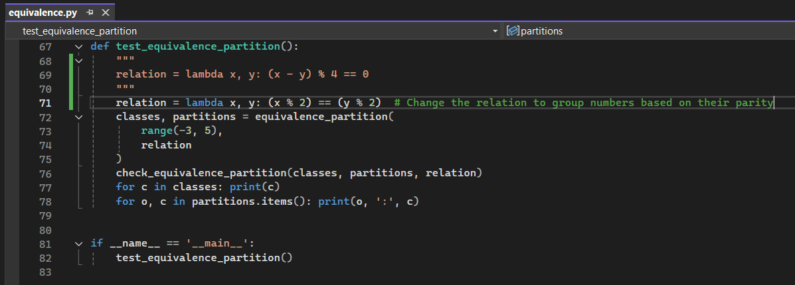
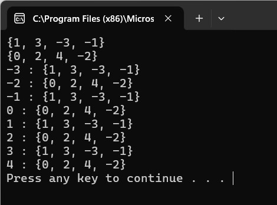
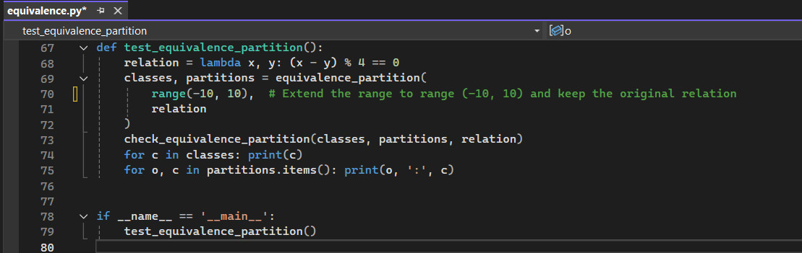
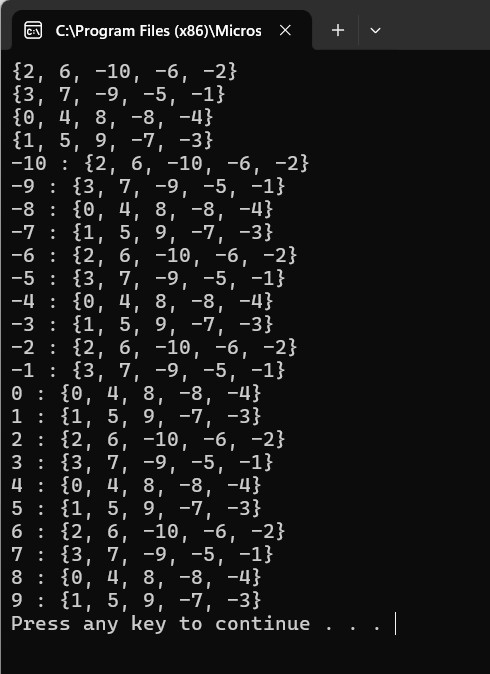
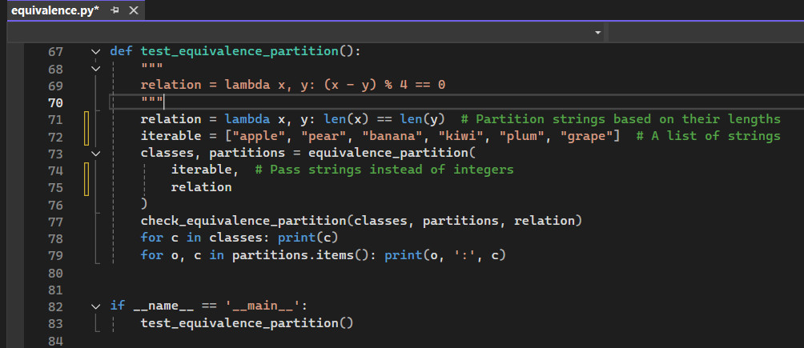
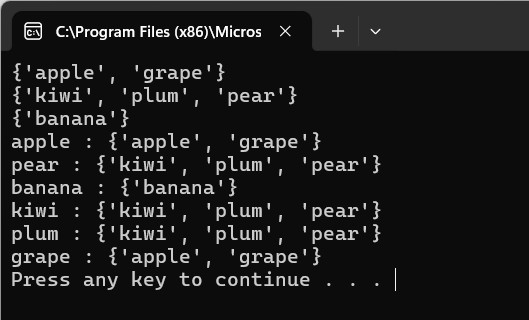

# Equivalence Testing in Python

## Requirement
Run **equivalence.py** in your chosen IDE - Testing with Python - which is an implementation of equivalence partitioning. This test partitions integers [-3,5] into equivalence classes based on _lambda x, y: (x-y)%4 == 0_.

 <br>


In the output, you should be able to see how a set of objects to be partitioned are considered, and a function evaluates if the two objects are equivalent before printing the result.

test_equivalence_partition() produces the following output:

```python
set([1, -3]) set([2, -2]) set([3, -1]) set([0, 4]) 0 : set([0, 4]) 1 : set([1, -3]) 2 : set([2, -2]) 3 : set([3, -1]) 4 : set([0, 4]) -2 : set([2, -2]) -3 : set([1, -3]) -1 : set([3, -1])
```

The actual output <br> 
 <br>

## Explanation of equivalence_partition
The equivalence_partition function is designed to group a given iterable into equivalence classes based on a specified equivalence relation. An equivalence relation is a binary function that satisfies these three properties (GeeksforGeeks, 2024):

1. Reflexive: Every element is equivalent to itself.
2. Symmetric: If a is equivalent to b, then b is equivalent to a.
3. Transitive: If a is equivalent to b and b is equivalent to c, then a is equivalent to c.

The function iterates over all elements in the input iterable and determines if the current element belongs to an existing equivalence class. If it does, the element is added to that class; otherwise, a new equivalence class is created.

Key Components of the Code
1. _equivalence_partition_:
 - Accepts an iterable and a relation function.
 - Groups elements into equivalence classes (sets).
 - Returns a list of equivalence classes and a dictionary mapping each element to its class.

2. _equivalence_enumeration_:
 - Extends the functionality of equivalence_partition by assigning a unique identifier to each equivalence class.
 - Returns the equivalence classes, the partitions, and a dictionary mapping elements to class IDs.

3. _check_equivalence_partition_:
 - Validates that the partitioning is consistent with the equivalence relation, ensuring that:
    - Each element belongs to exactly one equivalence class.
    - Elements in the same equivalence class satisfy the relation.

4. test_equivalence_partition:
 - Tests the partitioning functionality using the relation lambda x, y: (x - y) % 4 == 0.
 - Partitions integers in the range [-3, 5] into equivalence classes based on this relation.


## How the Test Works
The test uses the relation (x - y) % 4 == 0, which groups integers that have the same remainder when divided by 4. For example:

 - -3, 1 are equivalent because (-3 - 1) % 4 == 0.
 - -2, 2 are equivalent because (-2 - 2) % 4 == 0.

## Output Explanation:

### Classes:
```python
{1, -3}
{2, -2}
{3, -1}
{0, 4}
```
These are the equivalence classes. For example, {1, -3} means that 1 and -3 are equivalent under the relation.

### Partitions:
```python
-3 : {1, -3}
-2 : {2, -2}
-1 : {3, -1}
 0 : {0, 4}
 1 : {1, -3}
 2 : {2, -2}
 3 : {3, -1}
 4 : {0, 4}
```
Each element in the range [-3, 5] is mapped to its corresponding equivalence class.


## Experimentation and Results
To further investigate the code, I had modified the equivalence relation and observe how the output changes. For example:

### Experiment 1: Testing with a Different Relation
Change the relation to group numbers based on their parity:<br>
 <br>

Output:<br>
 <br>

### Experiment 2: Larger Range of Numbers
Extend the range to range(-10, 10) and keep the original relation:<br>
 <br>

Output:<br>
 <br>

### Experiment 3: Non-numeric Data
Partition strings based on their lengths:<br>
 <br>

Output:<br>
 <br>

## Reflections

This exercise on equivalence partitioning has helped me understand how to group and classify data logically using equivalence relations. I learned to implement equivalence partitioning in Python, dividing a set of objects into equivalence classes based on a defined relation. This process highlighted the importance of systematically evaluating relationships between elements to ensure they are grouped correctly. I also gained practical skills in using modular functions, lambda expressions, and validation techniques. Experimenting with the code showed me how changes to the equivalence relation affect the output and how testing edge cases ensures robustness. Beyond the technical aspects, I realized the broader significance of equivalence partitioning in simplifying complex problems and reducing redundancy.

Through my research on this exercise, I discovered that equivalence partitioning is an important technique for black-box testing (Namiko, 2021) and can be used to reduce the number of test cases while still ensuring comprehensive coverage. I can apply this technique to functional and security testing by identifying valid and invalid input groups and testing representative values from each group. For example, I can test input validation mechanisms, edge cases, and unexpected inputs systematically. While I am not fully certain how this will apply to my upcoming security software design project, the exercise has given me valuable insights into how equivalence partitioning can simplify testing and uncover potential issues during system development.

<br><br>

---

## Reference
GeeksforGeeks (2024) Equivalence Class. Available from: https://www.geeksforgeeks.org/equivalence-class/

Namiko (2021) Efficient Test Cases with Equivalence Partitioning & BVA. Available from: https://shiftasia.com/column/equivalence-class-partitioning-and-bva-in-test-design/#:~:text=In%20this%20method%2C%20the%20input,cases%2C%20still%20covering%20maximum%20requirements.

Stackoverflow (N.D.) Is there a standard way to partition an interable into equivalence classes given a relation in python? Available from: https://stackoverflow.com/questions/38924421/is-there-a-standard-way-to-partition-an-interable-into-equivalence-classes-given/38924631#38924631


## Bilbilogphy

Astralweb (N.D.) Test design technology: introduction and application of Equivalence Partitioning. Available from: https://www.astralweb.com.tw/test-design-technology-equivalence-partitioning-introduction-and-application/

Chernyak, A.Z. (N.D.) Equivalence Partitioning in Software Testing – What is It, Types, Process, Approaches, Tools, & More! Available from: https://www.zaptest.com/equivalence-partitioning-in-software-testing-what-is-it-types-process-approaches-tools

GeeksforGeeks (2024) Equivalence Partitioning Method. Available from: https://www.geeksforgeeks.org/equivalence-partitioning-method/

Karkar, J. (2024) Equivalence Partitioning: A Detailed Guide to for Smart Testing.  Available from: https://testgrid.io/blog/equivalence-partitioning-testing/

Ranorex. (2023) Using Equivalence Partitioning to Design Your QA Tests. Available from: https://www.ranorex.com/blog/using-equivalence-partitioning/


<br><br>

---

[Return to Module 6 Unit 5](SSD_Unit05.md)
