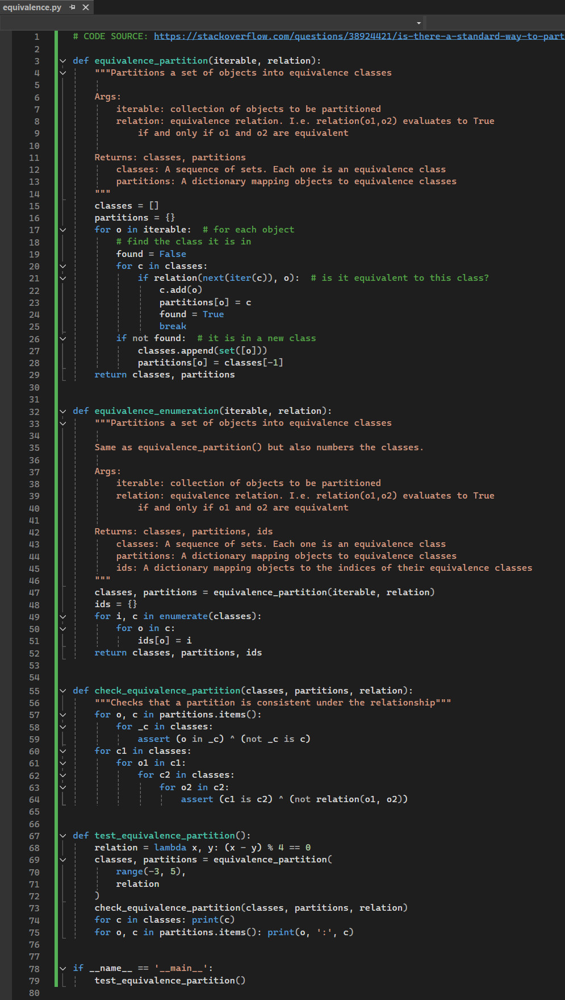
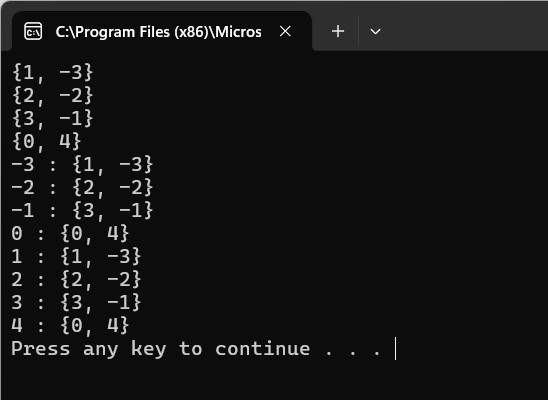

# Equivalence Testing in Python

## Requirement
Run **equivalence.py** in your chosen IDE - Testing with Python - which is an implementation of equivalence partitioning. This test partitions integers [-3,5] into equivalence classes based on _lambda x, y: (x-y)%4 == 0_.

 <br>


In the output, you should be able to see how a set of objects to be partitioned are considered, and a function evaluates if the two objects are equivalent before printing the result.

test_equivalence_partition() produces the following output:

```python
set([1, -3]) set([2, -2]) set([3, -1]) set([0, 4]) 0 : set([0, 4]) 1 : set([1, -3]) 2 : set([2, -2]) 3 : set([3, -1]) 4 : set([0, 4]) -2 : set([2, -2]) -3 : set([1, -3]) -1 : set([3, -1])
```

The actual output <br> 
 <br>

## Explanation of equivalence_partition
The equivalence_partition function is designed to group a given iterable into equivalence classes based on a specified equivalence relation. An equivalence relation is a binary function that satisfies these three properties (GeeksforGeeks, 2024):

1. Reflexive: Every element is equivalent to itself.
2. Symmetric: If a is equivalent to b, then b is equivalent to a.
3. Transitive: If a is equivalent to b and b is equivalent to c, then a is equivalent to c.

The function iterates over all elements in the input iterable and determines if the current element belongs to an existing equivalence class. If it does, the element is added to that class; otherwise, a new equivalence class is created.

Key Components of the Code
1. _equivalence_partition_:
 - Accepts an iterable and a relation function.
 - Groups elements into equivalence classes (sets).
 - Returns a list of equivalence classes and a dictionary mapping each element to its class.

2. _equivalence_enumeration_:
 - Extends the functionality of equivalence_partition by assigning a unique identifier to each equivalence class.
 - Returns the equivalence classes, the partitions, and a dictionary mapping elements to class IDs.

3. _check_equivalence_partition_:
 - Validates that the partitioning is consistent with the equivalence relation, ensuring that:
    - Each element belongs to exactly one equivalence class.
    - Elements in the same equivalence class satisfy the relation.

4. test_equivalence_partition:
 - Tests the partitioning functionality using the relation lambda x, y: (x - y) % 4 == 0.
 - Partitions integers in the range [-3, 5] into equivalence classes based on this relation.


## How the Test Works
The test uses the relation (x - y) % 4 == 0, which groups integers that have the same remainder when divided by 4. For example:

 - -3, 1 are equivalent because (-3 - 1) % 4 == 0.
 - -2, 2 are equivalent because (-2 - 2) % 4 == 0.

## Output Explanation:

### Classes:
```python
{1, -3}
{2, -2}
{3, -1}
{0, 4}
```
These are the equivalence classes. For example, {1, -3} means that 1 and -3 are equivalent under the relation.

### Partitions:
```python
-3 : {1, -3}
-2 : {2, -2}
-1 : {3, -1}
 0 : {0, 4}
 1 : {1, -3}
 2 : {2, -2}
 3 : {3, -1}
 4 : {0, 4}
```
Each element in the range [-3, 5] is mapped to its corresponding equivalence class.


## Experimentation and Results
To further investigate the code, I had modified the equivalence relation and observe how the output changes. For example:

### Experiment 1: Testing with a Different Relation
Change the relation to group numbers based on their parity:
```python
relation = lambda x, y: (x % 2) == (y % 2)
```

Expected Output:

#### Classes: 
```python
{0, 2, 4, -2}, {1, 3, -3, -1}
```

#### Partitions:
```python
-3 : {1, 3, -3, -1}
-2 : {0, 2, 4, -2}
-1 : {1, 3, -3, -1}
 0 : {0, 2, 4, -2}
 1 : {1, 3, -3, -1}
 2 : {0, 2, 4, -2}
 3 : {1, 3, -3, -1}
 4 : {0, 2, 4, -2}
```

### Experiment 2: Larger Range of Numbers
Extend the range to range(-10, 10) and keep the original relation:
```python
relation = lambda x, y: (x - y) % 4 == 0
```

Expected Output:

#### Classes: 
```python
{0, -4, 4, 8, -8}, {1, -3, 5, -7, 9}, {2, -2, 6, -6}, {3, -1, 7, -5}
```

#### Partitions:
Each number will be assigned to its appropriate equivalence class.

### Experiment 3: Non-numeric Data
Partition strings based on their lengths:
```python
relation = lambda x, y: len(x) == len(y)
iterable = ["apple", "pear", "banana", "kiwi", "plum", "grape"]
```python

Expected Output:
#### Classes:
```python
{"apple", "grape"}, {"pear", "kiwi", "plum"}, {"banana"}
```python

## Reflections

This exercise on equivalence partitioning has provided me with a deeper understanding of how to logically group and classify data using equivalence relations. I learned how to implement equivalence partitioning in Python, which involves dividing a set of objects into distinct equivalence classes based on a custom relation. This process helped me understand the importance of systematically evaluating relationships between elements to ensure they are grouped correctly. Additionally, I gained practical skills in using modular functions, lambda expressions, and validation techniques. By experimenting with the code, I saw how changes to the equivalence relation affect the output and how testing edge cases ensures robustness. Beyond the technical implementation, I realized the broader significance of equivalence partitioning in simplifying complex problems by reducing redundancy and focusing on distinct cases.

In the context of my upcoming assignment on security software design, this concept is highly relevant. I can apply equivalence partitioning to key areas such as input validation, where inputs can be grouped into equivalence classes like valid, invalid, or edge cases to ensure comprehensive testing and prevent security vulnerabilities. It can also be used in access control systems to group users based on roles and privileges, simplifying role-based access control implementation. Additionally, equivalence partitioning can aid in threat modeling by categorizing threats into distinct groups, which helps prioritize defenses more effectively. It can also optimize processes like encryption key management by grouping keys based on their properties and streamline intrusion detection by classifying network traffic patterns. This exercise has taught me how to approach security software design systematically, ensuring both efficiency and reliability, while emphasizing the importance of modular design, validation, and thorough testing. Overall, the skills and insights gained from this exercise will significantly enhance my ability to design secure and robust software systems.

<br><br>

---

## Reference
GeeksforGeeks (2024) Equivalence Class. Available from: https://www.geeksforgeeks.org/equivalence-class/

Stackoverflow (N.D.) Is there a standard way to partition an interable into equivalence classes given a relation in python? Available from: https://stackoverflow.com/questions/38924421/is-there-a-standard-way-to-partition-an-interable-into-equivalence-classes-given/38924631#38924631

## Bilbilogphy

<br><br>

---

[Return to Module 6 Unit 5](SSD_Unit05.md)
