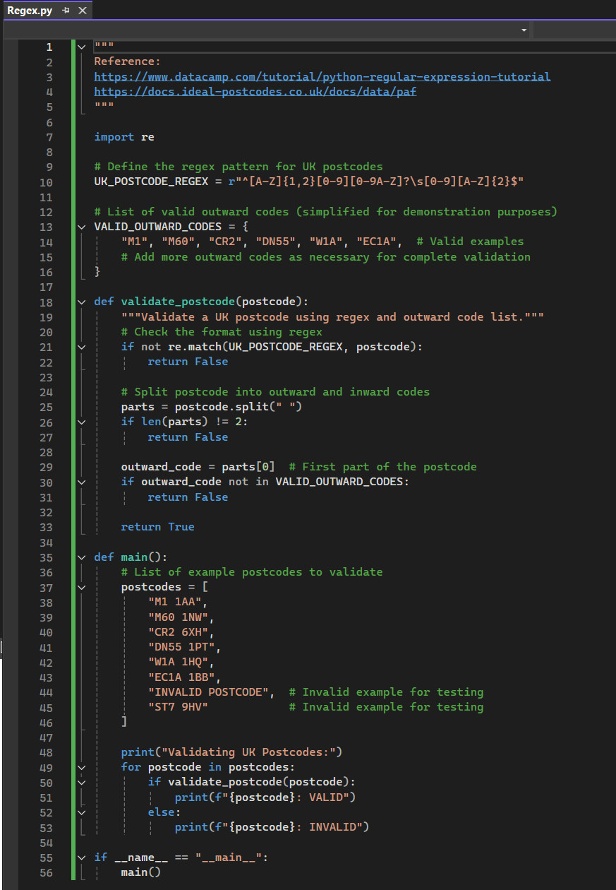
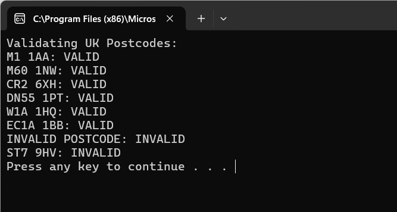

# Equivalence Testing in Python

## Requirement
Run **equivalence.py** in your chosen IDE - Testing with Python - which is an implementation of equivalence partitioning. This test partitions integers [-3,5] into equivalence classes based on _lambda x, y: (x-y)%4 == 0_.

 <br>

 <br>

In the output, you should be able to see how a set of objects to be partitioned are considered, and a function evaluates if the two objects are equivalent before printing the result.

test_equivalence_partition() produces the following output:

```python
set([1, -3]) set([2, -2]) set([3, -1]) set([0, 4]) 0 : set([0, 4]) 1 : set([1, -3]) 2 : set([2, -2]) 3 : set([3, -1]) 4 : set([0, 4]) -2 : set([2, -2]) -3 : set([1, -3]) -1 : set([3, -1])
```


## You should carry out further investigations on the code and experiment with it.


## Reflections
xxx

<br><br>

---

## Reference
xxx

<br><br>

---

[Return to Module 6 Unit 5](SSD_Unit05.md)
