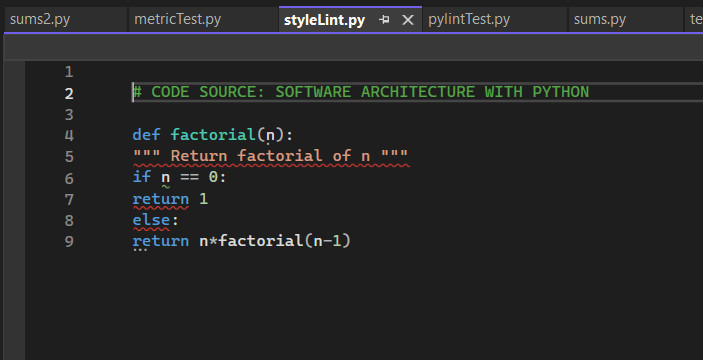
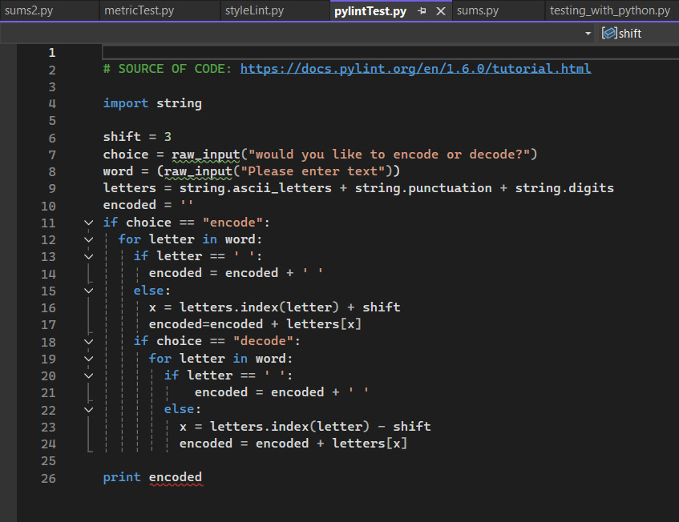
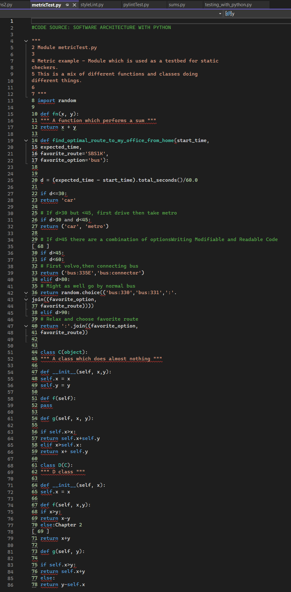
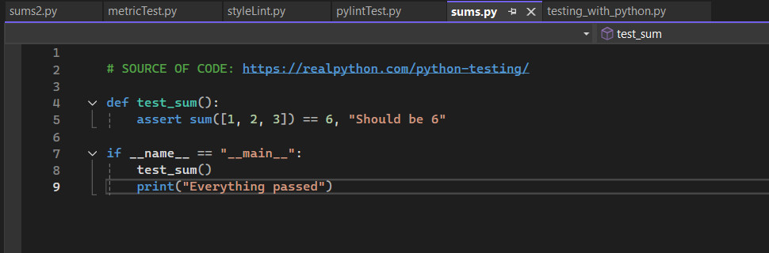
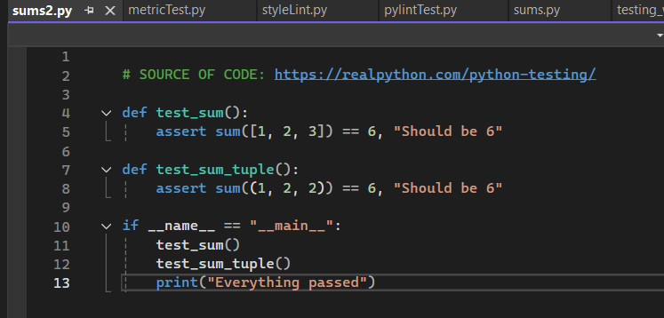

# Exploring Linters to Support Testing in Python

## Requirement
The following questions will be discussed during this week’s seminar. 
These questions are provided in the **'testing-with-python'** zip file with instructions provided in the ['Secure Software Development' PDF file](SSD_Unit06_SeminarReference.pdf) . These activities should be completed on your chosen Jupyter Notebook workspace.

## Question 1
Run _styleLint.py_

 - What happens when the code is run? 
 - Can you modify this code for a more favourable outcome? 
 - What amendments have you made to the code?

  
 

## Question 2

_pip install pylint_

Run 

 _pylint_   
on _pylintTest.py_

- Review each of the code errors returned. 
- Can you correct each of the errors identified by pylint?

Before correcting the code errors, save the _pylintTest.py_ file with a new name (it will be needed again in the next question).

  
 

## Question 3

_pip install flake8_

Run 

_flake8_  
on _pylintTest.py_

 - Review the errors returned.
 - In what way does this error message differ from the error message returned by pylint?

  
 

Run 

_flake8_   
on _metricTest.py_ 

- Can you correct each of the errors returned by flake8?
- What amendments have you made to the code?

  
 

## Question 4

_pip install mccabe_

Run 

_mccabe_  
on _sums.py_. 

- What is the result?

  
 

Run 

_mccabe_   
on _sums2.py_. 

- What is the result?
- What are the contributors to the cyclomatic complexity in each piece of code?

  
 

## Activity
Select one or more of the tools installed above and use it/them to test the code your team has created as part of the summative assessment. 
You should demonstrate your tests (and share your results) during the seminar. 
Discuss the need to change the code based on the output from the test tools/linters.

You will also have the opportunity to discuss your team’s progress during the seminar.

## Reflections
xxx

  

---

## Reference
xxx

  

---

[Return to Module 6 Unit 6](SSD_Unit06.md)
