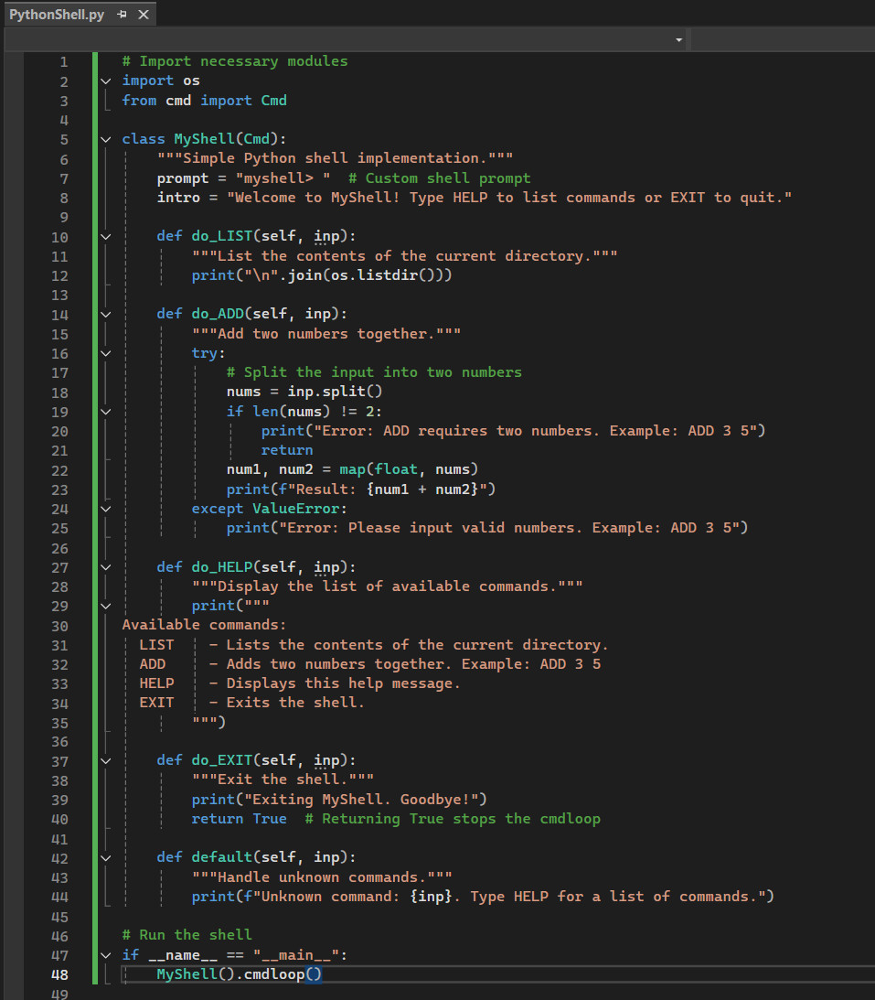
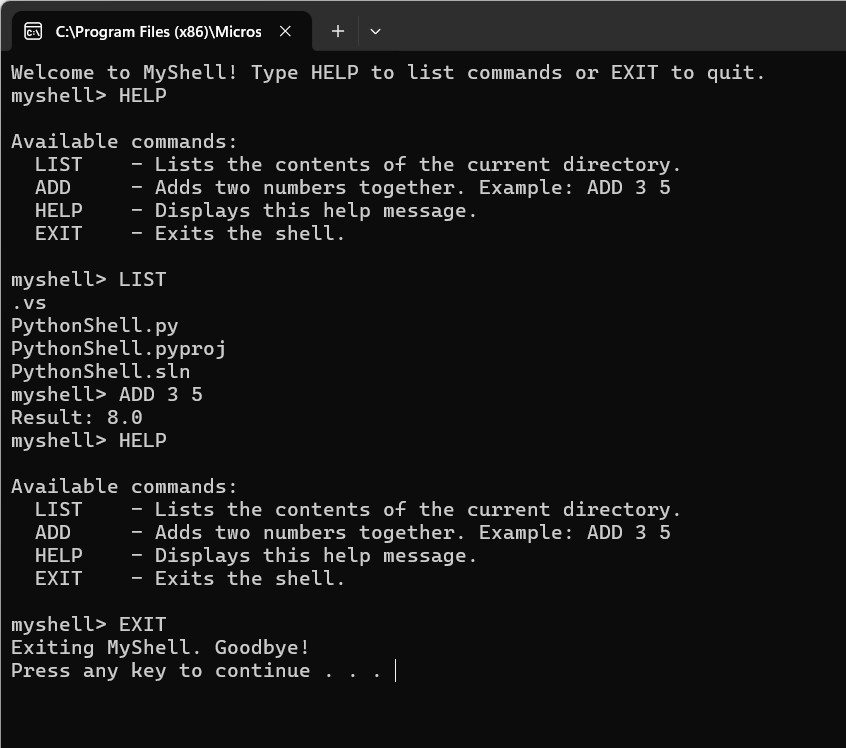

# Exploring a simple Python shell

## Requirement
In this session, you will create a command shell in Python, and then run it and answer questions about it. 

Review the blogs at [Prakash (2018)](https://danishpraka.sh/posts/shell-in-python/) and [Szabo (n.d.)](https://code-maven.com/interactive-shell-with-cmd-in-python) and then:

<br>

## Create a CLI/ shell that implements the following:

 - When you enter the command LIST it lists the contents of the current directory
 - The ADD command will add the following two numbers together and provide the result
 - The HELP command provides a list of commands available
 - The EXIT command exits the shell

 <br>

<br>

## Run the shell you have created, try a few commands and then answer the questions below. 

 <br>

### What are the two main security vulnerabilities with your shell?

1. The LIST command uses the os.listdir() function to display the directory contents. If it were extended to accept user input (e.g., a specific directory), it may expose the system to path traversal or malicious file access.
   
2. The ADD command directly parses user input without strict validation. Malicious inputs (e.g., strings instead of numbers) may cause crashes or unexpected behavior.

### What is one recommendation you would make to increase the security of the shell?

Validate all user inputs strictly to prevent malicious or unexpected inputs. For example, ensure that commands like ADD only accept numerical inputs and commands like LIST only operate within a predefined, safe directory.

### Add a section to your e-portfolio that provides a (pseudo)code example of changes you would make to the shell to improve its security.

Below is a pseudocode example showing how security can be improved:

```Python
# Validate inputs for the ADD command
def do_ADD(self, inp):
    if not inp or len(inp.split()) != 2:
        print("Error: ADD requires two numbers. Example: ADD 3 5")
        return
    nums = inp.split()
    try:
        # Validate that both inputs are numbers
        num1 = float(nums[0])
        num2 = float(nums[1])
        print(f"Result: {num1 + num2}")
    except ValueError:
        print("Error: Invalid numbers. Please enter valid numerical inputs.")
```

For the LIST command:

```Python
# Restrict LIST command to safe directories
def do_LIST(self, inp):
    """List files only in a safe directory."""
    safe_directory = "/your/safe/path"
    try:
        print("\n".join(os.listdir(safe_directory)))
    except Exception as e:
        print(f"Error: Could not access the directory. {e}")
```


## Reflections
This exercise was a valuable exploration into developing a Python-based command shell and addressing associated security concerns. The process required critical analysis to identify potential vulnerabilities, such as command injection and input parsing issues. It also enhanced our problem-solving abilities by implementing strict input validation to improve security and reflecting on the design of the shell and its functionality.

The implementation demonstrated how even simple applications must adhere to secure coding principles to mitigate risks. For future improvements, I would explore implementing user authentication and logging mechanisms to enhance the shell's functionality and monitor potential misuse.

<br><br>

---

## Reference
Prakash, D. (2018) Write a shell in Python. Available from: https://danishpraka.sh/posts/shell-in-python/

Szabo, G. (n.d.) Create your own interactive shell with cmd in Python. Available from: https://code-maven.com/interactive-shell-with-cmd-in-python

<br><br>

---

[Return to Module 6 Unit 7](SSD_Unit07.md)
