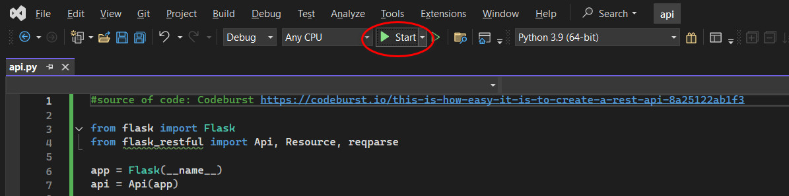
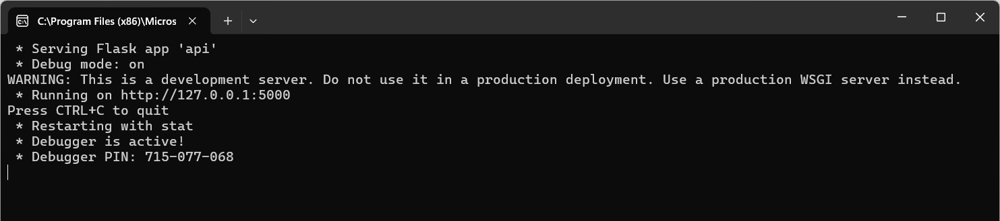
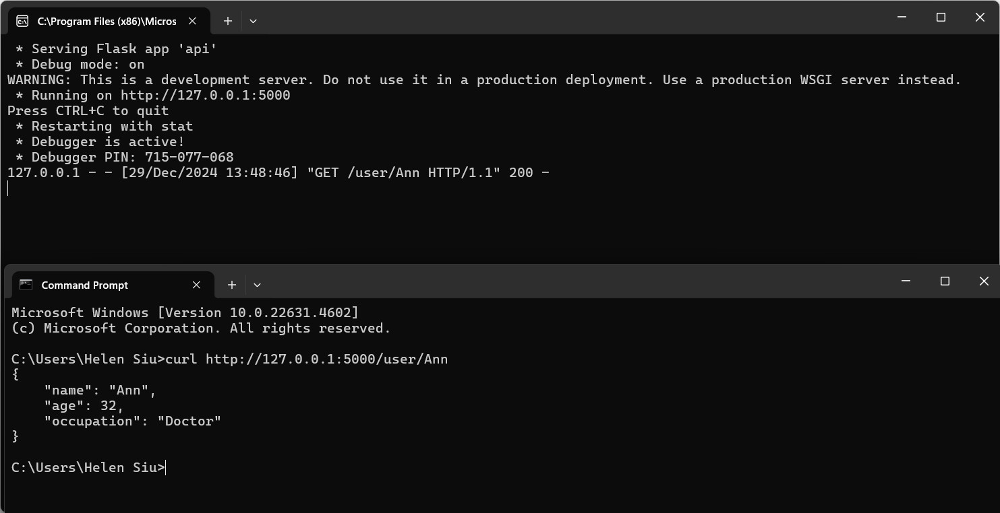
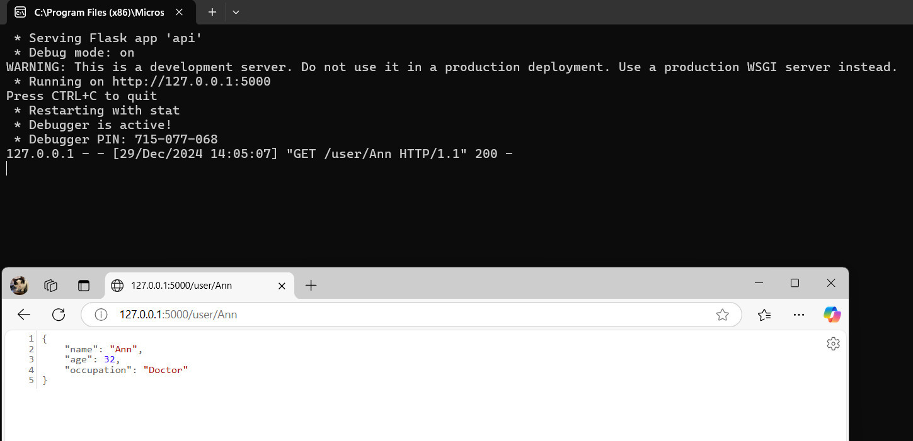
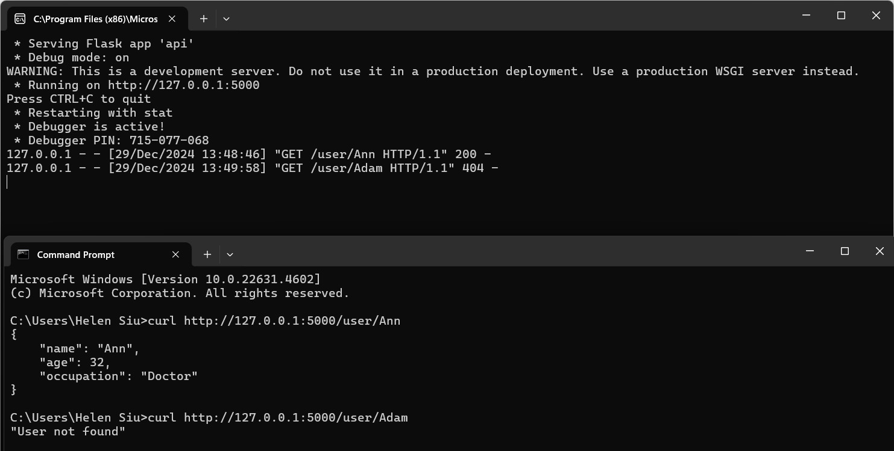
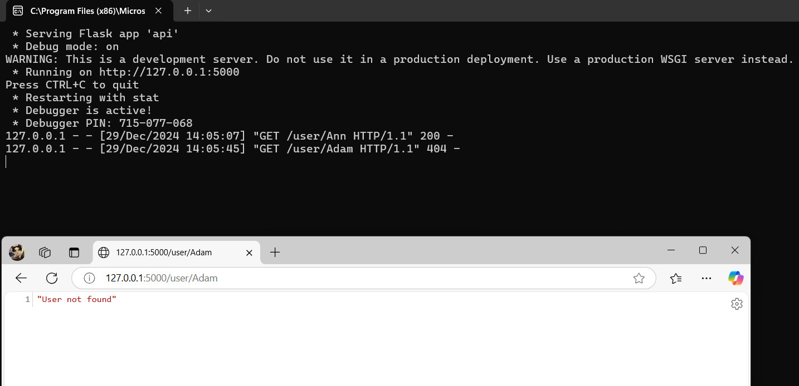

# Developing an API for a Distributed Environment

## Requirement
In this session, you will create a RESTful API which can be used to create and delete user records. 
Responses to the questions should be recorded in your e-portfolio.

You are advised to use these techniques to create an API for your submission in [Unit 11](SSD_Unit11.md). 
<br><br>


## Create a file named api.py and copy the following code into it: 

 <br>
<br>

## Question 1
### Run the API.py code. Take a screenshot of the terminal output. What command did you use to compile and run the code?

I clicked the Start button (or press F5) in **Visual Studio** to compile and run the code. <br>
 <br>

Below is the output: <br>
 <br>
This output shows that the API is running on http://127.0.0.1:5000.

<br>

## Question 2
### Run the following command at the terminal prompt, what happens when this command is run, and why?
```w3m http://127.0.0.1:5000/user/Ann```

I am using Windows and Visual Studio (VS). For convenience, I run the Flask app in the VS terminal and use the Windows Command Prompt with curl to execute the HTTP commands.

 <br>
<br>

I also tried an alternative to test the API endpoints by entering the URL directly into the web browser (Microsoft Edge).

 <br>
<br>

When the Flask application is running, it listens for incoming HTTP requests on http://127.0.0.1:5000. By opening a separate terminal and using tools like w3m, curl, or a browser, I can simulate these requests. 

When accessing the endpoint http://127.0.0.1:5000/user/Ann, the browser sends a GET request to the API. The GET method in the User class is executed, and the Flask application processes the request by searching for a user with the name "Ann" in the users list. Since "Ann" exists and matches, the corresponding user object is returned with a status code of 200 OK and responds with the user's details in JSON format.


<br>

## Question 3
### Run the following command at the terminal prompt, what happens when this command is run, and why?
```w3m http://127.0.0.1:5000/user/Adam```

As explained in Question 2, I used Windows Command Prompt with curl and Microsoft Edge to complete this exercise. <br>

 <br>
<br>

 <br>
<br>

When this command is run, the browser sends a GET request to the endpoint http://127.0.0.1:5000/user/Adam. The API looks for a user with the name Adam in the users list. Since Adam does not exist, the API responds with the error message "User not found" with a status code of 404 Not Found.

<br>

## Question 4
### What capability is achieved by the flask library?

The Flask library provides the capability to build lightweight, flexible web applications and RESTful APIs. Key features include (Saini, 2024) :

 - **Routing:** Allows defining URL endpoints and associating them with specific handler functions (e.g., /user/<string:name>).
 - **Request handling:** Handles HTTP methods like GET, POST, PUT, and DELETE for creating, reading, updating, and deleting resources.
 - **Development server:** Includes a built-in development server for testing and debugging applications.
 - **Extensibility:** Supports extensions like Flask-RESTful for building RESTful APIs and integrating additional functionality like authentication or database management.
 - **Lightweight framework:** Minimal overhead, making it ideal for microservices and small applications.

<br>

## Architecture Evolution Activity
### Based on your reading this week, could you write a section that might be appended to this paper, Salah et al (2016), which would present the next phase of evolution history, from microservices to the technologies which are commonly in use today?

Following the rise of microservices, the next phase in distributed systems evolution has been the emergence and adoption of serverless architectures. Serverless computing, often referred to as Function-as-a-Service (FaaS), abstracts the underlying infrastructure entirely, allowing developers to focus solely on writing code (QA, 2023; Salah et al, 2016; Temov, 2024).

**Characteristics of Serverless Architectures:** (QA, 2023; Salah et al, 2016; Temov, 2024) 
 - **Event-Driven Execution:** Functions are triggered by specific events (e.g., HTTP requests, database changes, or message queue events).
 - **Fine-Grained Scaling:** Each function scales independently based on the number of incoming requests or events, optimizing resource usage.
 - **No Server Management:** Developers do not need to manage or provision servers. The cloud provider handles infrastructure management, scaling, and fault tolerance.
 - **Pay-as-You-Go Pricing:** Billing is based on the actual execution time and resources consumed by functions, reducing costs for workloads with variable or occasional traffic.

**Advantages Over Microservices:** (QA, 2023; Salah et al, 2016; Temov, 2024) 
 - **Reduced Operational Overhead:** Serverless eliminates the need to manage infrastructure, container orchestration, or cluster management.
 - **Faster Time-to-Market:** Developers can focus on core functionality without worrying about the underlying infrastructure.
 - **Cost Efficiency:** Organizations pay only for the compute time used, making it more economical for low-traffic applications.

**Challenges:** (QA, 2023; Salah et al, 2016; Temov, 2024) 
 - **Cold Starts:** Serverless functions may experience latency when idle functions are invoked for the first time.
 - **Vendor Lock-In:** Applications become tightly coupled to specific cloud providers (e.g., AWS Lambda, Azure Functions, Google Cloud Functions).
 - **Monitoring and Debugging:** Distributed workflows in serverless architectures can be challenging to monitor and debug due to the stateless nature of functions.


<br><br>


---

## Reflections

This exercise provided valuable hands-on experience in building RESTful APIs using Flask, offering a practical demonstration of distributed system principles. It was fascinating to see how fundamental concepts such as GET, POST, and DELETE requests are applied in real-world scenarios.

During the process, I encountered challenges with the w3m command mentioned in the requirements, as it did not work in the Windows environment. Additionally, I was unable to set up multiple terminals in Visual Studio, which required me to conduct extensive research to find a solution. While I discovered methods for creating Flask projects directly within Visual Studio, these required additional time to explore. As a result, I opted for a simpler approach: running the Flask app in Visual Studio and using the Windows Command Prompt in parallel.

I also realized that w3m is a Linux-based command, which led to additional time spent identifying alternatives. Eventually, I learned about using curl and discovered that testing the API directly in a web browser could achieve similar results. Although this process was time-consuming, it was highly engaging and mirrored the problem-solving scenarios often encountered in real-world development. This experience also proved beneficial in preparing me for the coding exercises in Assignment 2.

Furthermore, exploring the evolution from microservices to serverless architectures emphasized the ongoing pursuit of scalability, cost-efficiency, and reduced operational complexity in modern distributed systems. This exercise highlighted the importance of adaptability and staying informed about emerging technologies in computer science, which is crucial for professional growth.

<br><br>

--- 

## Reference

QA. (2023) Advantages and disadvantages of microservices architecture. Available from: https://www.qa.com/resources/blog/microservices-architecture-challenge-advantage-drawback/#:~:text=Improved%20fault%20isolation%3A%20Larger%20applications,an%20individual%20service%20as%20needed.

Saini, A. (2024) Understanding Flask Framework: Installation, features & Expert Insights. Available from: https://www.analyticsvidhya.com/blog/2021/10/flask-python/

Salah, T., Zemerly, M. J., et al. (2016) The Evolution of Distributed Systems towards Microservices Architectures, in Proc. of the 11th International Conference for Internet Technology and Secured Transactions.

Temov, J. (2024) Serverless Architectures: Benefits and Challenges. Available from: https://www.enov8.com/blog/serverless-architectures-benefits-and-challenges/

<br><br> 

---

## Bibliography

30DayCodingInc. (2024) Building Scalable REST APIs with Flask and Python: A Comprehensive Guide. Available from: https://30dayscoding.com/blog/building-scalable-rest-apis-with-flask-and-python?srsltid=AfmBOorI6JNyf2XH7moOUKUGW5UacagzwqBiO_Yr2fIoyNO4vByK-ppG

cURL. (N.D.) What is curl used for? Available from: https://curl.se/

GeeksforGeeks. (2023) Flask Cookies. Available from: https://www.geeksforgeeks.org/flask-cookies/

GeeksforGeeks. (2024) Implement a Python REST API with Flask & Flasgger. Available from: https://www.geeksforgeeks.org/implement-a-python-rest-api-with-flask-flasgger/

Microsoft. (2024) Tutorial: Work with the Flask web framework in Visual Studio. Available from: https://learn.microsoft.com/en-us/visualstudio/python/learn-flask-visual-studio-step-01-project-solution?view=vs-2022


<br><br>

---

[Return to Module 6 Unit 7](SSD_Unit07.md)
