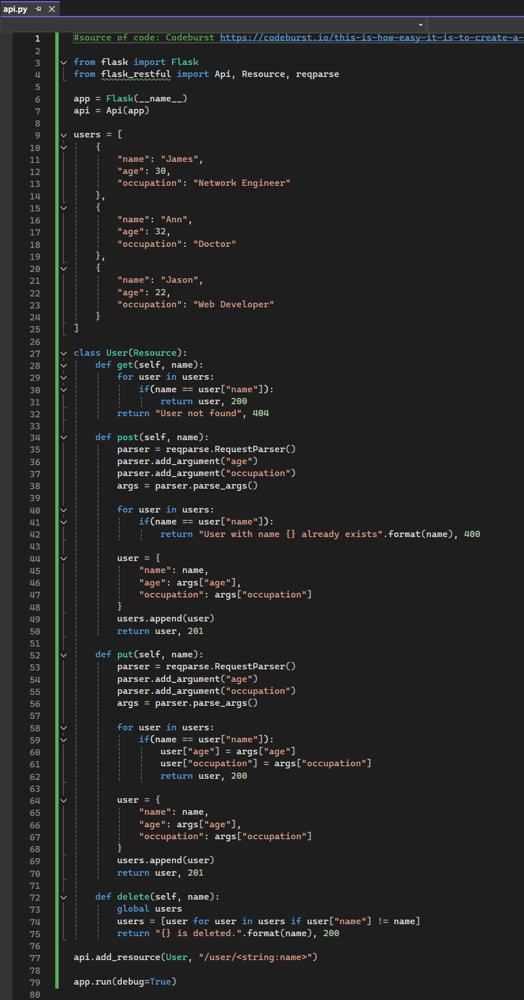

# Developing an API for a Distributed Environment

## Requirement
In this session, you will create a RESTful API which can be used to create and delete user records. 
Responses to the questions should be recorded in your e-portfolio.

You are advised to use these techniques to create an API for your submission in [Unit 11](SSD_Unit11.md). 
  

## Create a file named api.py and copy the following code into it: 

  
 

## Question 1
### Run the API.py code. Take a screenshot of the terminal output. What command did you use to compile and run the code?

I used the Start icon to compile and run the code.  
  

Below is the output:  
  
This output shows that the API is running on http://127.0.0.1:5000.

 

## Question 2
Run the following command at the terminal prompt: w3m http://127.0.0.1:5000/user/Ann

What happens when this command is run, and why?

 

## Question 3
Run the following command at the terminal prompt: w3m http://127.0.0.1:5000/user/Adam

What happens when this command is run, and why?

 

## Question 4
What capability is achieved by the flask library?

 

## Architecture Evolution Activity
Based on your reading this week, could you write a section that might be appended to this paper, [Salah et al, 2016](SSD_Unit07_ActivityRef1.pdf), which would present the next phase of evolution history, from microservices to the technologies which are commonly in use today?

Remember to record your results, ideas and team discussions in your e-portfolio.

  

## Reflections
xxx

  

---

## Reference
xxx

  

---

[Return to Module 6 Unit 7](SSD_Unit07.md)
