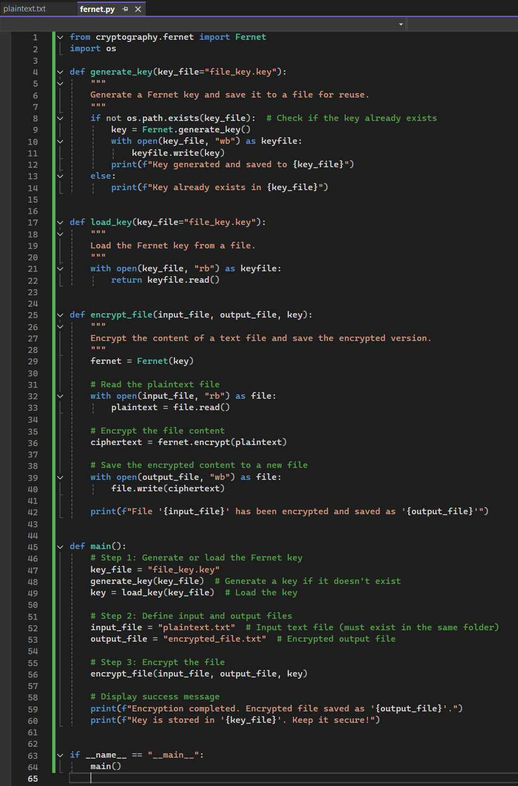
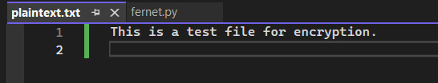
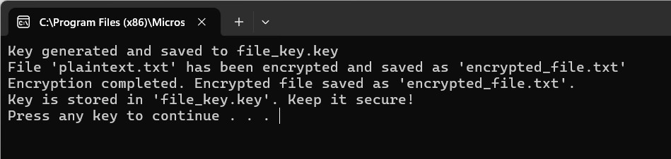
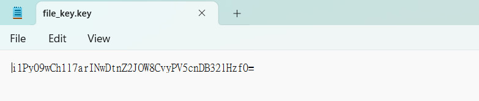
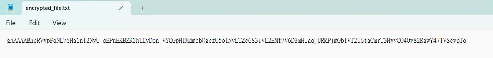

# Cryptography Programming Exercise

## Requirement
Read the [Cryptography with Python blog at tutorialspoint.com](https://www.tutorialspoint.com/cryptography_with_python/cryptography_with_python_quick_guide.htm). 
Select one of the methods described / examples given and create a python program that can take a short piece of text and encrypt it.

 

## Select one of the methods described / examples given.
Before selecting a method and creating the Python program, I created a table to review all the methods described on Tutorialspoint.com.

| **Method**	| **Type**	| **Key Management**	| **Use Case** | **GDPR Compliance** | **Performance** | **Weakness** | **Ease of Implementation** |
| :---------- | :-------- | :--------------- | :----------------- |:----------------- |:----------------- |:----------------- |:----------------- |
| **Reverse Cipher** | Substitution Cipher | No key required | Simple encryption for educational purposes | No | High (Fast) | Extremely weak; easily reversible (not secure) | Very Easy |
| **Caesar Cipher** | Substitution Cipher | Single key (shared) | Encoding small text, educational purposes | No | High (Fast) | Vulnerable to brute force (only 25 possible keys) | Very Easy |
| **ROT13 Algorithm** | Substitution Cipher | No key required (fixed shift of 13) | Simple encoding, educational purposes | No | High (Fast) | Fixed shift makes it easily reversible; not secure | Very Easy |
| **Transposition Cipher** | Rearrangement Cipher | Single key (shared) | Securing small text by rearranging characters | No | Moderate | Vulnerable to frequency analysis; not suitable for modern secure communication | Moderate |
| **Base64 Encoding** | Encoding (Not Encryption)| No key required | Encoding binary data into text for transmission | No | High (Fast) | Not encryption; easily decoded by anyone | Easy |
| **XOR Process** | Symmetric Cipher | Single key (shared) | Fast encryption for small data | No | High (Fast) | Vulnerable to key reuse attacks; not secure for sensitive data | Easy |
| **Multiplicative Cipher** | Substitution Cipher | Single key (shared) | Educational purposes | No | High (Fast) | Vulnerable to brute force; weak unless combined with other methods | Moderate |
| **Affine Cipher** | Hybrid Substitution | Single key (shared) | Basic encryption combining multiplicative and Caesar ciphers | No | High (Fast) | Weak against frequency analysis unless used with strong parameters | Moderate |
| **Monoalphabetic Cipher** | Substitution Cipher | Single key (substitution map) | Encrypting text with a fixed substitution alphabet | No | Moderate | Vulnerable to frequency analysis; substitution alphabet can be guessed | Moderate |
| **Simple Substitution Cipher** | Substitution Cipher | Single key (random substitution map) | Encrypting small text with a user-defined substitution alphabet | No | Moderate | Requires a secure random substitution alphabet; vulnerable to frequency analysis | Moderate |
| **Vigenere Cipher** | Polyalphabetic Cipher | Single key (shared) | Encrypting text with a repeating key | No | Moderate (Better than Caesar) | Repeated key makes it vulnerable to statistical attacks (e.g., Kasiski examination) | Moderate |
| **One-Time Pad Cipher** | Polyalphabetic Cipher | Single-use key (same size as data) | Encrypting highly sensitive data (perfect secrecy if used correctly) | Yes | High (Fast) | Requires truly random keys as long as the plaintext; impractical for large-scale use | Moderate |
| **Data Encryption Standard (DES)** | Symmetric Cipher | Single key (shared)  | Encrypting small data (outdated but educational) | No | Moderate | Considered insecure due to small key size (56 bits); vulnerable to brute force | Moderate |
| **AES (Advanced Encryption Standard)  e.g. Fernet encryption** | Symmetric Cipher | Single key (shared) | Encrypting files, large amounts of data | Yes | High (Very Fast) | Secure only if key is managed properly; vulnerable to side-channel attacks in flawed implementations  | Easy (with libraries like `cryptography`) |
| **RSA (Rivest–Shamir–Adleman)** | Asymmetric Cipher | Key pair (public/private) | Secure key exchange, digital signatures, encrypting small data | Yes  | Low (Slow for large data) | Computationally intensive; quantum computers can potentially break it in the future | Moderate |
| **Hybrid Cryptography** | Mixed (Symmetric + Asymmetric) | Symmetric key + RSA for key exchange | Combining fast symmetric encryption (e.g., AES) with secure key exchange (e.g., RSA) | Yes | High (Efficient for large data)| Complex implementation; depends on the security of the underlying symmetric and asymmetric algorithms | Moderate to Difficult |

 

## Create a python program that can take a text file and output an encrypted version as a file in your folder on the system . 

Create _fernet.py_ using Fernet encryption (from the cryptography module) to take a plaintext file, encrypt its contents, and save the encrypted version as a new file in the same folder.  

  

Create a plaintext file named _plaintext.txt_ in the same folder as Input File. Add text "This is a test file for encryption." to it. 

  

clicked the Start button (or press F5) in Visual Studio to compile and run _fernet.py_.

  

The program then:  
Generate a Encryption Key and save it to a file named _file_key.key_.  

  

Encrypt the contents of plaintext.txt and save the encrypted data to _encrypted_file.txt_.  

  

 

## Answer the following questions in your e-portfolio:

### Why did you select the algorithm you chose?

I selected Fernet encryption because:

 - It is simple to use and provided by the cryptography module with secure defaults.
 - It uses AES encryption (a widely trusted symmetric encryption method) in CBC mode (Cipher Block Chaining) with HMAC (Hash-based Message Authentication Code)  for integrity verification.
 - It abstracts away complexities like key management and padding, making it beginner-friendly yet robust.

 

### Would it meet the GDPR regulations? Justify your answer.

Yes, Fernet encryption can meet GDPR regulations if implemented correctly:
 - GDPR Article 32 requires encryption of personal data to ensure its confidentiality and integrity. Fernet uses AES encryption (a standard compliant with GDPR) and HMAC to detect any tampering.
 - The encryption key is securely stored in a separate file (file_key.key), ensuring data cannot be decrypted without it.
 - The algorithm follows modern cryptographic standards and ensures secure encryption as long as the key is managed properly.
 - Compliance also depends on securely storing the key (e.g., using a Hardware Security Module or secure key vault in production systems).

  

### Additional discussion : Security Concerns and Mitigations

When using Fernet encryption, there are several security concerns that need to be addressed to ensure data remains safe and the encryption process is robust. Below are the potential concerns and corresponding mitigation strategies:

Table of Security Concerns and Mitigations (Iuzvyk et al,N.D.; Marynowski, 2024; OWASP, N.D.)

| **Security Concern**	| **Description**	| **Mitigation** |
| :-------------------- | :-------------- | :--------------|
| **Key Management** | Key exposure or poor storage leads to data compromise. |	Use secure storage (e.g., Key Management Service, HSM); avoid hardcoding keys; rotate keys periodically. |
| **Replay Attacks** | Reusing ciphertext for malicious purposes. |	Validate timestamps during decryption; reject expired ciphertext. |
| **Key Loss** |	Losing the key results in permanent data loss. |	Securely back up keys; use key versioning and recovery processes. |
| **Side-Channel** | Attacks	Leaks from poorly implemented encryption processes. |	Use trusted libraries like cryptography; avoid custom modifications. |
| **Large Data Encryption** |	Performance bottlenecks for large files. |	Use hybrid encryption or streaming encryption for large files. |
| **Ciphertext Integrity** |	Tampering with ciphertext may lead to incorrect decryption or vulnerabilities. |	Use Fernet's built-in HMAC validation; securely transmit and store ciphertext. |
| **Weak Key Generation** |	Weak keys make encryption vulnerable to brute-force attacks. |	Use Fernet.generate_key() for strong keys; use KDFs (e.g., PBKDF2, bcrypt) for password-derived keys. |
| **Incorrect Use of Timestamps** |	Failing to validate timestamps may introduce security risks. |	Enforce TTL validation during decryption using Fernet.decrypt(token, ttl). |
| **Shared Key Exposure** |	Using the same key across systems increases risk. |	Use unique keys per system; encrypt shared keys using asymmetric encryption (e.g., RSA). |
| **Regulatory Compliance** |	Poor encryption practices may fail regulations like GDPR. |	Use secure key management, audit encryption processes, and ensure proper implementation of encryption laws. |

While Fernet encryption is a secure and simple-to-use method, its security relies heavily on proper key management, careful implementation, and best practices for encryption. By addressing the above concerns and implementing the suggested mitigations, you can ensure that Fernet encryption is used securely and meets regulatory standards like GDPR.

 

## Reflections

Through this exercise, I gained a deeper understanding of cryptographic principles and how encryption can be effectively implemented in Python. I chose Fernet encryption because it is easy to understand and implement with Python’s cryptography library, making it a great starting point for gaining hands-on experience in developing encryption algorithms. I learned how to secure data using a symmetric encryption method that combines AES encryption and HMAC (Hash-based Message Authentication Code) to ensure both confidentiality and integrity.

Building on the critical thinking skills I developed in previous units, I now approach every new option with a structured perspective. In this exercise, I consider the justification for my choice, **Fernet encryption**, evaluate potential security concerns, assess whether they can be mitigated, and explore alternatives. I also aim to balance the cost and benefits of every option. This mindset led me to include a discussion on security concerns and mitigations in this exercise, even though it was beyond the assignment's requirements.

The practical experience of encrypting a file and managing keys has given me the confidence to integrate secure encryption into my coding projects. For upcoming Coding Assignment, I can apply similar techniques to encrypt files or sensitive data, ensuring compliance with data protection requirements. Additionally, focusing on best practices, such as avoiding hardcoded keys and using secure libraries like cryptography, will enable me to write more secure and reliable code.

  

---

## Reference

D. Iuzvyk, D., Peck, T. & Kolesnikov, O. (N.D.) Securonix Security Advisory: Python-Based PY#RATION Attack Campaign Leverages Fernet Encryption and Websockets to Avoid Detection. Available from: https://www.securonix.com/blog/security-advisory-python-based-pyration-attack-campaign/

Tutorialspoint. (N.D.) Cryptography with Python Tutorial. Available from: https://www.tutorialspoint.com/cryptography_with_python/cryptography_with_python_quick_guide.htm

Marynowski, T. (2024) Data Security vs. Operational Efficiency: A case study of encryption in Databricks. Available from: https://medium.com/@tedm/data-security-vs-operational-efficiency-a-case-study-of-encryption-in-databricks-ec312fab1a49

OWASP (N.D.a) Cryptographic Storage Cheat Sheet. Available from: https://cheatsheetseries.owasp.org/cheatsheets/Cryptographic_Storage_Cheat_Sheet.html

OWASP (N.D.b) Key Management Cheat Sheet. Available from: https://cheatsheetseries.owasp.org/cheatsheets/Key_Management_Cheat_Sheet.html

  

## Bibliography
Airflow Apache. (N.D.) Fernet. Available form: https://airflow.apache.org/docs/apache-airflow/stable/security/secrets/fernet.html

Cryptography.io (N.D.a) Welcome to pyca/cryptography. Available from: https://cryptography.io/en/latest/

Cryptography.io (N.D.b) Fernet (symmetric encryption). Available from: https://cryptography.io/en/latest/fernet/
  

---

[Return to Module 6 Unit 8](SSD_Unit08.md)
