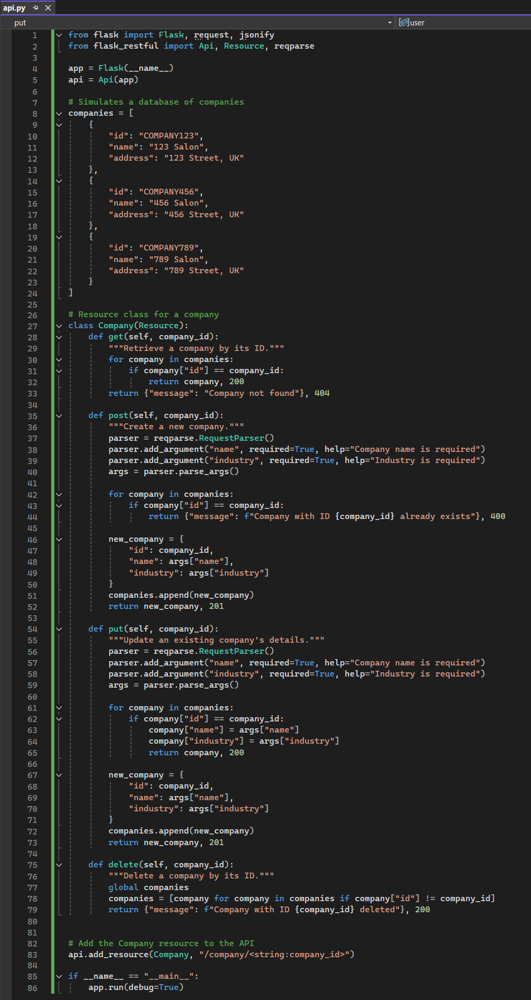
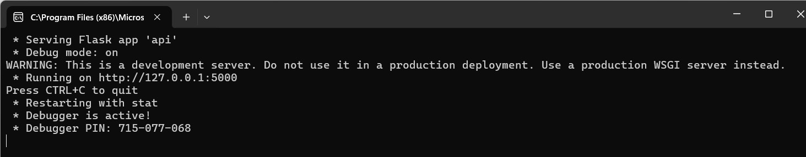
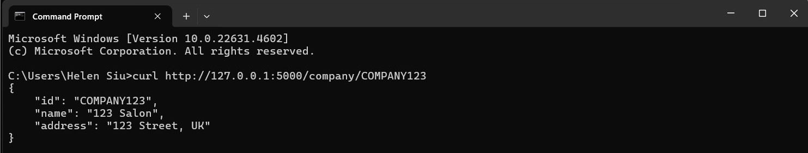

# API Demonstrations

## Requirement
In this session, we will expand the API [Unit 7](SSD_Unit07.md) with functionality relevant to your summative code submission. 

## Expand the API created in [Unit 7 - Developing an API for a Distributed Environment](SSD_Unit07_Activity2.md) with functionality relevant to your summative code submission.

Below is the expanded API integrates CRUD operations (Create, Read, Update, Delete) for managing company resources.  

  

To retrieve company information using curl, I can send a GET request to the endpoint /company/<company_id>.  

  

If the company with the ID COMPANY123 exists, the API will respond with the company's details in JSON format:  

  

 

## Read the paper: S. Fiore et al. (2019). Making reference to page 117659 and the paragraph which begins, "Through an API or via web pages, ...", write a similar paragraph which is applicable for the system that you have designed and developed."

Through an API or via web pages, the system allows secure and efficient management of company records, crucial for resource and order handling in the system. The API provides endpoints for creating, reading, updating, and deleting company information (CRUD). It ensures data integrity by validating unique company IDs and requiring mandatory fields such as company name and industry category during creation or updates. The API also returns meaningful HTTP status codes (e.g., 200 OK, 404 Not Found, 400 Bad Request) to enable seamless integration with other services or front-end interfaces. This design abstracts the complexities of database management, allowing developers and stakeholders of the system to focus on high-level functionality while ensuring scalability for future requirements.

 

## Reflections
This exercise provided valuable experience in applying the principles of RESTful API development learned in Unit 7 to the design and implementation of an expanded API for the system designed for Assignment 2. The API supports CRUD operations and incorporates meaningful HTTP status codes, such as 200 OK, 404 Not Found, and 400 Bad Request, to improve usability and error handling. However, I am still uncertain whether my system design will fully apply CRUD functionality via the API.

The use of flask_restful simplified the development process by structuring the API with resource classes and leveraging the reqparse module for input validation. During implementation, I faced challenges in ensuring that the API design was both scalable and extensible while maintaining simplicity. Additionally, I carefully addressed error scenarios, such as handling duplicate entries and missing fields, to make the API more robust and user-friendly.

This exercise not only strengthened my understanding of RESTful API principles but also emphasized the critical role of scalability and adaptability in software development. Overall, this experience has been highly valuable in preparing me for future projects involving distributed systems and large-scale API development.

  

---

## Reference
Fiore, S., Elia, D., Pires, C.E., Mestre, D.G., Cappiello, C., Vitali, M., Andrade, N., Braz, T., Lezzi, D., Moraes, R. and Basso, T., 2019. An integrated big and fast data analytics platform for smart urban transportation management. IEEE access, 7, pp.117659.

  

---

[Return to Module 6 Unit 9](SSD_Unit09.md)
