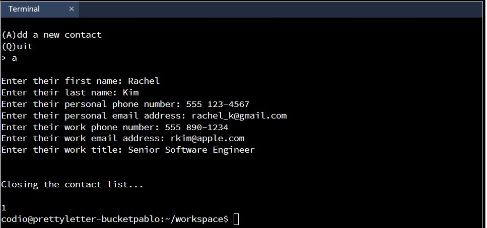

**This lab will focus on using polymorphism while interacting with a contact list.**
**There will be a main class Contacts that controls the “view” the user sees and responds to user input.**
**The contact information (personal and work) will be an instance of the Information class.**

```python

# Polymorphism Tutorial Lab 1

# The Contacts Class
class Contacts:
  def __init__(self):
    self.view = 'quit'
    self.contact_list = []
    self.choice = None
    self.index = None

  # The Display Method
  def display(self):
    while True:
      if self.view == 'list':
        self.show_list()
      elif self.view == 'info':
        self.show_info()
      elif self.view == 'add':
        print()
        self.add_contact()
      elif self.view == 'quit':
        print('\nClosing the contact list...\n')
        break

  # Starting the Other Methods
  def show_list(self):
    pass

  def show_info(self):
    pass

  def add_contact(self):
    pass

#Testing Your Code
contacts = Contacts()
contacts.display()
```

Polymorphism Tutorial Lab 1 Output


---

```python
# Polymorphism Tutorial Lab 2

# Adding a Contact
class Contacts:
  def __init__(self):
    self.view = 'list'
    self.contact_list = []
    self.choice = None
    self.index = None
  
  def display(self):
    while True:
      if self.view == 'list':
        self.show_list()
      elif self.view == 'info':
        self.show_info()
      elif self.view == 'add':
        print()
        self.add_contact()
      elif self.view == 'quit':
        print('\nClosing the contact list...\n')
        break

  def show_list(self):
    print()
    if len(self.contact_list) == 0:
      self.choice = input('(A)dd a new contact \n(Q)uit \n> ').lower()
    else:
      self.view = 'quit'
    self.handle_choice()

  def show_info(self):
    pass

  #Adding a Contact
  def __add__(self, new_contact):
    self.contact_list.append(new_contact)

  def add_contact(self):
    self + Information()
    self.view = 'list'

  # Handling User Choices
  def handle_choice(self):
    if self.choice == 'q':
      self.view = 'quit'
    elif self.choice == 'a' and self.view == 'list':
      self.view = 'add'

#  The Information Class
class Information:
  def __init__(self):
    self.first_name = input('Enter their first name: ')
    self.last_name = input('Enter their last name: ')
    self.personal_phone = input('Enter their personal phone number: ')
    self.personal_email = input('Enter their personal email address: ')
    self.work_phone = input('Enter their work phone number: ')
    self.work_email = input('Enter their work email address: ')
    self.title = input('Enter their work title: ')

contacts = Contacts()
contacts.display()
print(len(contacts.contact_list))
```

Polymorphism Tutorial Lab 2 Output



---

```python
# Polymorphism Tutorial Lab 3

class Contacts:
  def __init__(self):
    self.view = 'list'
    self.contact_list = []
    self.choice = None
    self.index = None

  def display(self):
    while True:
      if self.view == 'list':
        self.show_list()
      elif self.view == 'info':
        self.show_info()
      elif self.view == 'add':
        print()
        self.add_contact()
      elif self.view == 'quit':
        print('\nClosing the contact list...\n')
        break

  def show_list(self):
    print()
    if len(self.contact_list) == 0:
      self.choice = input('(A)dd a new contact \n(Q)uit \n> ').lower()
    else:
      for index, contact in enumerate(self.contact_list):
        print(f"{index + 1}) {contact.first_name} {contact.last_name}")
      self.choice = input('\n(#) Select a name \n(A)dd a new contact\n(Q)uit \n> ').lower()
    self.handle_choice()

  def show_info(self):
    pass

  def __add__(self, new_contact):
    self.contact_list.append(new_contact)

  def add_contact(self):
    self + Information()
    self.view = 'list'

  # Handling Numeric Input
  def handle_choice(self):
    if self.choice == 'q':
      self.view = 'quit'
    elif self.choice == 'a' and self.view == 'list':
      self.view = 'add'
    elif self.choice.isnumeric() and self.view == 'list':
      index = int(self.choice) - 1
      if index >= 0 and index < len(self.contact_list):
        self.index = index
        self.view = 'info'

class Information:
  def __init__(self):
    self.first_name = input('Enter their first name: ')
    self.last_name = input('Enter their last name: ')
    self.personal_phone = input('Enter their personal phone number: ')
    self.personal_email = input('Enter their personal email address: ')
    self.work_phone = input('Enter their work phone number: ')
    self.work_email = input('Enter their work email address: ')
    self.title = input('Enter their work title: ')

# Displaying the List View
contacts = Contacts()
contacts.display()
```

Polymorphism Tutorial Lab 3 Output


---

```python

# Polymorphism Lab Challenge

class Chef:
    def __init__(self, name, cuisine, stars):
        self.name = name
        self.cuisine = cuisine
        self.michelin_stars = stars
    
    def __gt__(self, other_chef):
        return self.michelin_stars > other_chef.michelin_stars
    
    def compare(self, other_chef):
        if self > other_chef:
            return f"{self.name} has more Michelin stars than {other_chef.name}"
        else:
            return f"{other_chef.name} has more Michelin stars than {self.name}"
marco = Chef('Marco Pierre White', 'French, British', 3)
rene = Chef('Rene Redzepi', 'Nordic', 2)

print(marco.compare(rene))
print(rene.compare(marco))
```

```python

# Polymorphism Lab Challenge Output

Marco Pierre White has more Michelin stars than Rene Redzepi
Marco Pierre White has more Michelin stars than Rene Redzepi
```

---

[Return to Module 2 Unit 8](OOP_Unit08.md)
