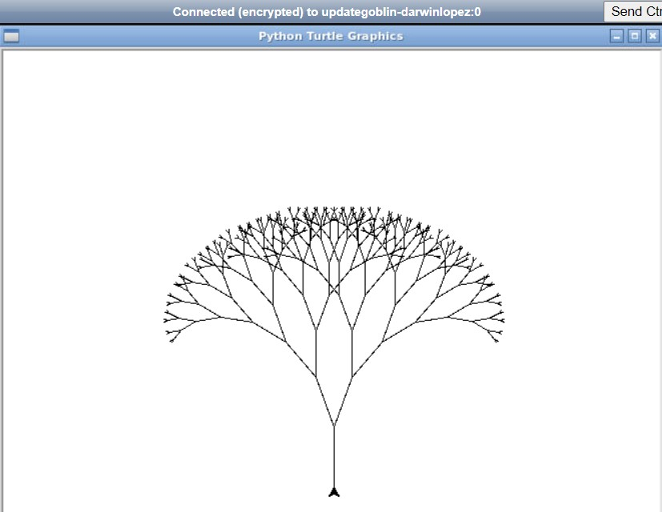

```python
# Tutorial Lab 1 - Recursive Tree

import turtle

t = turtle.Turtle()
t.lt(90)
t.penup()
t.backward(150)
t.pendown()
t.speed(10)

def recursive_tree(branch_length, angle, t):
    """Draw a tree recursively"""
    if branch_length > 1:
        t.forward(branch_length)
        t.right(angle)
        recursive_tree(branch_length - 7, angle, t)
        t.left(angle * 2)
        recursive_tree(branch_length - 7, angle, t)
        t.right(angle)
        t.backward(branch_length)
      
recursive_tree(60, 20, t)
turtle.mainloop()
```

Tutorial Lab 1 - Recursive Tree Output



---

```python
# Tutorial Lab 2 - The Hilbert Curve

import turtle

t = turtle.Turtle()

def hilbert(dist, rule, angle, depth, t):
    if depth > 0:

        if rule == 1:
            t.left(angle)
            hilbert(dist, 2, angle, depth - 1, t)
            t.forward(dist)
            t.right(angle)
            hilbert(dist, 1, angle, depth - 1, t)
            t.forward(dist)
            hilbert(dist, 1, angle, depth - 1, t)
            t.right(angle)
            t.forward(dist)
            hilbert(dist, 2, angle, depth - 1, t)
            t.left(angle)

        if rule == 2:
            t.right(angle)
            hilbert(dist, 1, angle, depth - 1, t)
            t.forward(dist)
            t.left(angle)
            hilbert(dist, 2, angle, depth - 1, t)
            t.forward(dist)
            hilbert(dist, 2, angle, depth - 1, t)
            t.left(angle)
            t.forward(dist)
            hilbert(dist, 1, angle, depth - 1, t)
            t.right(angle)

hilbert(5, 1, 90, 5, t)
turtle.mainloop()
```

Tutorial Lab 2 - The Hilbert Curve Output


---

[Return to Module 2 Unit 8](OOP_Unit08.md)
