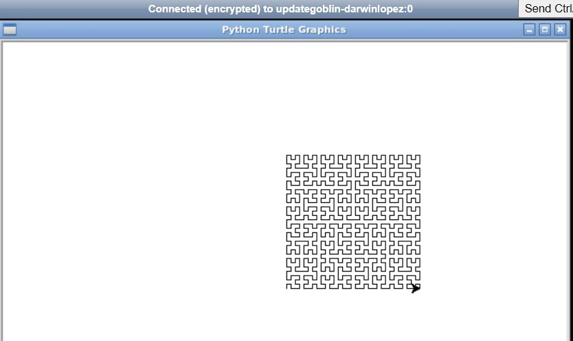
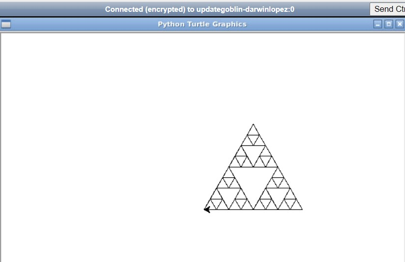

```python
# Tutorial Lab 1 - Recursive Tree

import turtle

t = turtle.Turtle()
t.lt(90)
t.penup()
t.backward(150)
t.pendown()
t.speed(10)

def recursive_tree(branch_length, angle, t):
    """Draw a tree recursively"""
    if branch_length > 1:
        t.forward(branch_length)
        t.right(angle)
        recursive_tree(branch_length - 7, angle, t)
        t.left(angle * 2)
        recursive_tree(branch_length - 7, angle, t)
        t.right(angle)
        t.backward(branch_length)
      
recursive_tree(60, 20, t)
turtle.mainloop()
```

Tutorial Lab 1 - Recursive Tree Output


---

```python
# Tutorial Lab 2 - The Hilbert Curve

import turtle

t = turtle.Turtle()

def hilbert(dist, rule, angle, depth, t):
    if depth > 0:

        if rule == 1:
            t.left(angle)
            hilbert(dist, 2, angle, depth - 1, t)
            t.forward(dist)
            t.right(angle)
            hilbert(dist, 1, angle, depth - 1, t)
            t.forward(dist)
            hilbert(dist, 1, angle, depth - 1, t)
            t.right(angle)
            t.forward(dist)
            hilbert(dist, 2, angle, depth - 1, t)
            t.left(angle)

        if rule == 2:
            t.right(angle)
            hilbert(dist, 1, angle, depth - 1, t)
            t.forward(dist)
            t.left(angle)
            hilbert(dist, 2, angle, depth - 1, t)
            t.forward(dist)
            hilbert(dist, 2, angle, depth - 1, t)
            t.left(angle)
            t.forward(dist)
            hilbert(dist, 1, angle, depth - 1, t)
            t.right(angle)

hilbert(5, 1, 90, 5, t)
turtle.mainloop()
```

Tutorial Lab 2 - The Hilbert Curve Output



---

```python
# Tutorial Lab 3 - Sierpinski Triangle

import turtle

t = turtle.Turtle()
t.speed(10)

def sierpinski(length, n):
    if n == 1:
        draw_triangle(length)
    else:
      sierpinski(length, n-1)
      t.rt(120)
      t.fd(length * 2**(n-2))
      sierpinski(length, n-1)
      t.lt(120)               
      t.fd(length * 2**(n-2)) 
      sierpinski(length, n-1)
      t.fd(length * 2**(n-2))  
         
def draw_triangle(length):
    t.setheading(180)      
    for i in range(3):     
        t.rt(120)          
        t.fd(length)

sierpinski(20, 4)

turtle.mainloop()
```

Tutorial Lab 3 - Sierpinski Triangle Output



---

```python
# Tutorial Lab Challenge
""Write a recursive function called recursive_power that takes two integers as parameters.
The first parameter is the base and the second parameter is the exponent. Return the base parameter to the power of the exponent.""""

def recursive_power(base, exponent):
    # Base case: any number to the power of 0 is 1
    if exponent == 0:
        return 1
    # Recursive case: multiply base by the result of base raised to the power of (exponent - 1)
    else:
        return base * recursive_power(base, exponent - 1)

# Example usage:
print(recursive_power(5, 3))
print(recursive_power(4, 5))
```

```python
# Tutorial Lab Challenge Output

125
1024
```

---

[Return to Module 2 Unit 8](OOP_Unit08.md)
